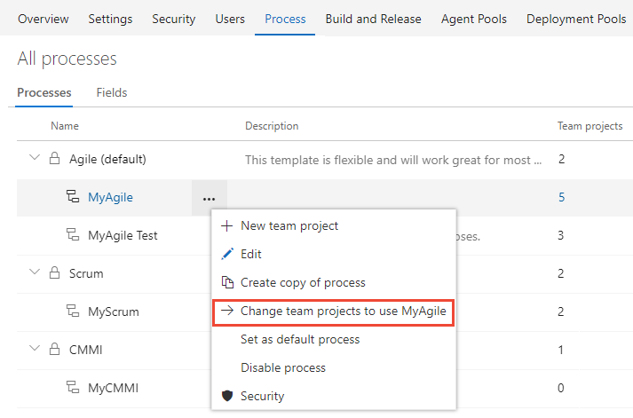
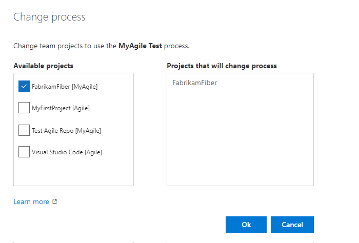

# Change a project from Hosted XML to an inherited process 

[!INCLUDE [temp](../../../_shared/version-vsts-only.md)]

Once you've [upgraded your Hosted XML process to an inherited process](upgrade-hosted-to-inherited.md), you can change the project(s) from the Hosted XML process to the inherited process. You change a project from a Hosted XML process to its derived inherited process to start customizing the process through the user interface.  

> [!IMPORTANT]  
> Choosing to upgrade a team project from a Hosted XML process model to an inherited process is an irreversible operation. Before you change the process of an existing project from Hosted XML to the upgraded inherited process, review [Supported upgrade operations when moving from Hosted XML process to inherited process](upgrade-support-hosted-to-inherited.md) to understand which customizations are preserved and which are not before you change the process of a project from Hosted XML to an inherited process. Also, [create a test project](upgrade-hosted-to-inherited.md#verify) to verify the customizations preserved or reapplied to a process.

## Prerequisites 
- You must be a member of the Project Administrators group for the project you want to change, or a member of the Project Collection Administrators group.

## Change the process used by a team project 

After you've verified your customizations, you can now apply the process to your existing project. 

0. Open the &hellip; context menu for the process and choose the **Change team projects**&hellip; option. 

	Here we open the menu for the MyAgile inherited process. 

	> [!div class="mx-imgBorder"]  
	> 
	
0. Check the checkbox of those projects you want to change to use the MyAgile process. The system lists only those projects that are valid for the current process and the projects based on the Hosted XML process.	

	Here we choose to use the MyAgile process for the FabrikamFiber project.  Only those projects created from the Agile process or one that inherits from Agile will appear under the **Available projects** column. 
  
	> [!div class="mx-imgBorder"]  
	>  

0. After  you've confirmed that the projects you want to change are correct, choose **Ok**. 

<!--- 
If you have several projects that you want to change, you can change several projects at once by going to the **Process** page and choosing the [**Change team projects…** option](../../../work/customize/process/manage-process.md). 
--> 

## Related articles
- [Supported upgrade operations when moving from Hosted XML process to an inherited process](upgrade-support-hosted-to-inherited.md)
- [Upgrade a Hosted XML process to an Inheritance process](upgrade-hosted-to-inherited.md) 

