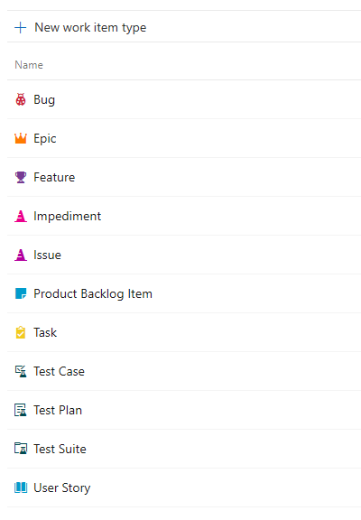
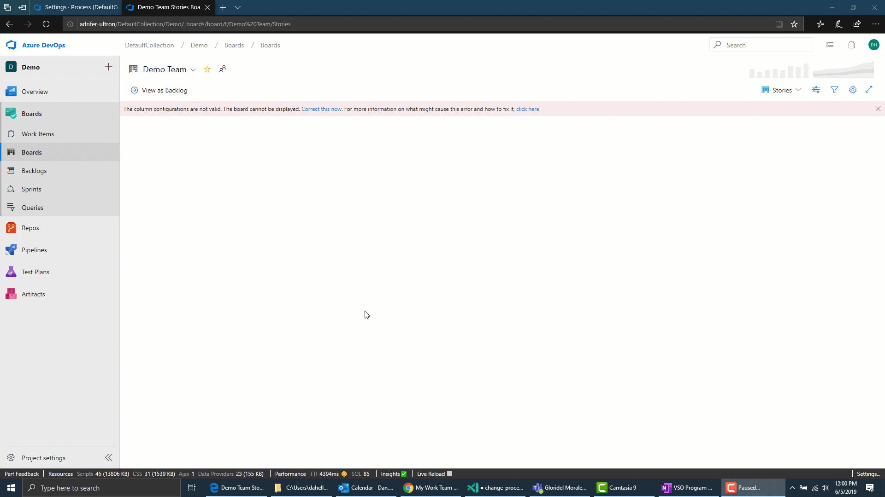

# Scrum to Agile

[!INCLUDE [temp](../../../_shared/version-vsts-only.md)]

> [!NOTE]     
> This feature is currently in private preview. Please [email us](mailto:dahellem@microsoft.com) if you are interested in participating in the preview.

> [!WARNING]     
> If you have existing work items, this process requires manual updates to work items and board configuration. Please make sure you follow the below steps and images before attempting to change the process used by a project.

## Steps
  
1. [Create a custom process](./manage-process.md) under Agile called "Agile - Inherited".

2. If the work item types are being used by your project then [add the work item type](./customize-process-wit.md) Product Backlog Item and Impediment to the "Agile - Inherited" process.  

  > [!div class="mx-imgBorder"]  
  > 

3. Run the Change Process Wizard by going to Organization Settings > Process. Select the process that contains the project you want to change. For example, Agile. Click on the Projects tab and hover over the project. Click the ... context menu and select "Change Process". Follow the steps in the wizard. 

  > [!div class="mx-imgBorder"]  
  >   

4. Update the [board settings](../../../boards/get-started/customize-boards.md) for each board so that the column to state mapping is correct.

  > [!div class="mx-imgBorder"]  
  > 

5. [Create a query](../../../boards/queries/using-queries.md) to get a list of all Product Backlog Items. Sort the list by state value. Highlight all Product Backlog Items and do a [change type](../../../boards/backlogs/remove-delete-work-items.md#change-the-work-item-type) to User Story. Next do a [bulk edit](../../../boards/backlogs/bulk-modify-work-items.md) to update work items to the right state for the User Story type. For example: Committed would change to Active. Do this for each state, one state at a time.

6. Adjust query to show only Issues. Highlight all Issue work items and a change type to be an Impediment. Do a bulk edit to update work items to the right state for the Impediment type. Do this for each state, one state at a time.

7. Adjust query to only show Tasks. Use bulk edit to update state value for all Tasks, one state at a time. Rinse and repeat the same process for Bugs, Epics, and Features.
  
  > [!div class="mx-imgBorder"]  
  > 

8. [Change the process used by the project](./manage-process.md#change-the-process-used-by-a-project) to use the system Agile process

## Reference

- [Bulk modify work items](../../../boards/backlogs/bulk-modify-work-items.md)
- [Change the process used by a project](./manage-process.md#change-the-process-used-by-a-project)
- [Create an inherited process](./manage-process.md#create-an-inherited-process)
- [Add and manage work item types](./customize-process-wit.md)
- [Customize your boards](../../../boards/get-started/customize-boards.md)
- [Create and saved managed queries with the query editor](../../../boards/queries/using-queries.md)