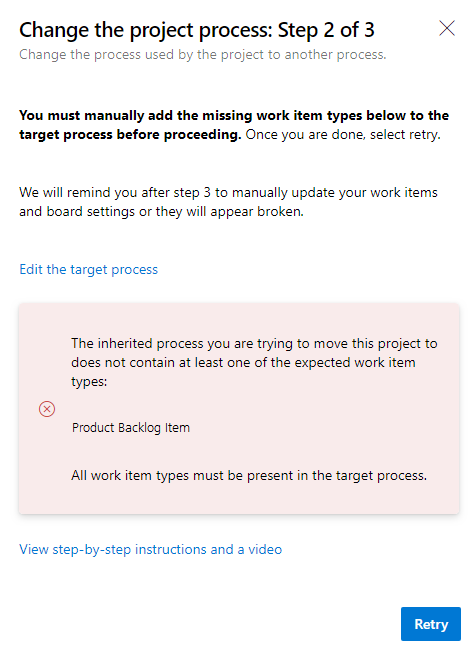
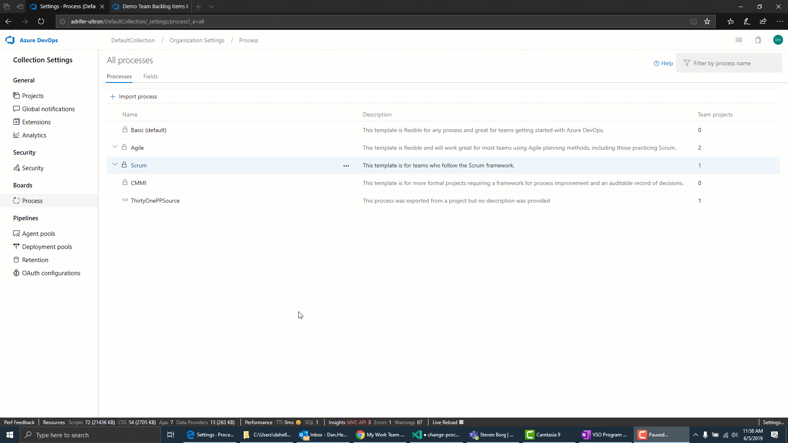
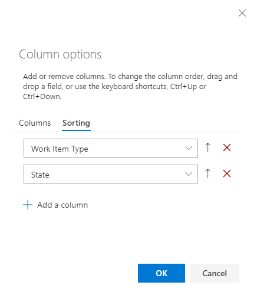
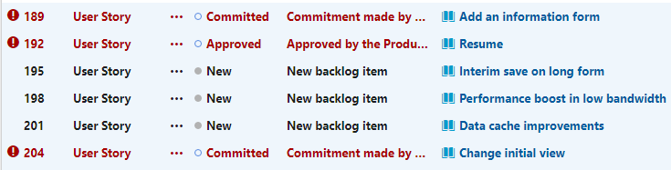
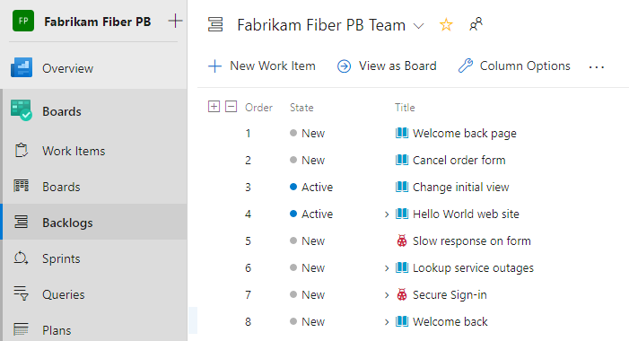

# Change a project process from Scrum to Agile

[!INCLUDE [temp](../../../_shared/version-vsts-only.md)]

You can change a project based on the Scrum process to use to use an inherited Agile process. This article provides the steps needed to make this change. 

[!INCLUDE [temp](../_shared/cloud-only-feature.md)]

Prior to making this change, we recommend you familiarize yourself with the process you are changing to. The Task, Bug, Feature, and Epic work item types are the same for both Scrum and Agile processes. Some State and Reason field values, however, are different.

| Process | Work item types | Workflow |
|------|---------|---------|
|**Scrum** | ||
|**Agile** | ||

For an overview of all processes and workflows for all work item types, see [Choose a process](../../../boards/work-items/guidance/choose-process.md).

Reasons you might want to change your process from Scrum to Agile:

- You want to use User Story and Story Points instead of Product Backlog Item and Effort.
- Your organization is requiring everyone to standardize their tracking with a customized inherited process based on the Agile process.

<!--- QUESTION: What happens to Analytics data when you do this change?  -->

[!INCLUDE [temp](../_shared/change-process-manual-steps.md)]

[!INCLUDE [temp](../_shared/prerequisites-change-process.md)]

[!INCLUDE [temp](../_shared/open-process-admin-context-ts-only.md)]

<a id="create-customize-process" />

## Create and customize an Agile inherited process

1. [Create a custom process](./manage-process.md) under Agile called "Agile - Inherited".

2. If the Product Backlog Item and Impediment work item types are used in your current Scrum-based project, you need to [add these work item types](./customize-process-wit.md) to the "Agile - Inherited" process.

   You don't have to add any details to these work item types as you'll be changing them later to User Story and Issue. However, if you have captured details within a field&mdash;such as Effort, Priority, or other field&mdash;then add those fields to the work item types.

3. When you are finished, your work item types list should appear as follows.

> [!div class="mx-imgBorder"]  
> 

## Change the process

1. Choose the process that contains the project you want to change. To change from Scrum to Agile, choose **Scrum** or a custom process based on Scrum.

   > [!div class="mx-imgBorder"]  
   > 

1. Choose **Projects**, and then choose the  actions icon for the project you want to change, and select **Change process**. Here we choose the Fabrikam Fiber PB project.

   > [!div class="mx-imgBorder"]  
   > 

   Follow the steps in the wizard.

1. Choose the **Agile - Inherited** process that you created earlier and then choose **Save**.

   > [!div class="mx-imgBorder"]  
   > 

   If you skipped step 2 of [Create and customize an Agile inherited process](#create-customize-process), you'll receive the following message to add the missing work item types.

   > [!div class="mx-imgBorder"]  
   > 

   Close the wizard dialog and add the missing work item types now.

1. Upon successful completion, the wizard displays the following information. Make a note of the steps to follow and then choose **Close**.

    > [!div class="mx-imgBorder"]  
    > 

    Steps to manually update your work items and board settings:
    - Update the column to state mapping for each team Kanban board.
    - Update existing work items using the work item types set by the target process.
    - Update existing work items using the correct state model of the target process.

## Update Kanban board column-to-state settings

You can customize Kanban boards to display intermediate columns. For each column added, you must choose a valid workflow state for the work item types displayed on the board. To learn more, see [Workflow states & state categories](../../../boards/work-items/workflow-and-state-categories.md).

1. For each team, [open your Kanban board](../../../boards/get-started/plan-track-work.md).

   > [!div class="mx-imgBorder"]  
   > 

1. Choose the **Correct this now** link or the  gear icon to configure the board settings.

   The Settings dialog opens. Those tabs that display a  required icon need correction.

   > [!div class="mx-imgBorder"]  
   > 

   Rename each column and choose the correct state for each column so that the column-to-state mapping is correct. As needed, add one or more columns. When done, choose **Save and close**.

   > [!div class="mx-imgBorder"]  
   > 

<!---

## Steps

1. [Create a custom process](./manage-process.md) under Agile called "Agile - Inherited".

2. If the work item types are being used by your project then [add the work item type](./customize-process-wit.md) Product Backlog Item and Impediment to the "Agile - Inherited" process.

  > [!div class="mx-imgBorder"]
  > 

3. Run the Change Process Wizard by going to Organization Settings > Process. Select the process that contains the project you want to change. For example, Agile. Click on the Projects tab and hover over the project. Click the ... context menu and select "Change Process". Follow the steps in the wizard.

  > [!div class="mx-imgBorder"]
  > 

4. Update the [board settings](../../../boards/get-started/customize-boards.md) for each board so that the column to state mapping is correct.

  > [!div class="mx-imgBorder"]
  > 

5. [Create a query](../../../boards/queries/using-queries.md) to get a list of all Product Backlog Items. Sort the list by state value. Highlight all Product Backlog Items and do a [change type](../../../boards/backlogs/remove-delete-work-items.md#change-the-work-item-type) to User Story. Next do a [bulk edit](../../../boards/backlogs/bulk-modify-work-items.md) to update work items to the right state for the User Story type. For example: Committed would change to Active. Do this for each state, one state at a time.

6. Adjust query to show only Issues. Highlight all Issue work items and a change type to be an Impediment. Do a bulk edit to update work items to the right state for the Impediment type. Do this for each state, one state at a time.

7. Adjust query to only show Tasks. Use bulk edit to update state value for all Tasks, one state at a time. Rinse and repeat the same process for Bugs, Epics, and Features.

  > [!div class="mx-imgBorder"]
  > 

8. [Change the process used by the project](./manage-process.md#change-the-process-used-by-a-project) to use the system Agile process

-->

## Update work items

Your next step is to bulk update work items. The recommended sequence is:

- Create a work item query that displays all work items that need update.
- Perform a bulk update to change the work item type of Product Backlog Item work items to User Story.
- Perform a bulk update on all States to change from Scrum states&mdash;Approved, Committed, and Done&mdash;to Agile process states&mdash;Active, Resolved, and Closed.

1. [Create a query](../../../boards/queries/using-queries.md) to get a list of all Product Backlog Items, Impediments, Features, Tasks, and Epics. You will need to change the work item type of the first two work item types, and the State and Reason fields for all items.

   > [!div class="mx-imgBorder"]  
   > 

2. Choose the  actions icon and then select **Column options**. Choose to show the State and Reason fields. Choose the **Sort** tab, and set it to sort the list by work item type and state value.

   > [!div class="mx-imgBorder"]  
   > 

3. Choose **Results** to just show the list of work items.

4. Highlight all User Stories, choose the  actions icon, select **Change type**, and change the type to Product Backlog Item.

   > [!div class="mx-imgBorder"]  
   > 

   For more details, see [Move, change, or delete work items, Change the work item type](../../../boards/backlogs/remove-delete-work-items.md#change-the-work-item-type).

   It's possible that you will receive errors where the work item type and the state are mismatched. In that case, you can't save your changes until you update the state as described in the next step.

   > [!div class="mx-imgBorder"]  
   > 

5. Highlight all work items of the same State, such as Resolved, choose the  actions icon, and then select **Edit**. Add the State field and select Committed or a valid value for the Product Backlog Item. You may also need to update the Reason field. For details, see [Bulk edit work items](../../../boards/backlogs/bulk-modify-work-items.md).

   > [!div class="mx-imgBorder"]  
   > 

   This should result in an updated list without errors.

   > [!div class="mx-imgBorder"]  
   > 

6. To save your changes, choose the  actions icon and select **Save items**.

7. Repeat the above steps to change the work item type for Impediment to Issue, and update the states to valid states for the work item types.

8. When done, make sure you choose the  actions icon and select **Save items**.

> [!TIP]  
> If you have a number of field value changes, such as populating the Story Points field with the value held in Effort, you can do that using Excel. See [Bulk add or modify work items with Excel](../../../boards/backlogs/office/bulk-add-modify-work-items-excel.md).

## Verify your changes

1. Go to your team backlog and verify that the backlog items appear as expected.

   > [!div class="mx-imgBorder"]  
   > 

1. Go to your team board and verify that the column settings are valid.

   > [!div class="mx-imgBorder"]  
   > 

   To add columns or change column names, see [Add columns to your Kanban board](../../../boards/boards/add-columns.md).

## Optional updates

After changing the process, you may want to make additional updates as follows:

- [Change the project name](../../../organizations/projects/rename-project.md)
- [Update your project summary or vision](../../../organizations/projects/project-vision-status.md)
- Disable or delete the work item types that won't be used going forward. See [Customize a work item type for an inherited process](customize-process-wit.md#enable-disable)

## Related articles

- [Bulk modify work items](../../../boards/backlogs/bulk-modify-work-items.md)
- [Change the process used by a project](./manage-process.md#change-the-process-used-by-a-project)
- [Create an inherited process](./manage-process.md#create-an-inherited-process)
- [Add and manage work item types](./customize-process-wit.md)
- [Show bugs on backlogs and boards](../show-bugs-on-backlog.md)
- [Customize your boards](../../../boards/get-started/customize-boards.md)
- [Create and saved managed queries with the query editor](../../../boards/queries/using-queries.md)
