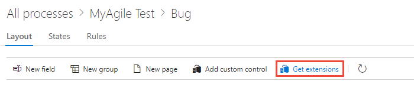
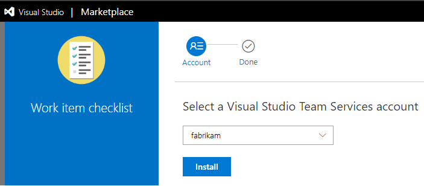
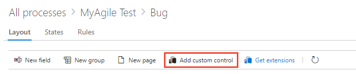

# Add extensions and custom controls to a work item type  (Inheritance process)  

[!INCLUDE [temp](../../../boards/_shared/version-vsts-plus-azdevserver-2019.md)]

With extensions, you can add rich functionality to your work item forms. An extension comes in four flavors, or contribution types. The following controls appear on the web form layout for all inherited and customizable work item types (WITs):    
- Field-level contribution (custom controls) 
- Group-level contribution 
- Page-level contribution

The fourth type, action-level contributions, on the other hand, appear in the context menu of the web form.  

[!INCLUDE [temp](../_shared/note-on-prem-link.md)]

You add all contributions by installing its extension from the [Visual Studio Marketplace](https://marketplace.visualstudio.com/azuredevops), Azure DevOps tab. Or, you can [create your own custom control](../../../extend/get-started/node.md).

For example, you can add the [**Who recently viewed a work item?** extension](https://marketplace.visualstudio.com/items?itemName=mmanela.vsts-workitem-recentlyviewed). This group-level contribution appears in your work item form as shown.

[!INCLUDE [temp](../_shared/process-prerequisites.md)] 

To add extensions or edit a process, you must be a member of the Project Collection Administrators group or be [granted explicit permissions to edit a specific process](../../../organizations/security/set-permissions-access-work-tracking.md#process-permissions).

[!INCLUDE [temp](../_shared/open-process-admin-context-ts.md)]

[!INCLUDE [temp](../_shared/automatic-update-project.md)] 

## Review installed Marketplace extensions   

From the **Settings** context, **Extensions**, you can view the extensions that are already installed. You may need to choose  to refresh the page to show newly installed extensions.  

   

To learn more about extensions, see [Install free extensions](../../../marketplace/install-extension.md).

## Add a Marketplace extension   

You can [browse the Marketplace](https://marketplace.visualstudio.com/search?term=control%20group%20tab%20page&target=vsts&category=Plan%20and%20track&hosting=cloud&sortBy=Relevance) to determine what extension(s) you want to add.

0. To add an extension to a work item type, choose your inherited process, the WIT, and then choose **Get extensions**.
 
	> [!div class="mx-imgBorder"]  
	>  

0. Select the extension you want to add. Here we choose the Work item checklist.

0. Select the organization you want to add it to and choose **Install**.  

	> [!div class="mx-imgBorder"]  
	>  

	> [!IMPORTANT]  
	> Extensions you install are added to all WITs across all processes.

0. Return to the process and WIT and verify the location of the extension is where you want it. Look for it at the bottom of the middle column and drag it to where you want it on the form. 

	> [!div class="mx-imgBorder"]  
	>  

## Add a field-level contribution or custom control 

0. Install the [custom control](#add-extension) as discussed in the previous section.  
  
0. Open **Settings>Work>Process** from a work item form. For details, see [Open Settings>Process](add-custom-wit.md#open-process-wit).

0. (Optional) [Add a field](customize-process-field.md#add-custom-field) to associate with the custom control. Alternatively, you can specify an existing field, inherited or custom. 

0. With the WIT selected, choose **Add custom control**. 

	> [!div class="mx-imgBorder"]  
	>  

	> [!NOTE]    
	> If you don't see the **Add custom control** option, then you haven't installed a field-level extension. Or, you may need to refresh your browser to cause your browser to register any new extensions that have been recently installed. 
	
0. Choose the custom control you want from the menu of options. 

	For example, here we choose the Toggle control that you can associate with a Boolean field.

	> [!div class="mx-imgBorder"]  
	>  

1. Choose the **Options** tab and fill out the dialog box. The options you need to specify depend on the custom control you've selected.

	For example, here we specify the custom field, Triaged, and indicate the toggle labels to appear on the form.

	

0. (Optional) Open the **Layout** tab and specify the label for the field. 
 
	Fill in any additional required fields. Review the extension description for guidance. 

0.	Verify the working of the custom control by opening a work item of the type you modified. You may need to refresh your browser to see your changes.  

	Here, we show how the control appears by default with the checkbox and then with the toggle control.  

	<table>
	<tr><th>Boolean field with checkbox</th>
	<th>Boolean field with toggle control</th></tr> 
	<tr><td></td>
	<td></td>
	</tr> 
	</table>

## Group-level and page-level contributions

When you add group-level and page-level contributions, they are automatically added to all WITs defined for all processes, both inherited and custom. You can choose to [hide these contributions from appearing on the form](customize-process-field.md#show-hide-field) for a specific WIT, or move it within the form from it's default location. 

If you've installed a group or page contribution, refresh your browser, and then open a work item to view the placement of the contribution on the form. To move or hide the contribution, [follow the guidance provided for the Layout tab](customize-process-form.md).  

## Action-level contributions

Action-level contributions are added to the context menu of inherited and customizable WITs for both system and inherited processes. All action-level contributions are added to all work item types and cannot be hidden or removed without [uninstalling or disabling the extension](../../../marketplace/uninstall-disable-vsts-extensions.md).  

For example, the following image shows nine action-level contributions have been added and appear in the context menu for the user story.  

 

## Programmatically add custom controls 
You can use these REST APIs to work with extensions:   
- [Extend the work item form](../../../extend/develop/add-workitem-extension.md)  
- [Add a custom control to the work item form](../../../extend/develop/custom-control.md)  

## Related articles 

- [Add a custom field to a work item type](customize-process-field.md)  
- [Customize a work item type](customize-process-wit.md)
- [Customize the web layout](customize-process-form.md)
- [Customize a project using an inherited process](customize-process.md)  

