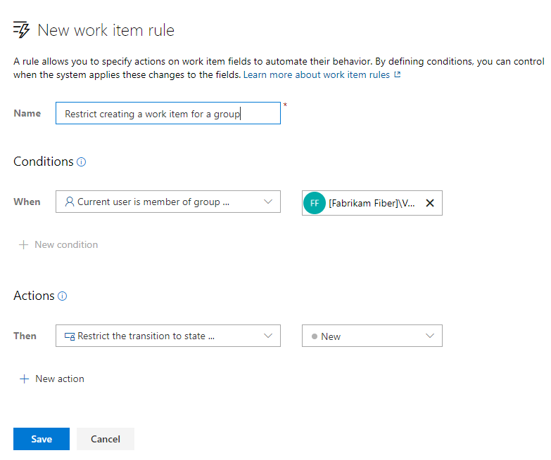

# Add a rule to a work item type (Inheritance process)

[!INCLUDE [temp](../../../boards/includes/version-vsts-plus-azdevserver-2019.md)]

Custom rules provide support for a number of business use cases, allowing you to go beyond setting a default value for a field or make it required. Rules allow you to clear the value of a field, copy a value into a field, and apply values based on dependencies between different fields' values.

[!INCLUDE [temp](../includes/note-on-prem-link.md)]

With a custom rule, you can define a number of actions based on specific conditions. For example, you can apply a rule to support these types of scenarios:

- When a value is defined for Priority, then make Risk a required field
- When a change is made to the value of Release, then clear the value of "Milestone"
- When a change was made to the value of Remaining Work, then make Completed Work a required field
- When the value of Approved is True, then make Approved By a required field
- When a user story is created, make the following fields required: Priority, Risk, and Effort
- When current user is a member of "Project Administrators", then make Priority required
- When current user is not a member of "Project Administrators", then hide the Priority field

> [!NOTE]  
> You make a field required and specify a field default through the [**Options** tab for the field](customize-process-field.md#options).

## Rule composition

Each rule consists of two parts: Conditions and Actions. Conditions define the circumstances which must be met in order for the rule to be applied. Actions define the operations to perform. You can specify a maximum of two conditions and 10 actions per rule. All custom rules require all conditions to be met in order to be run. 

> [!NOTE]  
> Currently, only 1 condition is supported for state-transition rules. If you're applying rules based on State, see [Apply rules to workflow states](apply-rules-to-workflow-states.md).

As an example, you can make a field required based on the value assigned to the state and another field. For example:
&nbsp;&nbsp;&nbsp;`(Condition) When a work item State is *Active*`
&nbsp;&nbsp;&nbsp;`(Condition) And when the value of *Value Area* = *Business*`  
&nbsp;&nbsp;&nbsp;`(Action) Then make required *Story Points*`

::: moniker range="azure-devops"

> [!div class="mx-tdBreakAll"]  
> |Supported conditions |Supported actions |
> |-------------|----------|  
> | | 

> [!NOTE]  
> The following conditions and actions are only available for Azure DevOps Services.  
> - Conditions:
>     - `A work item state moved from ...`  
>     - `Current user is member of group...`  
>     - `Current user is not member of group ...`   
> - Action:  
>     - `Restrict the transition to state...`   
::: moniker-end

::: moniker range="azure-devops-2019"

> [!div class="mx-tdBreakAll"]  
> |Supported conditions |Supported actions |
> |-------------|----------|  
> | | 

::: moniker-end

Rules are always enforced, not only when you are interacting with the form but also when interfacing through other tools. For example, setting a field as read-only not only applies the rule on the work item form, but also through the API and Excel based Add-in.

[!INCLUDE [temp](../includes/tip-formula-rule.md)]

[!INCLUDE [temp](../includes/process-prerequisites.md)]

[!INCLUDE [temp](../includes/open-process-admin-context-ts.md)]

[!INCLUDE [temp](../includes/automatic-update-project.md)]

## Add a custom rule

You add fields to a selected work item type.

1.  Select the WIT to which you want to add a rule, choose **Rules**, and then choose **New rule**.

    > [!div class="mx-imgBorder"]  
    > 

    If you can't fill out the New work item rule dialog, you don't have the necessary permissions to edit the process. See [Set permissions and access for work tracking, Customize an inherited process](../../../organizations/security/set-permissions-access-work-tracking.md#customize-an-inherited-process).

1.  Name the rule and select the condition(s) and action(s) from the dropdown menus.

    > [!TIP]  
    > Specify a name that builds off the field(s) you're acting on, or the conditions you're setting.

    Here we define that the **Acceptance Criteria** field is required when the **State** changes to **Active** and it is currently empty.

      

    > [!TIP]  
    > You can specify the State field by entering System.State. While you'll see a message that indicates it isn't a valid field, if the Save button is active, then you can save the rule.

	The sequence of actions you specify doesn't impact the behavior of the rule itself or its behavior with respect to other rules defined for the same WIT.

1.  Once you've added a custom rule, open a work item and verify that the rule works as you intended.

## Delete or disable a rule

You can temporarily disable a rule or delete it altogether.

You delete or disable the rule from the actions menu of the rule.

  

## Restrict modification of closed work items

[!INCLUDE [temp](../../../includes/restrict-modification-closed-wi.md)]

::: moniker range="azure-devops"

## Restrict modification of work items based on a user or group

You can add rules to work item types to support these restriction requests:

- Restrict who can modify a specific field for a work item type
- Hide field from the form

 
- Restrict who can create or modify a work item
- Restrict who can create a work item types 

For example, the following rule disallows members of the Fabrikam Fiber\Voice group to create the User Story work item type as they can't transition the work item to the New state. When a user of this group opens a new User Story, they are unable to save it as the State field can't automatically be set to New.

> [!div class="mx-imgBorder"]  
> 

> [!NOTE]   
> Depending on the rule action you specify, either the **Save** button on the work item form may be disabled, or an error message displays when a restricted user attempts to create or modify the work item. 

::: moniker-end

## Related articles

[!INCLUDE [temp](../includes/note-audit-log-support-process.md)]

- [Customize the web layout](customize-process-form.md)
- [Customize a project using an inherited process](customize-process.md)
