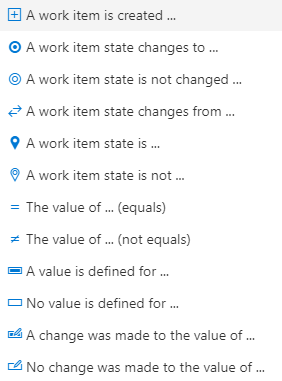
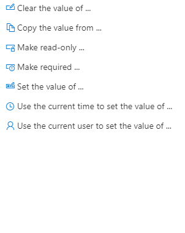
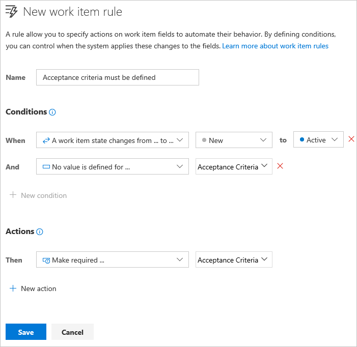
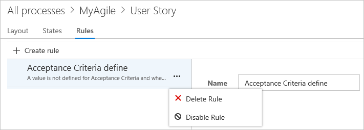

# Add a rule to a work item type (Inheritance process)   

[!INCLUDE [temp](../../../boards/_shared/version-vsts-plus-azdevserver-2019.md)]

Custom rules provide support for a number of business use cases, allowing you to go beyond setting a default value for a field or make it required. Rules allow you to clear the value of a field, copy a value into a field, and apply values based on dependencies between different fields' values. 

> [!NOTE]     
> You make a field required and specify a field default through the [**Options** tab for the field](customize-process-field.md#options).

With a custom rule, you can define a number of actions based on specific conditions. For example, you can apply a rule to support these types of scenarios: 

- When a value is defined for Priority, then make Risk a required field 
- When a change is made to the value of Release, then clear the value of "Milestone"     
- When a change was made to the value of Remaining Work, then make Completed Work a required field
- When the value of Approved is True, then make Approved By a required field 
- When a user story is created, make the following fields required: Priority, Risk, and  Effort

[!INCLUDE [temp](../_shared/note-on-prem-link.md)]

 

## Rule composition  

Each rule consists of two parts: Conditions and Actions. Conditions define the circumstances which must be met in order for the rule to be applied. Actions define the operations to perform. You can specify a maximum of two conditions and 10 actions per rule. All custom rules require all conditions to be met in order to be run. 

Rules are always enforced, not only when you are interacting with the form but also when interfacing through other tools. For example, setting a field as read-only not only applies the rule on the work item form, but also through the API and Excel based Add-in.
 
As an example, you can make a field required based on the value assigned to the state and another field. For example:
&nbsp;&nbsp;&nbsp;`(Condition) When a work item State is *Active*` 
&nbsp;&nbsp;&nbsp;`(Condition) And when the value of *Value Area* = *Business*`   
&nbsp;&nbsp;&nbsp;`(Action) Then make required *Story Points*`   

> [!div class="mx-tdBreakAll"]  
> |Supported conditions |Supported actions  |
> |-------------|----------|  
> | | 

[!INCLUDE [temp](../_shared/tip-formula-rule.md)]

[!INCLUDE [temp](../_shared/process-prerequisites.md)] 

[!INCLUDE [temp](../_shared/open-process-admin-context-ts.md)]
 
[!INCLUDE [temp](../_shared/automatic-update-project.md)] 

## Add a custom rule 

You add fields to a selected work item type.  
	
1. Select the WIT to which you want to add a rule, choose **Rules**, and then choose **New rule**.   

	> [!div class="mx-imgBorder"]  
	>   

	If you can't fill out the New work item rule dialog, you don't have the necessary permissions to edit the process. See [Set permissions and access for work tracking, Customize an inherited process](../../../organizations/security/set-permissions-access-work-tracking.md#customize-an-inherited-process).

0. Name the rule and select the condition(s) and action(s) from the dropdown menus.     

	> [!TIP]  
	>Specify a name that builds off the field(s) you're acting on, or the conditions you're setting.  
	
	Here we define that the Acceptance Criteria field is required when the State changes to Active and it is currently empty. 

     
 
	> [!NOTE]    
	>The sequence of actions you specify doesn't impact the behavior of the rule itself or its behavior with respect to other rules defined for the same WIT. 

0. Once you've added a custom rule, open a work item and verify that the rule works as you intended. 

## Delete or disable a rule     

You can temporarily disable a rule or delete it altogether.  

You delete or disable the rule from the actions menu of the rule.  

  

## Related articles   

- [Customize the web layout](customize-process-form.md)
- [Customize a project using an inherited process](customize-process.md)    

<!---
 - A work item state changes to a selected state - A work item state changes from one state to another state - A work item is created - A work item state is in a selected state - The value of a field equals a specified value - The value of a field does not equal a specified value - A value is defined for a field - No value is defined for a field - A change was made to the value of a field - No change was made to the value of a field 
 - Clear the value of a field - Copy the value of a field to another field - Make a field read-only   - Make a field required - Set the value of a field - Set the value of a field to the current date-time - Set the value of a field to the current user   

-->