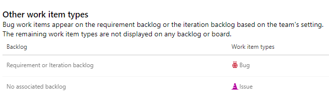
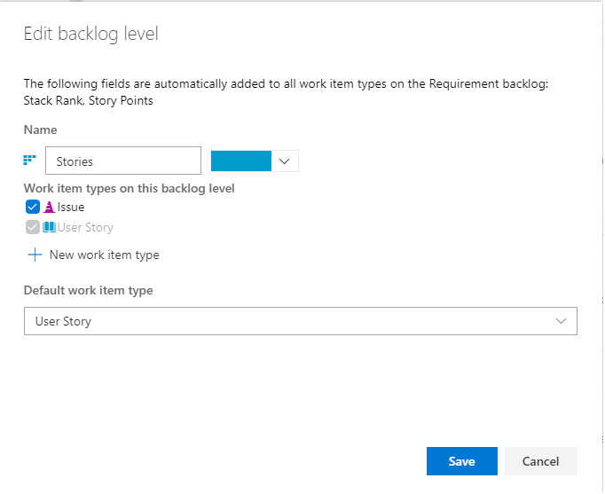
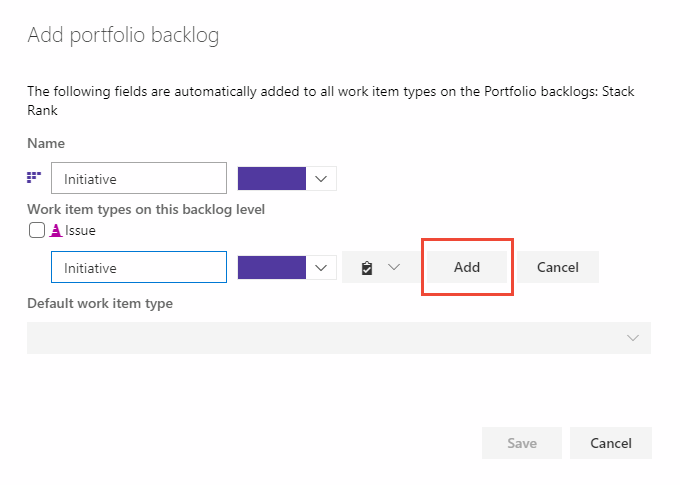
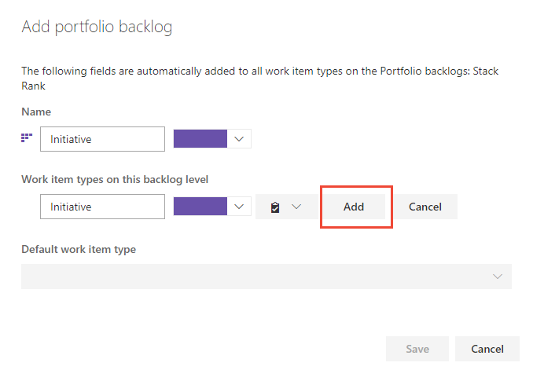
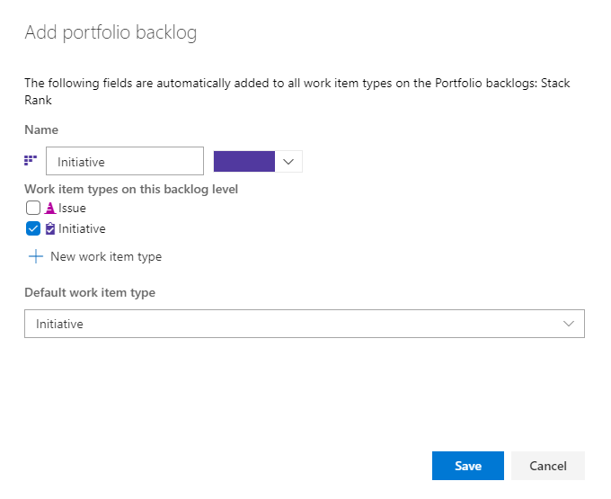
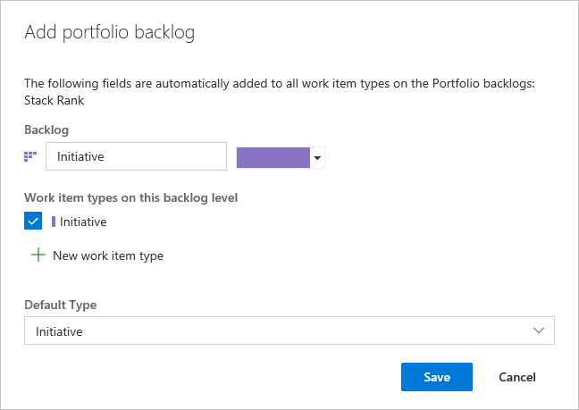
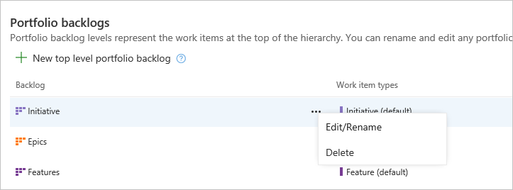
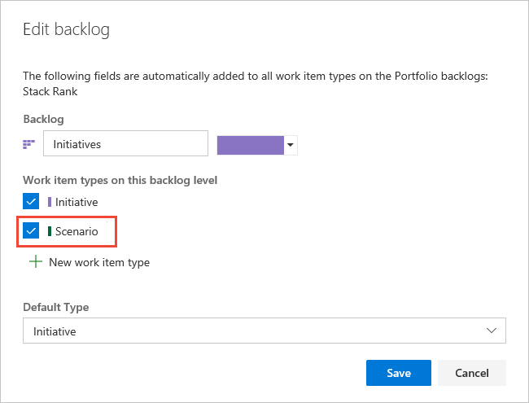
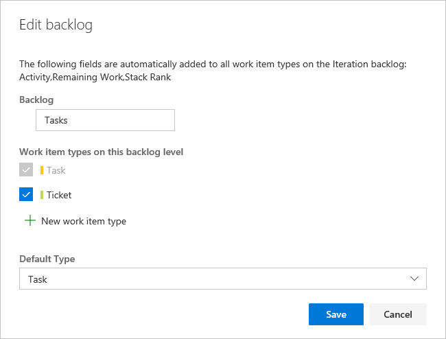

# Customize your backlogs or boards (Inheritance process)  

[!INCLUDE [temp](../../../boards/includes/version-vsts-plus-azdevserver-2019.md)]    

You can customize your backlogs to add more levels or add custom work item types to them. As shown below, we've added a third level portfolio backlog labeled *Initiatives* which tracks the custom *Initiative* work item type, and we've renamed the product backlog to *Stories and Tickets* to indicate that we not only track *User Stories*, but also *Customer Tickets* on the product backlog. 
 
> [!div class="mx-imgBorder"]  
>  

Your project defines two portfolio backlogs: Features and Epics. However, if you need one or more additional portfolio backlogs, you can add them.   

[!INCLUDE [temp](../includes/note-on-prem-link.md)]

Portfolio backlogs are useful for organizing your backlog under various business initiatives and user scenarios. When you [organize your backlogs into portfolios](../../../boards/backlogs/organize-backlog.md), you can gain a hierarchical view of the work defined in lower-level backlogs, including work in progress across several teams. Program managers can track the status of those backlog items of interest and drill down to ensure that all work is represented.  

To learn more about what you can customize, see [About process customization and inherited processes](inheritance-process-model.md). 
 
 
::: moniker range="azure-devops-2019"
> [!NOTE]    
> You can't add an inherited work item type to any backlog level. For example, you can't add the Issue or Impediment work item type to the product backlog. 
 
::: moniker-end 

## Supported customizations

[!INCLUDE [temp](../includes/process-customize-backlogs.md)]

[!INCLUDE [temp](../../../boards/includes/note-azure-devops-2020-1-updates.md)]

<a id="add-oob-to-backlog" /> 

::: moniker range=">= azure-devops-2020"

## Add a system work item type to a backlog  

If you want to track Issues or Impediments or other inherited work item types within a backlog or board, you can by editing the corresponding backlog. The following table lists the available work item types you can add to a backlog. 

---
:::row:::
   :::column span="1":::
      **Process**
   :::column-end:::
   :::column span="2":::
      **Work item types**
   :::column-end:::
:::row-end:::
---
:::row:::
   :::column span="1":::
      Agile
   :::column-end:::
   :::column span="2":::
      Issue
   :::column-end:::
:::row-end:::
---
:::row:::
   :::column span="1":::
      Scrum
   :::column-end:::
   :::column span="2":::
      Impediment
   :::column-end:::
:::row-end:::
---
:::row:::
   :::column span="1":::
      CMMI
   :::column-end:::
   :::column span="2":::
      Change Request, Issue, Review, Risk 
   :::column-end:::
:::row-end:::
---

Each **Edit backlog level** dialog automatically includes inherited and custom work item types which haven't been assigned to other backlog levels. For example, unassigned Agile work item types are listed under the **Other work item types** section as shown in the following image

> [!div class="mx-imgBorder"]  
>  

These same work item types, along with any custom work item types, appear in the **Edit backlog level** dialog of all backlog levels, until they are assigned to a particular backlog level. 

> [!div class="mx-imgBorder"]  
>  
 

> [!NOTE] 
> You can't remove the default, inherited work item type from any backlog level, but you can disable the corresponding work item type. For example, you can disable the User Story work item type for the Agile Requirement backlog as long as you have added another work item type to support that backlog. 

::: moniker-end 

## Fields added to work item types 

When you add a work item type to a backlog level, the following fields are added to the work item type definition as hidden fields (that is, they don't appear on the work item form) to support select Agile tool features.    

| Backlog level | Fields added | 
|---------------|--------------|
| Portfolio backlog |- Stack rank (Agile, CMMI) - Backlog Priority (Scrum) | 
| Requirement backlog |- Stack Rank, Story Points (Agile) - Stack Rank, Size (CMMI) - Backlog Priority, Effort (Scrum) |
| Iteration backlog |- Activity, Remaining Work, Stack Rank (Agile) - Discipline, Remaining Work, Stack Rank (CMMI) - Activity, Remaining Work, Backlog Priority (Scrum) |

The Stack Rank and Backlog Priority fields capture the relative priority of work items as they are reordered on a backlog or board. For details on it's usage, see [Behind the scenes: the Backlog Priority or Stack Rank field](https://blogs.msdn.microsoft.com/devops/2014/05/14/behind-the-scenes-the-backlog-priority-or-stack-rank-field/). 

The Story Points, Size, and Effort fields capture the relative work required to complete a WIT assigned to the Requirement backlog. This value is used to compute [velocity](../../../report/dashboards/team-velocity.md).  

And, lastly, Remaining Work is used in [Sprint burndown and capacity charts](../../../boards/sprints/define-sprints.md). 

[!INCLUDE [temp](../includes/process-prerequisites.md)] 

[!INCLUDE [temp](../includes/open-process-admin-context-ts.md)]
 
[!INCLUDE [temp](../includes/automatic-update-project.md)] 

## Add or edit portfolio backlogs 

The Agile, Scrum, and CMMI system processes defines two default portfolio backlogs, Epics and Features. Each is associated with their corresponding work item types, Epic and Feature. The Basic process only defines the Epics backlog and Epic work item type. For more information about each process, see [Choose a process](../../../boards/work-items/guidance/choose-process.md).

You can add a custom work item type when adding or editing a portfolio backlog, or you can choose a work item type you've previously added. Only those work item types that don't belong to another backlog level appear for selection. 
 

### Add a portfolio backlog  

You can add a portfolio backlog and custom work item type following these steps. 
	
1. From the  **Backlog levels** page, choose :::image type="icon" source="../../../media/icons/blue-add-icon.png" border="false"::: **New top level portfolio backlog**. 

	> [!div class="mx-imgBorder"]  
	>  

1. Name the backlog level, select the backlog level color, and add the work item type  to associate with this level. Click **Add**. 

	::: moniker range=">= azure-devops-2020"
	> [!div class="mx-imgBorder"]  
	>  
	::: moniker-end 
	::: moniker range="azure-devops-2019"
	> [!div class="mx-imgBorder"]  
	>  
	::: moniker-end 

1. If you are associating only one work item type with the backlog, then choose **Save** to save your changes. Otherwise, you can add more work item types as needed. 

	::: moniker range=">= azure-devops-2020"
	> [!div class="mx-imgBorder"]  
	> 
	::: moniker-end 
	::: moniker range="azure-devops-2019"
	> [!div class="mx-imgBorder"]  
	>  
	::: moniker-end 

### Edit, rename, or delete a portfolio backlog 

From the **Backlog levels** page, choose the :::image type="icon" source="../../../media/icons/actions-icon.png" border="false":::  context menu of a portfolio backlog to edit, rename, or delete it.  

Deleting a backlog level removes the backlog and board associated with the level for all teams, including customizations made to them. The work items defined with the associated work item types are not deleted or affected in any way. 

  

> [!NOTE]    
> You can't remove the default, inherited work item type from the Epics or Features portfolio backlogs. However, you can disable these work item types and that effectively removes them from the user interface.  

## Edit or rename the requirement backlog 

The Requirement backlog, also referred to as the product backlog, defines the work item types that appear on the product backlog and Kanban board. The default work item type for Agile is User Story; for Basic, Issue; for Scrum, Product Backlog Item; and for CMMI, Requirement. 

You can rename the backlog, change the color, add work item types, and change the default work item type. Open the Edit backlog dialog from the context menu for the Requirements backlog. 
 

::: moniker range=">= azure-devops-2020"

Here, we've renamed the backlog, added **Customer Ticket** and **Issue**, and changed the default type to *Customer Ticket*. Check those boxes of the work item types to include on the backlog. 

:::image type="content" source="media/backlogs/add-oob-issue-to-backlog.png" alt-text="On Edit backlog, Stories and Tickets is entered in Name, and there is a list of work item types for this backlog level.":::
 

::: moniker-end  

::: moniker range="azure-devops-2019"

Here, we've renamed the backlog, added *Customer Ticket*, and changed the default type to *Customer Ticket*. 

  
::: moniker-end  
 

> [!NOTE]    
> You can't remove the default, inherited work item type from the Requirements backlog. However, you can disable the work item type and that effectively removes it from the user interface.  

## Edit the iteration backlog 

The Iteration backlog, also referred to as the sprint backlogs, defines the work item types that are displayed on the sprint backlogs and Taskboards. The default work item type for all processes is Task.  

For the iteration backlog, you can add work item types and change the default work item type. Open the Edit backlog dialog from the context menu for the Iteration backlog. 

Here, we've added the *Ticket* work item type which is tracked along with tasks. 

  

> [!NOTE]    
> You can't remove the default, inherited work item type from the Iteration backlog. However, you can disable the work item type and that effectively removes it from the user interface. 

## Related articles  

[!INCLUDE [temp](../includes/note-audit-log-support-process.md)]

- [Add a custom work item type](add-custom-wit.md)  
- [Customize a project using an inherited process](customize-process.md)  
- [Backlogs, boards, and plans](../../../boards/backlogs/backlogs-boards-plans.md)  
- [Create your backlog](../../../boards/backlogs/create-your-backlog.md)  
- [Organize your backlog, work with portfolio backlogs](../../../boards/backlogs/organize-backlog.md)  

