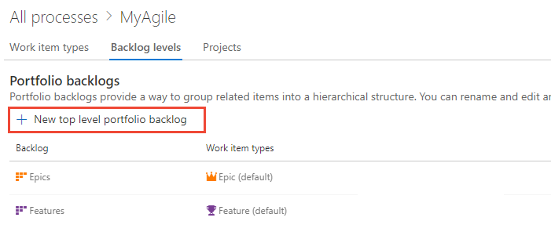
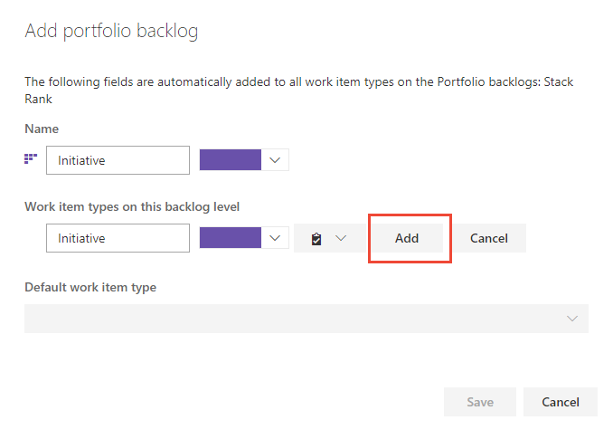
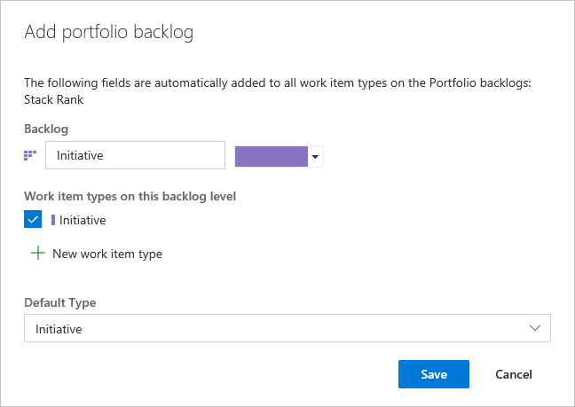
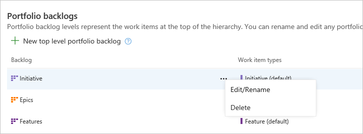
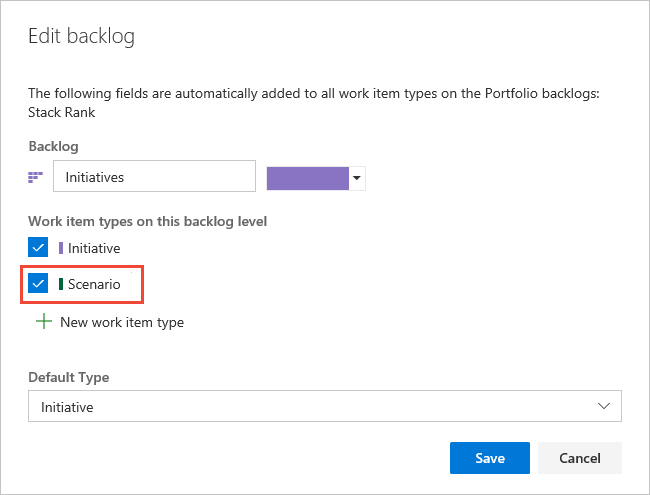
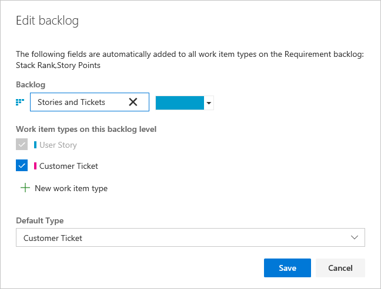
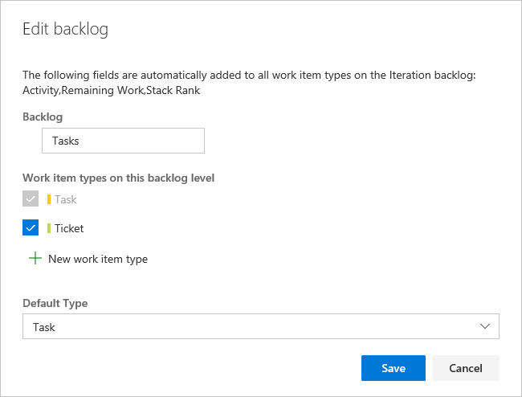

# Customize your backlogs or boards (Inheritance process)  

[!INCLUDE [temp](../../../boards/_shared/version-vsts-plus-azdevserver-2019.md)]    

You can customize your backlogs to add more levels or add custom work item types (WITs) to them. As shown below, we've added a third level portfolio backlog labeled *Initiatives* which tracks the custom *Initiative* WIT, and we've renamed the product backlog to *Stories and Tickets* to indicate that we not only track *User Stories*, but also *Customer Tickets* on the product backlog. 
 
> [!div class="mx-imgBorder"]  
>  

Your project comes equipped with two portfolio backlogs: Features and Epics. However, if you need one or more additional portfolio backlogs, you can add them.   

[!INCLUDE [temp](../_shared/note-on-prem-link.md)]

Portfolio backlogs are useful for organizing your backlog under various business initiatives and user scenarios. When you [organize your backlogs into portfolios](../../../boards/backlogs/organize-backlog.md), you can gain a hierarchical view of the work defined in lower-level backlogs, including work in progress across several teams. Program managers can track the status of those backlog items of interest and drill down to ensure that all work is represented.  

To learn more about what you can customize, see [About process customization and inherited processes](inheritance-process-model.md). 

[!INCLUDE [temp](../_shared/process-prerequisites.md)] 

[!INCLUDE [temp](../_shared/open-process-admin-context-ts.md)]
 
[!INCLUDE [temp](../_shared/automatic-update-project.md)] 

## Add or edit portfolio backlogs 

Each process defines two default portfolio backlogs, Epics and Features; each is associated with their corresponding work item types, epics and features. 

You can add a custom work item type when adding or editing a portfolio backlog, or you can choose a work item type you've previously added. Only those work item types that don't belong to another backlog level appear for selection. 
 

### Add a portfolio backlog 
	
1. From the  **Backlog levels** page, choose  **New top level portfolio backlog**. 

	> [!div class="mx-imgBorder"]  
	>  

0. Name the backlog level, select the backlog level color, and add the work item type  to associate with this level. Click Add. 

	> [!div class="mx-imgBorder"]  
	>  

0. If you are associating only one work item type with the backlog, then click Save to save your changes. Otherwise, you can add more work item types as needed. 

	 

### Edit, rename, or delete a portfolio backlog 

Open the context menu of a portfolio backlog that you've added to edit, rename, or delete it. From the Backlog levels page, open the Add portfolio backlog dialog. 

> [!NOTE]    
> You can't can't add an inherited WIT to any backlog level. 

Deleting a backlog level removes the backlog and board associated with the level for all teams, including customizations made to them. The work items defined with the associated work item types are not deleted or affected in any way. 

> [!NOTE]    
> You can't remove the default, inherited WIT from the Epics or Features portfolio backlogs. 

## Edit or rename the requirement backlog 
The Requirement backlog, also referred to as the product backlog, defines the WITs that appear on the product backlog and Kanban board. The default WIT for Agile is User Story; for Scrum, Product Backlog Item; and for CMMI, Requirement. 

You can rename the backlog, change the color, add WITs, and change the default WIT. Open the Edit backlog dialog from the context menu for the Requirements backlog. 

Here, we've renamed the backlog, added *Customer Ticket*, and changed the default type to *Customer Ticket*. 

> [!NOTE]    
>You can't remove the default, inherited WIT from the Requirements backlog. 

## Edit the iteration backlog 
The Iteration backlog, also referred to as the sprint backlogs, defines the WITs that are displayed on the sprint backlogs and task boards. The default WIT for all processes is Task.  

For the iteration backlog, you can add WITs and change the default WIT. Open the Edit backlog dialog from the context menu for the Iteration backlog. 

Here, we've added the *Ticket* WIT which is tracked along with tasks. 

> [!NOTE]    
> You can't remove the default, inherited WIT from the Iteration backlog. 

## Related articles  

- [Add a custom work item type](add-custom-wit.md)
- [Customize a project using an inherited process](customize-process.md) 
- [Backlogs, boards, and plans](../../../boards/backlogs/backlogs-boards-plans.md)    
- [Create your backlog](../../../boards/backlogs/create-your-backlog.md)
- [Organize your backlog, work with portfolio backlogs](../../../boards/backlogs/organize-backlog.md)

