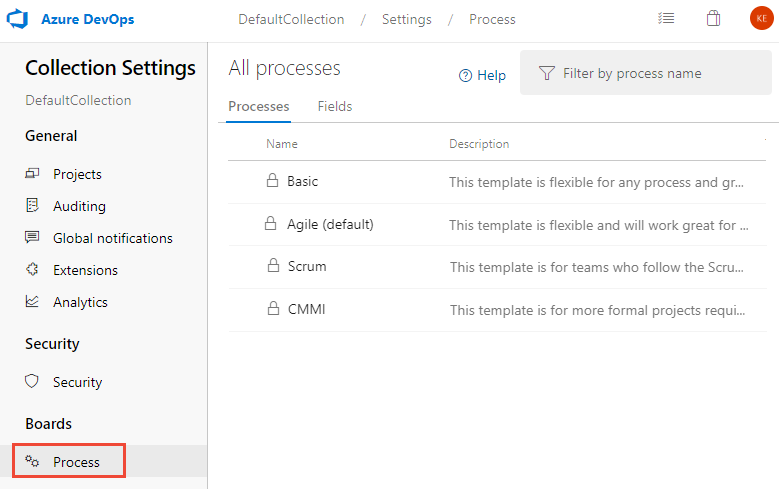

# Customize backlogs and boards (Inheritance process)  

[!INCLUDE [version-lt-eq-azure-devops](../../../includes/version-lt-eq-azure-devops.md)]    

In your project, you currently have two predefined portfolio backlogs: "Features” and “Epics."
But, if your project requires more portfolio backlogs, you can create them.

[!INCLUDE [temp](../includes/note-on-prem-link.md)]

**Benefits of portfolio backlogs:**
- **Organizing work:** Portfolio backlogs allow you to organize work based on business initiatives, user scenarios, or other relevant criteria.
- **Hierarchical view:** By [structuring backlogs into portfolios](../../../boards/backlogs/organize-backlog.md), you gain a hierarchical view of work, which includes items defined in lower-level backlogs (such as user stories, features, or tasks).
- **Cross-team visibility:** Program managers can track the status of backlog items across multiple teams. They can drill down to ensure that all work is adequately represented.

For more information, see [About process customization and inherited processes](inheritance-process-model.md). 

In the following example, we added a third level portfolio backlog labeled *Initiatives*, which tracks the custom *Initiative* work item type. We also renamed the product backlog to *Stories and Tickets* to indicate that we not only track *User Stories*, but also *Customer Tickets* on the product backlog. 

> [!div class="mx-imgBorder"]  
>  

 

## Supported customizations

[!INCLUDE [temp](../includes/process-customize-backlogs.md)]

[!INCLUDE [temp](../../../boards/includes/note-azure-devops-2020-1-updates.md)]

<a id="add-oob-to-backlog"></a> 

::: moniker range=">= azure-devops-2020"

## Add a system work item type to a backlog  

If you want to track Issues or Impediments or other inherited work item types within a backlog or board, edit the corresponding backlog. The following table lists the available work item types you can add to a backlog. 
::: moniker-end 

::: moniker range="azure-devops-2020"
> [!NOTE]   
> This feature requires Azure DevOps Server 2020.1 update or later version.
::: moniker-end 

::: moniker range=">= azure-devops-2020"

---
:::row:::
   :::column span="1":::
      **Process**
   :::column-end:::
   :::column span="2":::
      **Work item types**
   :::column-end:::
:::row-end:::
---
:::row:::
   :::column span="1":::
      Agile
   :::column-end:::
   :::column span="2":::
      Issue
   :::column-end:::
:::row-end:::
---
:::row:::
   :::column span="1":::
      Scrum
   :::column-end:::
   :::column span="2":::
      Impediment
   :::column-end:::
:::row-end:::
---
:::row:::
   :::column span="1":::
      CMMI
   :::column-end:::
   :::column span="2":::
      Change Request, Issue, Review, Risk 
   :::column-end:::
:::row-end:::
---

Each **Edit backlog level** dialog automatically includes inherited and custom work item types that aren't assigned to other backlog levels. For example, unassigned Agile work item types are listed under the **Other work item types** section as shown in the following image

> [!div class="mx-imgBorder"]  
>  

These same work item types, along with any custom work item types, appear in the **Edit backlog level** dialog of all backlog levels, until they get assigned to a particular backlog level. 

> [!div class="mx-imgBorder"]  
>  
 
> [!NOTE] 
> You can't remove the default, inherited work item type from any backlog level, but you can disable the corresponding work item type. For example, you can disable the User Story work item type for the Agile Requirement backlog as long as you have added another work item type to support that backlog. 

::: moniker-end 

## Fields added to work item types 

When you add a WIT to a backlog level, certain fields are automatically added to the WIT definition as hidden fields. These fields don't appear on the work item form but are essential for supporting specific Agile tool features.

| Backlog level | Fields added | Description |
|---------------|--------------|-------------|
| Portfolio backlog |- Stack rank (Agile, CMMI)<br/>- Backlog Priority (Scrum) | The Stack Rank and Backlog Priority fields capture the relative priority of work items as they get reordered on a backlog or board. For more information, see [Behind the scenes: the Backlog Priority or Stack Rank field](https://blogs.msdn.microsoft.com/devops/2014/05/14/behind-the-scenes-the-backlog-priority-or-stack-rank-field/).   |
| Requirement backlog |- Stack Rank, Story Points (Agile)<br/>- Stack Rank, Size (CMMI)<br/>- Backlog Priority, Effort (Scrum) |The Story Points, Size, and Effort fields capture the relative work required to complete a WIT assigned to the Requirement backlog. This value is used to compute [velocity](../../../report/dashboards/team-velocity.md).|
| Iteration backlog |- Activity, Remaining Work, Stack Rank (Agile)<br/>- Discipline, Remaining Work, Stack Rank (CMMI)<br/>- Activity, Remaining Work, Backlog Priority (Scrum) |Remaining Work is used in [Sprint burndown and capacity charts](../../../boards/sprints/define-sprints.md).|

## Prerequisites

[!INCLUDE [temp](../includes/process-prerequisites.md)]
 
[!INCLUDE [temp](../includes/automatic-update-project.md)] 

<a id="portfolio-backlogs">  </a>

## Add or edit portfolio backlogs 

The Agile, Scrum, and CMMI system processes define two default portfolio backlogs, Epics and Features. Each is associated with their corresponding work item types, Epic, and Feature. The Basic process only defines the Epics backlog and Epic work item type. For more information, see [About processes and process templates](../../../boards/work-items/guidance/choose-process.md).

You can add a custom WIT or select one that you previously added. Keep in mind that only WITs not associated with another backlog level appear for selection.

<a id="add-portfolio-backlog">  </a>

### Add a portfolio backlog  

You can add a portfolio backlog and custom work item type following these steps. 

:::moniker range="azure-devops"

1. Sign in to your organization (```https://dev.azure.com/{Your_Organization}```).
2. Select  **Organization settings**.
  
    

3. Select **Process**. 

::: moniker-end

::: moniker range="< azure-devops"

1. Sign in to your collection (```https://dev.azure.com/{Your_Collection}```).
2. Select **Collection Settings** or **Admin settings**.
3. Select **Process**. 
   
	> [!div class="mx-imgBorder"]  
	>  

::: moniker-end
	
4. From the  **Backlog levels** page, choose :::image type="icon" source="../../../media/icons/blue-add-icon.png" border="false"::: **New top level portfolio backlog**. 

	> [!div class="mx-imgBorder"]  
	>  

5. Name the backlog level, select the backlog level color, and add the work item type to associate with this level, and then select **Add**. 

	::: moniker range=">= azure-devops-2020"
	> [!div class="mx-imgBorder"]  
	>  
	::: moniker-end 
	 

6. If you're associating only one work item type with the backlog, then choose **Save** to save your changes. Otherwise, you can add more work item types as needed. 

	::: moniker range=">= azure-devops-2020"
	> [!div class="mx-imgBorder"]  
	> 
	::: moniker-end 
	 

<a id="edit-portfolio-backlog">  </a>

### Edit, rename, or delete a portfolio backlog 

From the **Backlog levels** page, choose the :::image type="icon" source="../../../media/icons/actions-icon.png" border="false":::  context menu of a portfolio backlog to edit, rename, or delete it.  


Deleting a backlog level removes the backlog and board associated with the level for all teams, including customizations made to them. The work items defined with the associated work item types aren't deleted or affected in any way. 

  

> [!NOTE]    
> You can't remove the default, inherited work item type from the Epics or Features portfolio backlogs. However, you can disable these work item types and that effectively removes them from the user interface.  

<a id="edit-product-backlog">  </a>

## Edit or rename the requirement backlog 

The Requirement backlog, also referred to as the product backlog, defines the work item types that appear on the product backlog and board. The default work item type for Agile is User Story; for Basic, Issue; for Scrum, Product Backlog Item; and for CMMI, Requirement. 

You can rename the backlog, change the color, add work item types, and change the default work item type. Open the Edit backlog dialog from the context menu for the Requirements backlog. 

::: moniker range=">= azure-devops-2020"

In the following example, we renamed the backlog, added **Customer Ticket** and **Issue**, and changed the default type to *Customer Ticket*. Check those boxes of the work item types to include on the backlog. 

:::image type="content" source="media/backlogs/add-oob-issue-to-backlog.png" alt-text="On Edit backlog, Stories and Tickets is entered in Name, and there's a list of work item types for this backlog level.":::
 
::: moniker-end  

  
 
> [!NOTE]    
> You can't remove the default, inherited work item type from the Requirements backlog. However, you can disable the work item type and that effectively removes it from the user interface.  

<a id="edit-iteration-backlog">  </a>

## Edit the iteration backlog 

The Iteration backlog, also referred to as the sprint backlogs, defines the work item types that are displayed on the sprint backlogs and Taskboards. The default work item type for all processes is Task.  

For the iteration backlog, you can add work item types and change the default work item type. Open the Edit backlog dialog from the context menu for the Iteration backlog. 

In the following example, we added the *Ticket* work item type that is tracked along with tasks. 

  

> [!NOTE]    
> You can't remove the default, inherited work item type from the Iteration backlog. However, you can disable the work item type and that effectively removes it from the user interface. 

## Related articles

- [Organize your backlog, work with portfolio backlogs](../../../boards/backlogs/organize-backlog.md)
- [Add a custom work item type](add-custom-wit.md)  
- [Learn about backlogs, boards, and plans](../../../boards/backlogs/backlogs-boards-plans.md) 
- [Customize a project using an inherited process](customize-process.md)
- [View changes made to an inherited process through the audit log](../../audit/azure-devops-auditing.md). 
