# Add and manage fields (Inheritance process)   

[!INCLUDE [temp](../../../boards/includes/version-vsts-plus-azdevserver-2019.md)]

You can add a custom field to support tracking additional data requirements or modify select attributes of an  inherited field. For example, you can add a custom field or change the label that appears in the work item form for an inherited field.  

[!INCLUDE [temp](../includes/note-on-prem-link.md)]

For a list of all fields defined for your organization&mdash;which includes all fields defined for system and inherited processes&mdash;see [Review fields](#review-fields). 

Once you've added a custom field, you can create [queries](../../../boards/queries/using-queries.md), [charts](../../../report/dashboards/charts.md), or [Analytics views and Power BI reports](../../../report/powerbi/create-quick-report.md) to track data related to it.  

[!INCLUDE [temp](../includes/process-prerequisites.md)] 

[!INCLUDE [temp](../includes/open-process-admin-context-ts.md)]
 
[!INCLUDE [temp](../includes/automatic-update-project.md)] 

## Review fields 

To review the list of fields defined for all processes and the WITs that reference them, choose **Process** and then **Fields**.  

Fields listed correspond to all fields defined for the organization. This includes all custom fields and those defined for system processes. 

For descriptions and usage of each field, as well as the Reference name for each field, you can look it up from the [Work item field index](../../../boards/work-items/guidance/work-item-field.md). You can also get the Reference name of fields from the [Work Item Types Field - List REST API](/rest/api/azure/devops/wit/work%20item%20types%20field/list).

> [!div class="mx-imgBorder"]  
> 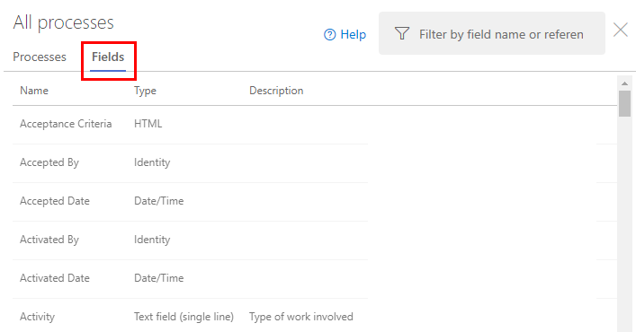 

## Custom field names

When you add a custom field to an inherited process, Azure DevOps assigns a reference name prefixed with *Custom* and then then name of the field with spaces removed. For example, you add a field named DevOps Triage, the reference name is **Custom.DevOpsTriage**. No spaces are allowed within the reference name.  

## Add a custom field 

You can add fields and specify the group and page where they should appear. Also, once you've added a field, you can drag-and-drop it within a page to move its placement within the form. If you have several fields you want to add to a custom page or group, then [add those pages or groups first](customize-process-form.md) and then add your fields. 

> [!NOTE] 
> Each process can define up to 1024 fields, including system inherited fields. You can only add fields within a page on a form. You can't add a field to the gray area within the form where the Assigned To, State, and Reason fields are located. 

1. From the **Process** page of the selected inherited process, choose the work item type you want to add the custom field to. 

	Here we choose the Bug WIT. Note the breadcrumb links that allow you to move back to <strong>All Processes</strong> and <strong>MyAgile</strong> process page.

	> [!div class="mx-imgBorder"]  
	> 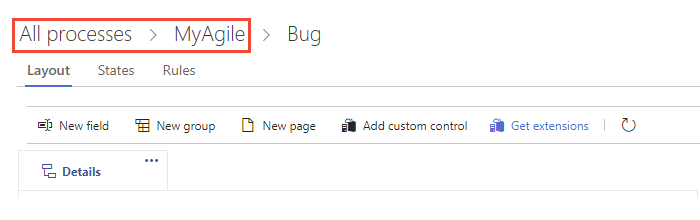 

	If the <strong>New field</strong> and other options are disabled, you don't have the necessary permissions to edit the process. See [Set permissions and access for work tracking, Customize an inherited process](../../../organizations/security/set-permissions-access-work-tracking.md#customize-an-inherited-process).

1. With the WIT selected, choose the :::image type="icon" source="media/process/new-field-icon.png" border="false"::: <strong>New field</strong>.  

	> [!div class="mx-imgBorder"]  
	> 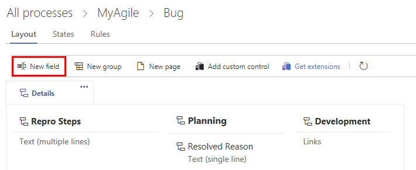 

1. Name the field and select the field type from one of the supported data types. Optionally, add a description.  

	> [!NOTE]    
	> You must specify a field name that is unique within the organization. A custom field defined for one process cannot be the same as the name defined for another process. For more information on field names, see [What is a field? How are field names used?](inheritance-process-model.md#field-reference)
	
	Here we add an Integer field labeled Customer Ticket. 

    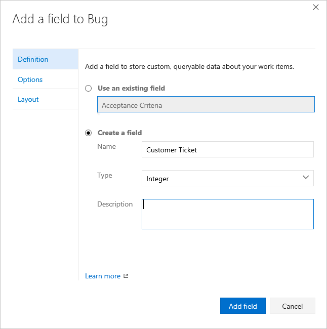 

	
1.	(Optional) On the <strong>Options</strong> tab, indicate if the field is required and specify a default value. Or leave the values blank. By making a field **Required**, users must specify a value for the field to save the work item. When you create a work item as well as every time someone opens a work item  and the field is empty, the default value is set.  

	  

	
1.	(Optional) On the <strong>Layout</strong> tab, you can enter a different form label than the name of the field. Also, you can choose the page and group where the field appears on the form.

	Here, we add the Customer Ticket field to a new group labeled Customer focus. 

	  

	> [!NOTE]    
	> While you can change the form label, you must use the field name when you are adding fields to cards ([Kanban](../../../boards/boards/customize-cards.md#fields), [Taskboard](../../../boards/sprints/customize-taskboard.md)) or [creating queries](../../../boards/queries/using-queries.md) based on the field.   

1.	Choose <strong>Add field</strong> to complete adding the field. If you don't specify its layout location, the system adds it to the first group of fields on the form.  

1.	When you've completed making all your changes, open a work item of the type you've customized. 

	Here, we show the Customer Ticket field has been added to the Status group. You may need to refresh your browser to see the changes. 

 	> [!div class="mx-imgBorder"]  
	> 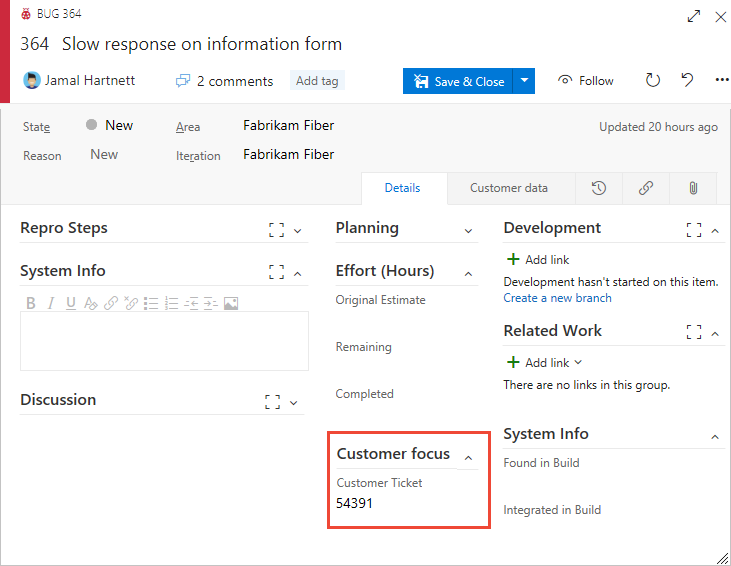 

<a id="edit-picklist-inherited" />

### Add a picklist  

[Work tracking, process, and project limits](object-limits.md)

::: moniker range=">= azure-devops-2020"

You can add a new field and define a pick list or customize the pick list of an inherited field. 

::: moniker-end

> [!NOTE] 
> Each organization or collection can define up to 1024 picklists. Each picklist can contain up to 2048 items. Picklist items must be 256 or fewer characters. If you want to add dependent picklists, see [Cascading lists](https://marketplace.visualstudio.com/items?itemName=ms-devlabs.cascading-picklists-extension). 

1. Start by choosing  <strong>New field</strong>, then specify the picklist type&mdash;integer or string&mdash;and then add the items to appear in the picklist. You can add an item and then press **Enter** to add another item. 

	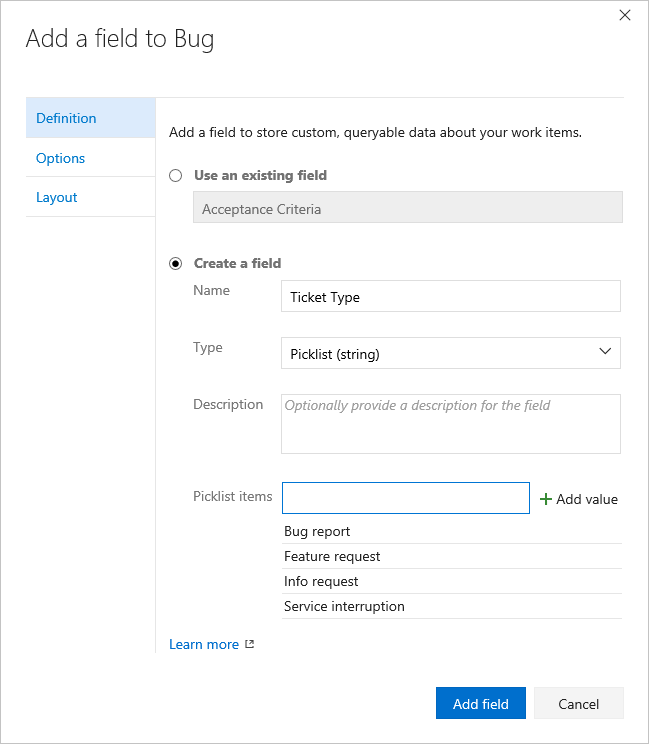  

	To delete an item in the list, highlight the item and then click the  delete icon.  

	::: moniker range=">= azure-devops-2020"
	To modify the pick list of an inherited field, choose **Edit** to edit the field. On the **Definition** tab, you can choose to **Add value**.

	> [!div class="mx-imgBorder"]  
	> 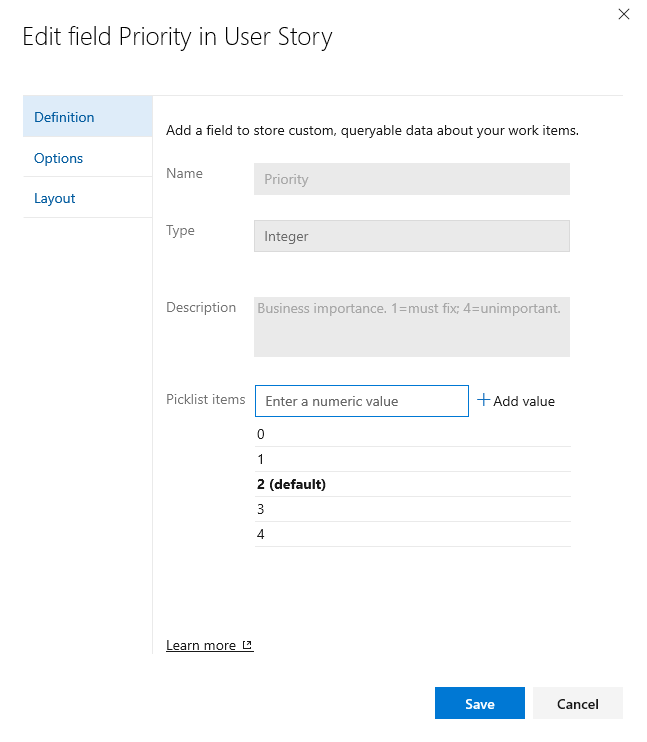   
	
	::: moniker-end

2. (Optional) Choose the **Options** tab to define the field as required, specify a default, or allow users to enter their own values. 

	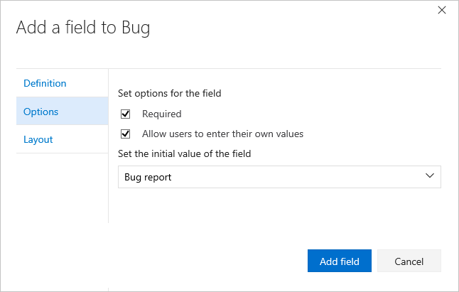  

3. (Optional) See previous [step 5](#layout) to specify where you want the field to appear on the form (**Layout** tab). 
 
<!---
2. Add the items in the order you want them to appear in the list.
	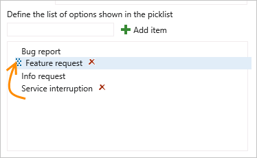
-->

### Add an Identity field  

Use an Identity-based field to add a field similar to the Assigned To field. Identity-based fields act in the same way as the Assigned To field, providing a search and identity picker function. When your organization manages users with Azure Active Directory or Active Directory, the system synchronizes Identity-based fields with the names defined in these directories. 

1. Start by choosing  <strong>New field</strong>, then the field name, Identity type, and optionally a description. 

	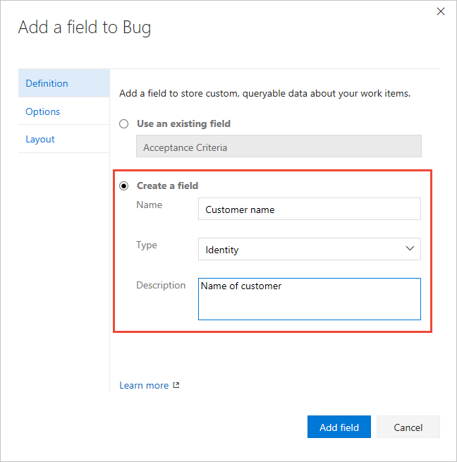  

1. (Optional) See previous [step 5](#layout) to specify where you want the field to appear on the form (Layout tab). 
 

### Add a rich-text, HTML field 

1. As before, choose the WIT you want to add the field to and then choose the  <strong>New field</strong>.  

1. Choose Text (multiple lines) as the type. Here we label the field as Customer request to capture customer comments for product feature requests.   

    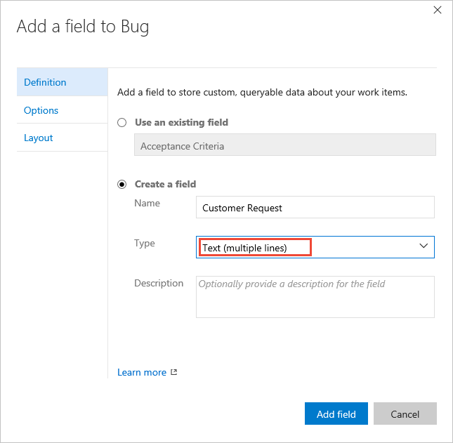

1. The field is added to the first column under all system-defined rich-text fields, but before the Discussion control.   

 	> [!div class="mx-imgBorder"]  
	> 

### Add a checkbox field  

1. As before, choose the WIT you want to add the field to and then choose  <strong>New field</strong>.  

2. Choose Boolean as the type, and give it a label. Here we label the field as Triaged to track the triage state of the bug.  

	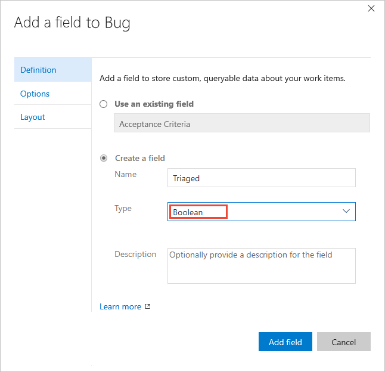   

3. (Optional) Open the <strong>Options</strong> tab and specify if the field should be required. 

	

4. By default, the field is added to the last group defined in the second column. Open the <strong>Layout</strong> tab to drag and drop the field to another group on the form.  

	> [!NOTE]    
	> The field appears as a checkbox in the work item form. Check the box to indicate a True value. If you display the field on the Kanban or Taskboard, then the field values of True and False display (not a checkbox).

## Add an existing field to another WIT

Existing fields correspond to any inherited field and custom field defined within the collection. Once you've added a custom field to one WIT, you can add it to others from the form menu. Or, you can add a field defined for one process to a work item type in another process. Open the work item type and choose the existing field. 

To look up descriptions of any system-defined work item field, see the [Work item field index](../../../boards/work-items/guidance/work-item-field.md).  

Here we add the Customer Ticket field to the User Story WIT.  

Optionally, specify the [Required/Default values](#options) and [placement within the form](#layout) for the field.  

## Relabel a field   

Renaming a field or changing the field type aren't supported actions. However, from the **Layout** tab you can change the label that appears on the work item form. When selecting the field in a query, you need to select the field name and not the field label. 

Here, we relabel the Customer Ticket field to Ticket Number.   
 
 

<a id="modify-description" />

## Modify Description help text  

::: moniker range=">= azure-devops-2020"

Description help text displays when users hover over a field in the work item form. You can define different help text for the same fields for different work item types. Modification is supported for both custom fields and inherited fields. Note that the implementation differs based on the field type. 
- **For inherited fields**: Description help text can be defined differently for each work item type and process.   
- **For custom fields**: Description help text appears the same for the field across all work item types and all processes. 

::: moniker-end

[!INCLUDE [temp](../../../boards/includes/note-azure-devops-2020-1-updates.md)]

::: moniker range="azure-devops-2019"

Description help text displays when users hover over a field in the work item form. You can only modify the description help text on a custom field. That help text propagates to all work item types and all processes. You can't customize the help text by process or work item type.

::: moniker-end

To modify the **Description** help text, choose the work item type you want to modify, choose **Edit** for the field and choose the **Definition** tab. The modified value only affects that field in the process and for that work item type. 

::: moniker range=">= azure-devops-2020"

Here we modify the Story Points field for User Story. 

> [!div class="mx-imgBorder"]  
> 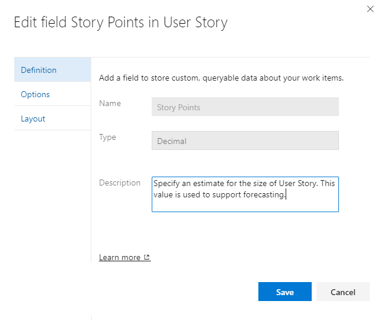

::: moniker-end

::: moniker range="azure-devops-2019"

Here we modify the custom Published field for User Story. 

> [!div class="mx-imgBorder"]  
> 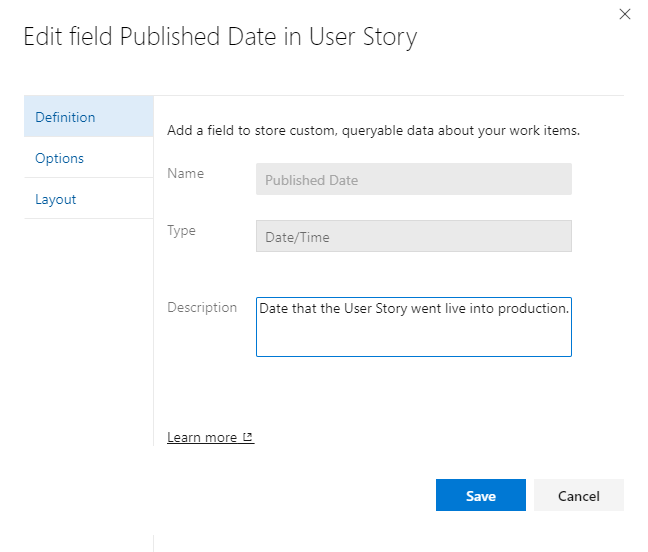

::: moniker-end

## Show, hide, or remove a field   

::: moniker range=">= azure-devops-2020"

You can choose to show or hide any field or custom control from appearing on a form. If you want to reinstate a field onto the form later, you can un-hide These actions differ from the [**Delete**](#delete-field) option, which deletes the field from the organization.

::: moniker-end

::: moniker range="azure-devops-2019"

You can choose to show or hide an inherited field or a custom control from appearing on a form. For custom fields, you can remove it from the form. If you want to reinstate it by choosing **Show on layout**. These actions differ from the [**Delete**](#delete-field) option, which deletes the field from the organization.

::: moniker-end

> [!NOTE]      
> Data defined for an inherited field, even if you hide it, is maintained in the data store and work item history. You can view a record of it by viewing the history tab for a work item. 
>
> When you remove a custom field from the layout, it is maintained in the data store but stripped from the history. You can view it from the query results. If you add the field back to the form, then the history for it is restored.To delete a custom field from a project collection, see [Delete a field](#delete-field).
  

::: moniker range=">= azure-devops-2020"
### Hide a field or custom control
::: moniker-end 

::: moniker range="azure-devops-2019"
### Hide an inherited field or custom control
::: moniker-end 

1. Open the context menu for the field or control and choose **Hide from layout**.

	 

1. To add a hidden field or control to the form, choose **Show on layout**.  

### Remove a custom field from a form

1. Choose **Remove** from the context menu of the field you want to remove. 

	  

2. Confirm that you want to remove the field.  

	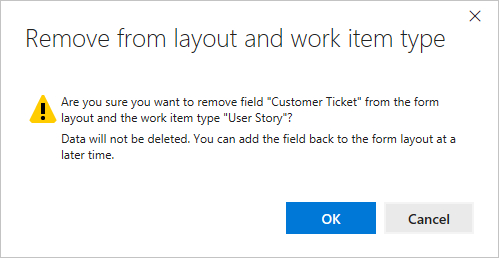   

1. To add a custom field that's been removed, choose **New field** and select **Use an existing field**.  

## Revert field to preset defaults 

You may discard changes you made to an inherited field. From the **Layout** page of the modified work item type, choose the **Revert** option for the field.  

> [!div class="mx-imgBorder"]  
> 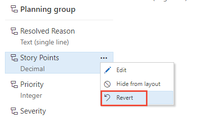

## Delete a field  

Deleting a field deletes all data associated with that field, including historical values. Once deleted, you can only restore the field and recover the data using the [Fields - Update REST API](/rest/api/azure/devops/wit/fields/update). 

1. You delete the field from the **All processes>Fields** page.  

	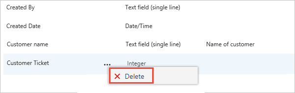 

	To delete fields, you must be a member of the Project Collection Administrators group or be [granted explicit permissions to Delete field from account](../../../organizations/security/set-permissions-access-work-tracking.md#process-permissions). 

2. To complete the delete operation, you must type the name of the field as shown. 

	 
 

## Related articles  

[!INCLUDE [temp](../includes/note-audit-log-support-process.md)]

- [Add or modify a custom work item type](customize-process-work-item-type.md)
- [Customize the web layout](customize-process-form.md)
- [Customize a project using an inherited process](customize-process.md)    
- [Customize cards on boards](../../../boards/boards/customize-cards.md)  
- [Show bugs on backlogs and boards](../show-bugs-on-backlog.md)  
- [Work tracking, process, and project limits](object-limits.md)

If you're working with test plans or test cases, see these articles: 

- [Create a test plan](../../../test/create-a-test-plan.md)  
- [Create manual test cases](../../../test/create-test-cases.md)   

<!--- 
Commenting this out as it is in the process of changing 

### Custom field names 

The reference name for any new field you add is prefixed with the name of the inherited process for which it was created. For example, if you add Custom 1 field to MyAgile process, the reference name  is `MyAgile.Custom1`. If you add Custom 2 field to MyAgile-Copy process, the reference name assigned to it is `MyAgile-Copy.Custom2`. 

By adding all customizations to the same base inherited process, you simplify the naming conventions that get applied to a custom fields. This is useful particularly when REST APIs are employed.  

Each  system process&mdash;[Agile](../../../boards/work-items/guidance/agile-process.md), [Scrum](../../../boards/work-items/guidance/scrum-process.md), or [CMMI](../../../boards/work-items/guidance/cmmi-process.md)&mdash;contains 100 or more work item fields. 

-->
