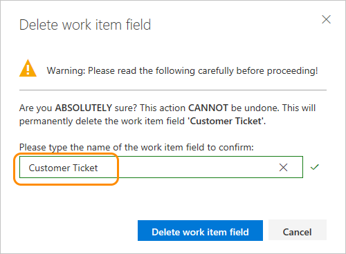

# Add and manage fields for an inherited process   

[!INCLUDE [temp](../../../boards/_shared/version-vsts-plus-azdevserver-2019.md)]

You can add a custom field to support tracking additional data requirements or modify select attributes of an  inherited field. For example, you can add a custom field or change the label that appears in the work item form for an inherited field.  

For a list of all fields defined for your organization&mdash;which includes all fields defined for system and inherited processes&mdash;see [Review fields](#review-fields). 

Once you've added a custom field, you can create [queries](../../../boards/queries/using-queries.md), [charts](../../../report/dashboards/charts.md), or [Analytics views and Power BI reports](../../../report/powerbi/create-quick-report.md) to track data related to it.  

[!INCLUDE [temp](../_shared/note-on-prem-link.md)]

[!INCLUDE [temp](../_shared/process-prerequisites.md)] 

[!INCLUDE [temp](../_shared/open-process-admin-context-ts.md)]
 
[!INCLUDE [temp](../_shared/automatic-update-project.md)] 

## Review fields 

To review the list of fields defined for all processes and the WITs which reference them, choose **Process** and then **Fields**.  

Fields listed correspond to all those defined for the organization. For descriptions and usage of each field, as well as the Reference name for each field, look it up from the [Work item field index](../../../boards/work-items/guidance/work-item-field.md). You can also get the Reference name of fields from the [Work Item Types Field - List REST API](/rest/api/azure/devops/wit/work%20item%20types%20field/list).

> [!div class="mx-imgBorder"]  
>  

## Add a custom field 

You can add fields and specify the group and page where they should appear. Also, once you've added a field, you can drag-and-drop it within a page to relocated it on the form. If you have several fields you want to add to a custom page or group, then you may want to [add those elements first](customize-process-form.md) and then add your fields. 

0. Open **Settings>Work>Process**.  For details, see [Open Settings>Process](add-custom-wit.md#open-process-wit).

	> [!IMPORTANT]  
	>If you don't see the **Organization settings** option, then you are working from an on-premises TFS. The **Process** page isn't supported. You must use the features supported for the [On-premises XML process model](../../../reference/on-premises-xml-process-model.md).
	
0. With the WIT selected, click the  (New Field icon).  

	> [!div class="mx-imgBorder"]  
	>  

0. Name the field and select the field type from one of the supported data types. Optionally, add a description.  

	> [!NOTE]    
	> You must specify a field name that is unique within the organization. A custom field defined for one process cannot be the same as the name defined for another process. For more information on field names, see [What is a field? How are field names used?](inheritance-process-model.md#field-reference)
	
	Here we add an Integer field labeled Customer Ticket. 

     

	
0.	(Optional) On the Options tab, indicate if the field is required and specify a default value. Or leave these blank. By making a field Required, users must specify a value for the field in order to save it. The default value you specified is set when you create a work item as well as every time a work item is opened and the field is empty.

	  

	
0.	(Optional) On the Layout tab, you can enter a different form label than the name of the field. Also, you can choose the page and group where the field appears on the form.

	Here, we add the Customer Ticket field to a new group labeled Customer focus. 

	  

	> [!NOTE]    
	> While you can change the form label, you must use the field name when adding fields to cards ([Kanban](../../../boards/boards/customize-cards.md#fields), [task board](../../../boards/boards/customize-cards.md#task-board)) or [creating queries](../../../boards/queries/using-queries.md) based on the field.   

0.	Click **Add field** to complete adding the field. If you haven't specified its layout location, it is added to the first group of fields on the layout form.  

0.	When you've completed making all your changes, open a work item of the type you've just customized. 

	Here, we show the Customer Ticket field has been added to the Status group. You may need to refresh your browser to see the changes. 

 	> [!div class="mx-imgBorder"]  
	>  

### Add a picklist  

1. Start by clicking  (New Field), then specify the picklist type&mdash;integer or string&mdash;and then add the items to appear in the picklist. You can simply add an item and then press Enter to add another item.

	  

	To delete an item in the list, highlight the item and then click the  delete icon.  

2. (Optional) Click the Options tab to define the field as required, specify  a default, or allow users to enter their own values. 

	  

3. (Optional) See previous [step 5](#layout) to specify where you want the field to appear on the form (Layout tab). 
 
<!---
2. To reorder the list, simply drag the item to where you want it in the list. 

	
-->

### Add an Identity field  

Azure Active Directory (Azure AD)
Use the Identity field to add a field similar to the Assigned To field. Identity fields act in the same way as the Assigned To field, providing a search and identity picker function. If your organization manages users with Azure Active Directory (Azure AD), then the system synchronizes Identity fields with the names defined in Azure AD and are valid users of the project. 

1. Start by clicking  (New Field), then the field name, Identity type, and optionally a description. 

	  

3. (Optional) See previous [step 5](#layout) to specify where you want the field to appear on the form (Layout tab). 
 

### Add a rich-text, HTML field 

1. Just as before, choose the WIT you want to add the field to and then click the  (New Field icon).  

2. Choose Text (multiple lines) as the type. Here we label the field as Customer request to capture customer verbatims.   

    

2. The field is added to the first column under all system-defined rich-text fields, but before the Discussion control.   

 	> [!div class="mx-imgBorder"]  
	> 

### Add a checkbox field  

1. Just as before, choose the WIT you want to add the field to and then click  New Field.  

2. Choose Boolean as the type, and give it a label. Here we label the field as Triaged to track the triage state of the bug.  

	   

3. (Optional) Open the Options tab and specify if the field should be required. 

	

4. By default, the field is added to the last group defined in the second column. Open the Layout tab to drag and drop the field to another group on the form.  

	> [!NOTE]    
	>The field appears as a checkbox in the work item form. Check the box to indicate a True value. If you display the field on the Kanban or Task board, then the field values of True and False display (not a checkbox).

## Add an existing field to another WIT

Existing fields correspond to any inherited field and custom field defined within the collection. Once you've added a custom field to one WIT, you can add it to others from the form menu. Or, you can add a field defined for one process to a work item type in another process. Simply open the work item and choose the existing field. 

For a list of all work item fields defined for all WITs and processes, see the [Work item field index](../../../boards/work-items/guidance/work-item-field.md).  

Here we add the Customer Ticket field to the User Story WIT.  

Optionally, specify the [Required/Default values](#options) and [placement within the form](#layout) for the field.  

## Relabel a field   
Renaming a field or changing the field type aren't supported actions. However, you can change the label that appears for a field on the work item form from the Layout tab. When selecting the field in a query you need to select the field name and not the field label. 

Here, we relabel the Customer Ticket field to Ticket Number.   
 
 

## Show, hide, or remove a field   

You can choose to show or hide an inherited field or a custom control from appearing on a form. For custom fields, you can remove it from the form. If you want to reinstate it later, you can add it back to the form. These actions differ from the [**Delete**](#delete-field) option, which deletes the field from the organization.

> [!NOTE]      
> Data defined for an inherited field, even if you hide it, is maintained in the data store and work item history. You can view a record of it by viewing the history tab for a work item. 
>
> When you remove a custom field from the layout, it is maintained in the data store but stripped from the history. You can view it from the query results.
If you add the field back to the form, then the history for it is restored.To delete a custom field from a project collection, see [Delete a field](#delete-field).
  

### Hide an inherited field or custom control 

1. Open the context menu for the inherited field and choose Hide from layout.

	 

0. To add a hidden field to the form, choose **Show on layout**.  

### Remove a custom field from a form
1. Choose Remove from the context menu of the field you want to remove. 

	  

2. Confirm that you want to remove the field.  

	   

0. To add a custom field that's been removed, choose **New field** and select **Use an existing field**.  

## Revert field to preset defaults     
If you've made changes to an inherited field, and now want to discard those changes, you can do that by choosing the **Revert** option for the field from the Layout page of the modified WIT.  

> [!div class="mx-imgBorder"]  
> 

## Delete a field     
Deleting a field deletes all data associated with that field, including historical values. Once deleted, you can't recover the data. 

1. You delete the field from the **All processes>Fields** page.  

	 

	To delete fields, you must be a member of the Project Collection Administrators group or be [granted explicit permissions to Delete field from account](../../../organizations/security/set-permissions-access-work-tracking.md#process-permissions). 

2. To complete the delete operation, you must type the name of the field as shown. 

	 
 

## Related articles  

- [Add or modify a custom work item type](customize-process-wit.md)
- [Customize the web layout](customize-process-form.md)
- [Customize a project using an inherited process](customize-process.md)    
- [Customize cards on boards](../../../boards/boards/customize-cards.md)  
- [Show bugs on backlogs and boards](../show-bugs-on-backlog.md)  

If you are working with test plans or test cases, see these topics: 
- [Create a test plan](../../../manual-test/getting-started/create-a-test-plan.md)  
- [Create manual test cases](../../../manual-test/getting-started/create-test-cases.md)   

 

<!--- 
Commenting this out as it is in the process of changing 
### Custom field names 

The reference name for any new field you add is prefixed with the name of the inherited process for which it was created. For example, if you add Custom 1 field to MyAgile process, the reference name  is `MyAgile.Custom1`. If you add Custom 2 field to MyAgile-Copy process, the reference name assigned to it is `MyAgile-Copy.Custom2`. 

By adding all customizations to the same base inherited process, you simplify the naming conventions that get applied to a custom fields. This can be useful particularly when REST APIs are employed.  

Each  system process&mdash;[Agile](../../../boards/work-items/guidance/agile-process.md), [Scrum](../../../boards/work-items/guidance/scrum-process.md), or [CMMI](../../../boards/work-items/guidance/cmmi-process.md)&mdash;contains 100 or more work item fields. 

--> 
