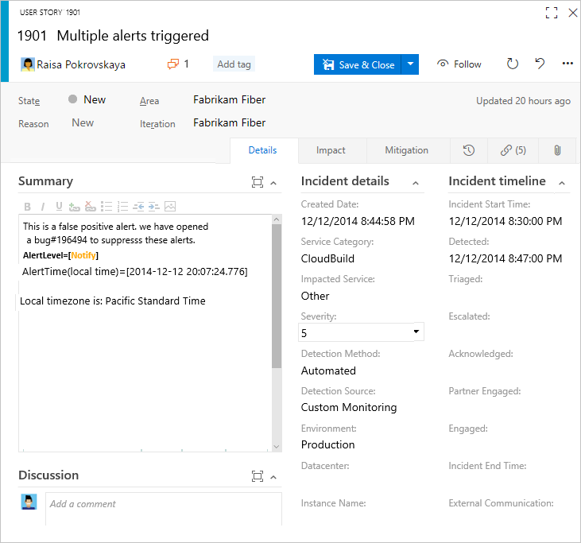
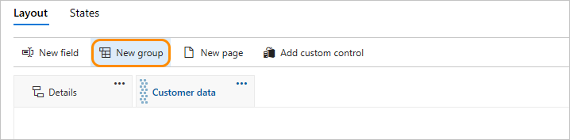
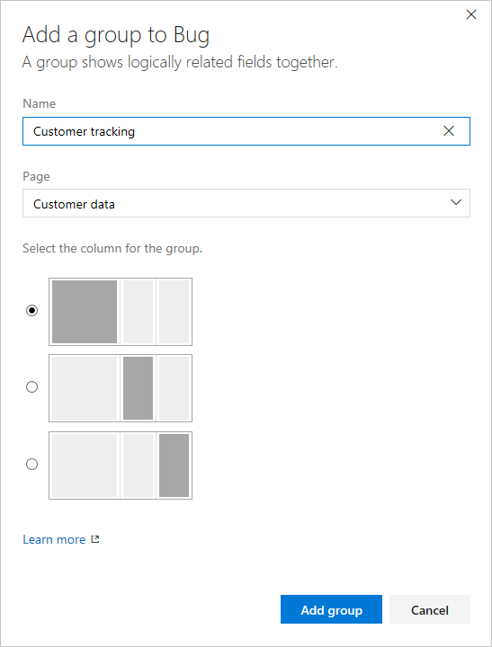
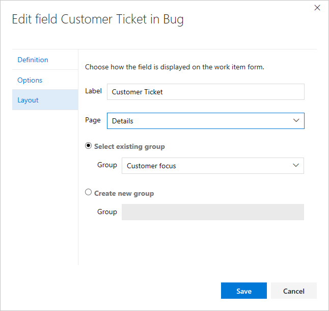
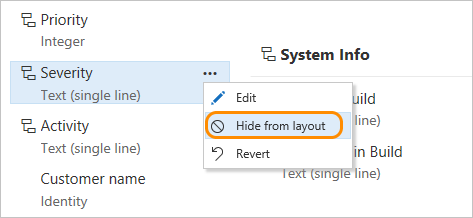
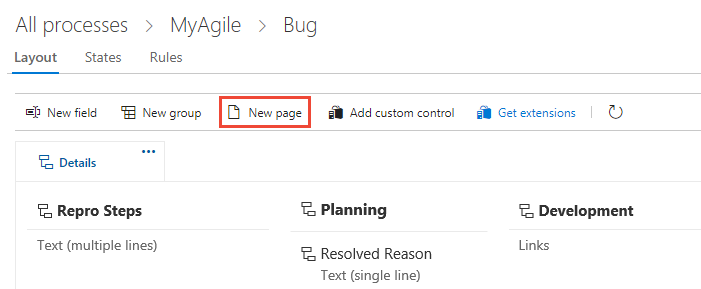
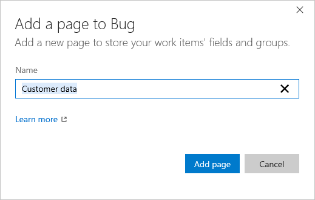
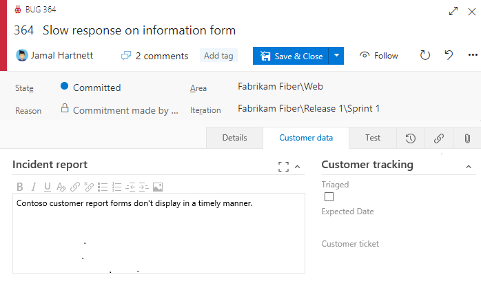
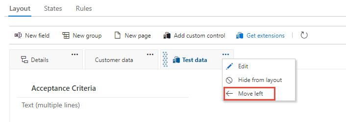

# Customize the web layout for a work item type (Inheritance process) 

[!INCLUDE [temp](../../../boards/_shared/version-vsts-plus-azdevserver-2019.md)]

Work items are the backbone for planning and tracking work. As such, you'll want to make sure that each work item type (WIT) is tracking the data that your team needs. 

To support your work tracking requirements, you can customize each WIT to add custom groups to collect custom fields that you add under a common section. You can organize your forms by placing logically related groups and HTML fields on separate pages within a form to minimize clutter on any one page within the form.  

For example, the following form shows that two custom pages have been added, **Impact** and **Mitigation**. In addition, several new groups and fields have been added to the Details page.  

 

Once you've added a custom page or group, you can add [custom fields to those pages or groups](customize-process-field.md). To learn more about what you can customize, see [About process customization and inherited processes](inheritance-process-model.md). 

[!INCLUDE [temp](../_shared/note-on-prem-link.md)]

[!INCLUDE [temp](../_shared/process-prerequisites.md)] 

[!INCLUDE [temp](../_shared/open-process-admin-context-ts.md)]
 
[!INCLUDE [temp](../_shared/automatic-update-project.md)] 

## Add a custom group  
You can add your own custom groups to both inherited pages and custom pages.

1. From the Layout page, choose **New group**.    

	Work Item Types>Bug>Layout>Add new group" style="border: 1px solid #C3C3C3;" /> 

	If the <strong>New field</strong> and other options are disabled, you don't have the necessary permissions to edit the process. See [Set permissions and access for work tracking, Customize an inherited process](../../../organizations/security/set-permissions-access-work-tracking.md#customize-an-inherited-process).

2. Name the group and choose the column it should appear in. For information about columns, see [About process customization and inherited processes, Layout and resizing](inheritance-process-model.md#resizing).   

	

	
3. (Optional) Once you've added the group, you can drag and drop the group into any column or within the column, or select the Move Up or Move Down options from the group's &hellip; context menu.  

  

## Delete or remove a custom group    

Before you remove a group, first move all fields defined in that group to another group or remove them from the form.  

> [!TIP]   
>You must remove all fields from a group for the Remove option to appear. 

Choose the  Remove option from the custom group &hellip; context menu.

> [!NOTE]     
>When all fields in an inherited group are hidden, the inherited group itself does not appear on the form.

## Move a field     

Within a page, you can quickly drag-and-drop a field to a new group or section within the page. 

To move a field to another page, choose Edit from the field's &hellip; context menu and then choose the Page from the menu. Optionally, select an existing group or create a new group. 

Here we move the Customer ticket field to the Details page and the Customer focus group.   

 

## Remove a field from a form    
 
You can only remove custom fields from a form. For inherited fields, you can hide them from showing on the form. To learn more, see [Customize a field for a process, Show, hide, or remove a field](customize-process-field.md#show-hide-remove-field).  

<!---
For a custom field, open the field's &hellip; context menu, and then choose the  **Remove** option.   

For an inherited field, open the field's &hellip; context menu, and then choose the **Hide from layout** option.   

Here we remove the Severity inherited field from appearing on the Bug form.   

Removing a custom field from a form removes tracking data for the WIT. You can re-add a custom field to a WIT by adding it to a form as an existing field. 

Removing an inherited field from a form simply hides the field from displaying on the form; it remains defined for the WIT. Hidden fields display on the admin layout page with a strikethrough. You can re-add these fields to the form through their context menu. 

--> 

## Add a custom page  
Add a custom page when you have several custom fields that you want to group within that page. You can add and reorder custom pages. 

0. From the Layout page of the WIT you've selected, click **New page**.    

	> [!div class="mx-imgBorder"]  
	>    

0. Label the page.

	

	
0. Edit the page to add [fields](customize-process-field.md) or [groups](#groups).  

0. When you've finished adding groups and fields to the page, verify your layout is as expected. Refresh your browser and open a work item of the type you just customized. 

	> [!div class="mx-imgBorder"]  
	>  

## Reorder pages 

You can reorder custom pages using drag and drop, or choose the move operation from the custom page &hellip; context menu. You can't move the inherited Details page.

 

## Delete a page  

Before you delete a page, you'll want to move any fields that your team still uses to another page. 

Choose the  Delete option from the custom page &hellip; context menu.   

> [!NOTE]    
>Deleting a page doesn't delete any data. Once data has been defined for a field, it's maintained in the data store and work item history, even if you remove it from the form. You can always choose to re-add the field by choosing **New field** and selecting **Use an existing field**.    

## Related articles  

- [Add or modify a custom work item type](customize-process-wit.md)
- [Add and manage fields](customize-process-field.md) 
- [Add extensions and custom controls to a work item type](custom-controls-process.md) 
- [Customize a project using an inherited process](customize-process.md)  
- [Customize cards on boards](../../../boards/boards/customize-cards.md)  

