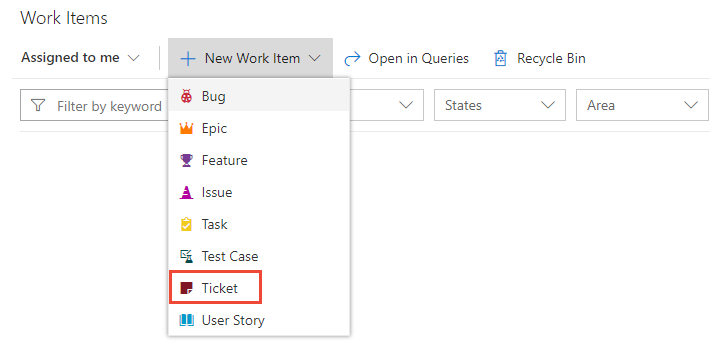
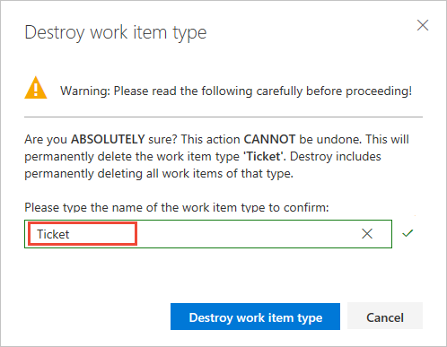

# Add and manage work item types      

[!INCLUDE [temp](../../../boards/_shared/version-vsts-only.md)]

For example, you may want to capture customer issues in a custom Ticket WIT.   

> [!div class="mx-imgBorder"]  
>  

[!INCLUDE [temp](../_shared/note-on-prem-link.md)]

[!INCLUDE [temp](../_shared/process-prerequisites.md)] 

[!INCLUDE [temp](../_shared/open-process-admin-context-ts.md)]
 
[!INCLUDE [temp](../_shared/automatic-update-project.md)] 

## Add a work item type

1. From the <strong>Work Item Types</strong> page, choose  <strong>New work item type</strong>.

	

1. Name the WIT and optionally specify a description, icon and color. The icon and color you specify appear throughout the web portal, including on the work item form and when associated work items appear on a backlog, boards, query results, and more. Choose <strong>Create</strong> to save. 

	 

1.   From the Layout page, you can add fields, groups, or pages to specify the form and fields you want to track. Each new WIT comes predefined with a Details page with the Description field, and Discussion, Development, and Related Work groups. For details, see [Add and manage fields](customize-process-field.md) or [Customize the web layout for a process](customize-process-form.md).    

	> [!div class="mx-imgBorder"]  
	> 	

	Also added, but not shown nor editable from the **Layout** page, are the standard elements included with the header of the form as shown in the following image, as well as the history, links, and attachment pages.

	 

0. Open the States page to view the default workflow states. Optionally, [customize the workflow states](customize-process-workflow.md).  
 

0. Optional. To add the WIT to a backlog, see [Customize your backlogs or boards for a process](customize-process-backlogs-boards.md). By default, custom WITs aren't added to any backlog. To learn more about different backlog levels, see [Backlogs, boards, and plans](../../../boards/backlogs/backlogs-boards-plans.md).   

0. Verify the custom work item type appears as expected. Open the **Work>Work Items** page (user context) and choose **New Work Item** and select the WIT you customized. Here we choose **Ticket**. 

	> [!div class="mx-imgBorder"]  
	>  

	If you don't see the custom WIT, refresh your browser to make sure it registers all the custom changes you've made. 

0.  Verify that the field you added appears on the form. Note that the  (exclamation mark) icon indicates the field is required.  

	> [!div class="mx-imgBorder"]  
	>  

## Change description, icon or color

To change the description, icon or color of a custom WIT, choose Edit from the WIT context menu. 

Here we change the description, icon and color for the Ticket custom WIT.  

 

## Enable or disable a WIT  

You can disable a custom WIT, which prevents users from being able to add work items using it. However, all existing work items defined using the custom WIT remain available. You can query for them and edit them.

You may want to disable a custom WIT until you have defined all the fields, workflow, and layout that you have planned.

To disable a custom WIT, choose **Disable** from the WIT context menu. 

To re-enable the WIT, choose **Enable** from the WIT context menu. 

> [!NOTE]    
> Disabling a WIT removes the WIT from the **New** drop down and add experiences. Creating a work item of that WIT is also blocked via REST APIs.  
>
>No changes are made to existing work items of that type. You can update or delete them and they continue to appear on backlogs and boards. Also, you can change the work item type of disabled WITs to an enabled type, but you can't change the type to a disabled WIT.

## Delete or destroy a custom WIT 

> [!IMPORTANT]  
> Destroying a WIT deletes all work items and data associated with that WIT, including historical values. Once destroyed, you can't recover the data.

1. To completely remove a custom WIT and all work items based on that WIT, choose **Destroy** from the WIT context menu.

	To destroy a WIT, you must be a member of the Project Collection Administrators group or be [granted explicit permissions to edit a specific process](../../../organizations/security/set-permissions-access-work-tracking.md#process-permissions). 

2. To complete the delete operation, you must type the name of the WIT as shown. 

	  
 
### WIT extensibility

To work with WITs programmatically, see [Work Item Types REST API](/rest/api/azure/devops/processdefinitions/work%20item%20types). 

## Related articles  

- [Add and manage fields](customize-process-field.md)  
- [Customize the layout](customize-process-form.md)
- [Customize a workflow for a work item type](customize-process-workflow.md)
- [Customize a project using an inherited process](customize-process.md) 

 