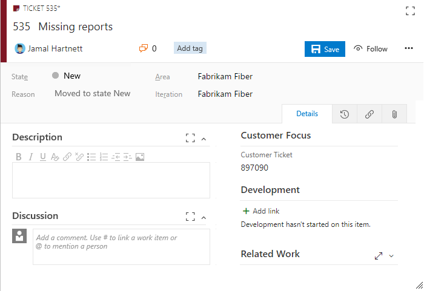
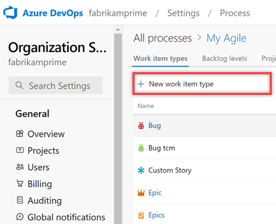
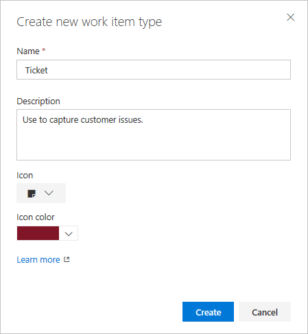
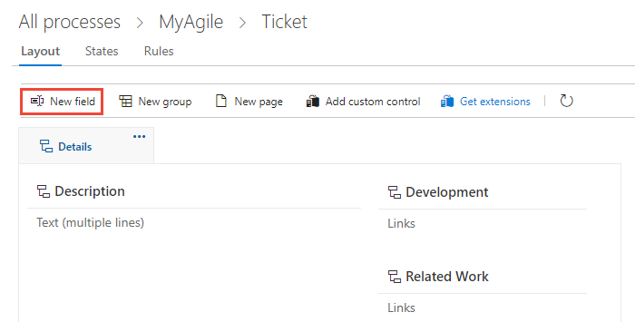
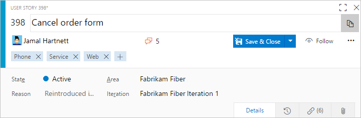
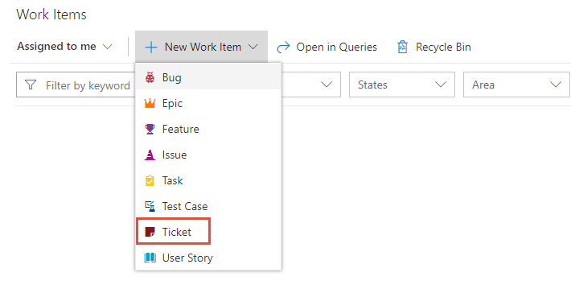
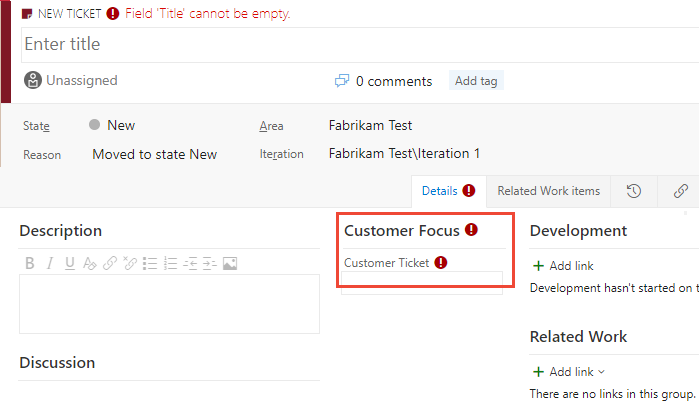
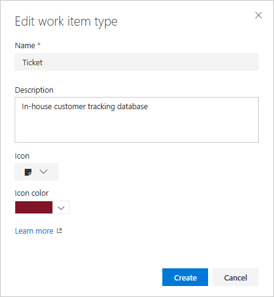
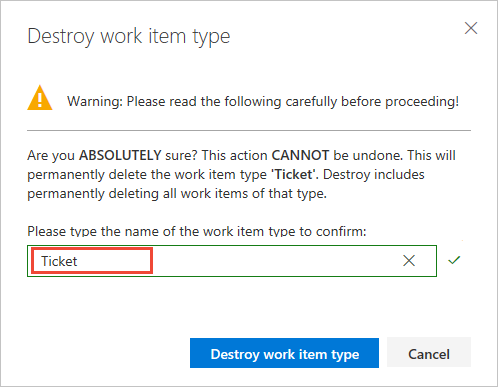

# Add and manage work item types

[!INCLUDE [version-lt-eq-azure-devops](../../../includes/version-lt-eq-azure-devops.md)]

You can add custom work item types (WITs) or modify existing WITs to add fields, remove or hide fields, add custom rules, and more.
For example, you might want to capture customer issues in a custom Ticket WIT.

> [!div class="mx-imgBorder"]
> 

[!INCLUDE [temp](../includes/note-on-prem-link.md)]

## Prerequisites

[!INCLUDE [temp](../includes/process-prerequisites.md)]

[!INCLUDE [temp](../includes/open-process-admin-context-ts.md)]

[!INCLUDE [temp](../includes/automatic-update-project.md)]

## Add a work item type

1. From the **Work Item Types** page, select :::image type="icon" source="../../../media/icons/blue-add-icon.png" border="false"::: **New work item type**.

	

1. Enter a name for the work item type. You can also add a description, icon, and color.
	The icon and color appear throughout the web portal, including on the work item form, backlogs, boards, and query results.
	Select **Create** to save.

	

1. From the **Layout** page, add fields, groups, or pages to specify the form and fields you want to track.
	Each new work item type comes predefined with a **Details** page with the **Description** field, and **Discussion**, **Development**, and **Related Work** groups.
	For more information, see [Add and manage fields](customize-process-field.md) or [Customize the web layout for a process](customize-process-form.md).

   > [!div class="mx-imgBorder"]
   > 

   The **Layout** page doesn't show or allow editing of the standard elements included with the header of the form, as the following image shows, or the history, links, and attachment pages.

   

1. Open the **States** page to view the default workflow states.
	Optionally, [customize the workflow states](customize-process-workflow.md).

   

1. (Optional) To add the work item type to a backlog, see [Customize your backlogs or boards for a process](customize-process-backlogs-boards.md).
	By default, custom work item types aren't added to any backlog.
	For more information about backlog levels, see [Backlogs, boards, and plans](../../../boards/backlogs/backlogs-boards-plans.md).

1. Verify the custom work item type appears as expected.
	Go to **Boards** > **Work Items** and select the work item type you customized from the **New Work Item** dropdown menu.
	In this example, select **Ticket**.

	> [!div class="mx-imgBorder"]
	> 

	If you don't see the custom work item type, refresh your browser to ensure it registers all the custom changes you made.

1. Verify that the field you added appears on the form.
	The :::image type="icon" source="../../../media/icons/required-icon.png" border="false"::: (exclamation mark) icon indicates the field is required.

   > [!div class="mx-imgBorder"]
   > 

## Change description, icon, or color

To change the description, icon, or color of a custom WIT, select **Edit** from the WIT context menu.

The following example shows changing the description, icon, and color for the Ticket custom WIT.

## Enable or disable a WIT

You can disable a custom WIT, which prevents users from adding new work items by using it.
However, all existing work items that use the custom WIT remain available.
You can query for them and edit them.

You might want to disable a custom WIT until you define all the fields, workflow, and layout that you planned.

To disable a custom WIT, select **Disable** from the WIT context menu.

To re-enable the WIT, select **Enable** from the WIT context menu.

> [!NOTE]
> Disabling a WIT removes the WIT from the **New** dropdown menu and add experiences.
> It also blocks creating a work item of that WIT type through REST APIs.
>
> No changes are made to existing work items of that type.
> You can update or delete them, and they continue to appear on backlogs and boards.
> Both work item types need to be enabled to perform a change type operation.

## Delete or destroy a custom WIT

> [!IMPORTANT]
> Destroying a WIT deletes all work items and data associated with that WIT, including historical values.
> Once destroyed, you can't recover the data.

1. To completely remove a custom WIT and all work items based on that WIT, select **Destroy** from the WIT context menu.

	To destroy a WIT, you must be a member of the Project Collection Administrators group or be [granted explicit permissions to edit a specific process](../../../organizations/security/set-permissions-access-work-tracking.md#process-permissions).

1. To complete the delete operation, type the name of the WIT as shown.

	
 
## WIT extensibility

To work with WITs programmatically, see [Work Item Types REST API](/rest/api/azure/devops/wit/work%20item%20types).

## FAQs

[!INCLUDE [temp](includes/qa-custom-work-item-on-backlog.md)]

## Related content

[!INCLUDE [temp](../includes/note-audit-log-support-process.md)]

- [Add and manage fields](customize-process-field.md)
- [Customize the layout](customize-process-form.md)
- [Customize a workflow for a work item type](customize-process-workflow.md)
- [Customize a project using an inherited process](customize-process.md)
