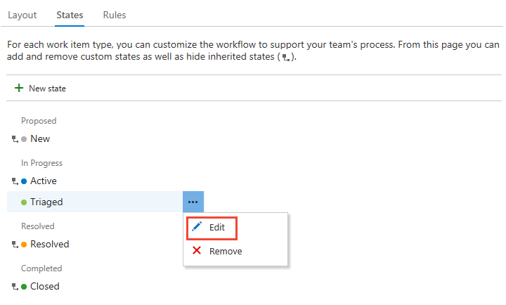

# Customize the workflow (Inheritance process)  

[!INCLUDE [temp](../../../boards/_shared/version-vsts-plus-azdevserver-2019.md)]

Each work item type is associated with a workflow that supports tracking the status of work as it moves from creation to completion. To support your business and team processes, you can add custom states to most work item types (WITs). For example, you may want to insert a Triaged state for bugs, or a Design state for features or user stories. 

Here, the Bug WIT has been customized to support a Triaged state. The state and reason fields appear on the work item form in the header area.

 

[!INCLUDE [temp](../_shared/note-on-prem-link.md)]

[!INCLUDE [temp](../_shared/process-prerequisites.md)] 

> [!NOTE]    
> Before adding a workflow state, review [Workflow states and state categories](../../../boards/work-items/workflow-and-state-categories.md) to learn how workflow states map to state categories. 

[!INCLUDE [temp](../_shared/open-process-admin-context-ts.md)]

[!INCLUDE [temp](../_shared/automatic-update-project.md)] 

## Add a workflow state   

States you add appear in the picklist for the States field shown in work item forms and the query editor. A transition to and from the State you add is created to every other State, except not to a Removed state. Also, default reasons are defined, such as Moved to state Triaged, Moved out of state Triaged.

> [!NOTE]    
> States that you add to the task WIT adds columns to the task board. If you [track bugs along with tasks](../show-bugs-on-backlog.md), then states you add to the bug WIT also add columns to the task board. You don't have to add the same states to each of these WITs, however, you may want to do so in order to  update the status in the same way and to minimize the number of columns that get added. 
>
> If you add a state to a WIT which is associated with a backlog level, each team needs to update their [Kanban board column settings](../../../boards/boards/add-columns.md) in order to view and use the Kanban board.  

1. From the **Work Item Types** page, choose the work item type you want to modify, choose **States**, and then choose **New State**.    

	> [!div class="mx-imgBorder"]  
	>  

	If the <strong>New state</strong> option is disabled, you don't have the necessary permissions to edit the process. See [Set permissions and access for work tracking, Customize an inherited process](../../../organizations/security/set-permissions-access-work-tracking.md#customize-an-inherited-process).

2. Enter the name of the State, choose its category and color, and then click **Save**. The color you specify appears throughout the product including on the work item form and when the State field appears on a backlog, boards, query results, and more.  

	  

	> [!NOTE]   
	> You can't change the order of states. States are listed in the order you add them within the **States** page, and they're listed alphabetically within the drop down list of a work item form).  
	
0. When you've finished adding states for the WIT, verify your changes by refreshing your browser and open a work item of the type you just customized. 

	Here we show the State drop-down menu with Triaged selected. 

	> [!div class="mx-imgBorder"]  
	>  

1. Remember, when you add a State to a WIT which is associated with a backlog level, each team that uses the Kanban board needs to [update their column settings](../../../boards/boards/add-columns.md).

## Edit a state

You can edit the category or the color of a custom state. However, you can't change the name of the custom state. 

1. Choose <strong>Edit</strong> from the &hellip; context menu for the state you want to modify.  
  
	> [!div class="mx-imgBorder"]  
	> 

1. Modify the category or color, and then choose <strong>Save</strong>. 

1. If you change the category, teams that use the Kanban board to update their status need to update their [column settings](../../../boards/boards/add-columns.md).    
 

## Hide or remove a state

When you hide or remove a state:  
- The state no longer appears in the State picklist for the WIT
- No changes occur to the work item history     
- Existing work items maintain their state value, but are in an invalid state. If you want to make a change to the work item, you must first update the state values. You may want to create a query and do a bulk update to move the affected work items into a valid state. If you add the state back to the work item type, the work items revert to a valid state.  

## Hide or unhide an inherited state 

You can hide an inherited state that your team doesn't use in its workflow process. However, you must have at least one state defined for each category. 

0. Open the &hellip; context menu for the state you want to hide and choose the <strong>Hide</strong> option. 

	Here we hide the Resolved state for the Bug WIT. 

	> [!div class="mx-imgBorder"]  
	>   

	> [!NOTE]    
	> If you hide the state of a WIT tracked on a Kanban board, each team  that uses the Kanban board needs to [update their column settings](../../../boards/boards/add-columns.md).

1. To unhide, open the &hellip; context menu and choose the **Unhide** option.  
 

## Remove a custom state 
0. Open the &hellip; context menu for the state you want to remove, and choose <strong>Remove</strong>. You can only remove a custom state.     

0. From the Remove State dialog, click <strong>Remove</strong>.   

	  

1.  If teams use the Kanban board to update their status, each team needs to update their [column settings](../../../boards/boards/add-columns.md).    
 

## Related articles   

- [Add or modify a work item type](customize-process-wit.md)
- [Add and manage fields](customize-process-field.md)  
- [Customize a form](customize-process-form.md)
- [Customize a project using an inherited process](customize-process.md) 
- [Add or edit Kanban columns](../../../boards/boards/add-columns.md)  
- [Query by workflow or Kanban board changes](../../../boards/queries/query-by-workflow-changes.md)    

