# Customize a project using an inherited process

[!INCLUDE [version-gt-eq-2019](../../../includes/version-gt-eq-2019.md)]

::: moniker range=">= azure-devops-2020"

Each project is based on a process that defines the building blocks for tracking work. The first project you create uses one of the default processes&mdash;[Agile](../../../boards/work-items/guidance/agile-process.md), [Basic](../../../boards/get-started/plan-track-work.md), [Scrum](../../../boards/work-items/guidance/scrum-process.md), or [CMMI](../../../boards/work-items/guidance/cmmi-process.md). 

::: moniker-end

::: moniker range="azure-devops-2019"

Each project is based on a process that defines the building blocks for tracking work. The first project you create uses one of the default processes&mdash;[Agile](../../../boards/work-items/guidance/agile-process.md), [Scrum](../../../boards/work-items/guidance/scrum-process.md), or [CMMI](../../../boards/work-items/guidance/cmmi-process.md). 

::: moniker-end

You can only customize inherited processes. Any changes you make to the inherited process automatically appears in the projects that use that process. 

[!INCLUDE [temp](../includes/note-on-prem-link.md)]

The sequence for customizing a project is to customize an inherited process, verify your customizations, and then change the process of the project to use that process. 

[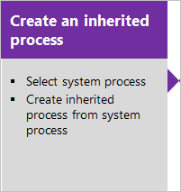](manage-process.md)[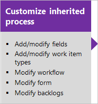](customize-process.md)[](manage-process.md#migrate)  

Customize a process by adding or modifying a work item type (WIT) that's part of the process.
 
[!INCLUDE [temp](../includes/note-audit-log-support-process.md)]

[!INCLUDE [temp](../includes/process-prerequisites.md)]

[!INCLUDE [temp](../includes/automatic-update-project.md)]

## Add or modify a field 

After you [create an inherited process](manage-process.md#create-an-inherited-process), you can customize it.

Locked :::image type="icon" source="media/process/locked-icon.png" border="false"::: fields and inherited :::image type="icon" source="media/process/inherited-icon.png" border="false"::: fields correspond to fields inherited from a system process. You can't customize locked fields. You can customize some options for inherited fields. You can fully customize fields that you add to a process. 

1. Sign in to your organization (```https://dev.azure.com/{yourorganization}```).
2. Select  **Organization settings**.
  
   
2. Select **Process** > your **inherited process** > the **WIT** you want to customize. 
3. To add a field, choose the :::image type="icon" source="media/process/new-field-icon.png" border="false"::: (**New Field** icon).  

	> [!div class="mx-imgBorder"]  
	> 

	In the resulting dialog, choose the type of field that you want to add. For more information, see the following articles:   
	- [Integer](customize-process-field.md#add-field)  
	- [Picklist (drop-down menu)](customize-process-field.md#pick-list)  
	- [Person-name/Identity](customize-process-field.md#identity)  
	- [Rich-text or HTML](customize-process-field.md#html)  
	- [Checkbox (Boolean)](customize-process-field.md#boolean-field)

4. To modify an existing field, you can exercise the following choices: 

	- [Change the field label](customize-process-field.md#rename-field)  
	- [Show/Hide field on form](customize-process-field.md#show-hide-field)  
	- [Set Required/Default options](customize-process-field.md#options)  
	- [Move the field within the layout](customize-process-form.md#move-field)
	- [Remove field from the form](customize-process-field.md#remove-field) 

## Add or modify a rule for a work item type
 
Add rules to support specific workflow and business use cases. Rules let you clear the value of a field, copy a value into a field, and apply values based on dependencies between different fields' values. 

1. Select your inherited process and the work item type.
2. Select **Rules** > **New rule**.   

> [!div class="mx-imgBorder"]  
>  

For more information, see [Rules and rule evaluation](custom-rules.md).

## Add or modify work item types

You use different WITs to plan and track different types of work. The main reason you add a custom WIT is to customize the web form and workflow states to meet specific business use cases.

1. Select your inherited process and the WIT you want to customize. 

2. From the **Work Item Types** page, choose the :::image type="icon" source="../../../media/icons/blue-add-icon.png" border="false"::: **New work item type**.

	:::image type="content" source="media/process/cpwit-add-new-wit.png" alt-text="Screenshot showing Process, Inherited process, Work Item Types, Add new work item type.":::

3. Name the WIT and optionally specify a description, icon, and color. The icon and color you specify appear throughout the web portal, including on the work item form and when associated work items appear on a backlog, boards, query results, and more. 

	:::image type="content" source="media/process/cwit-create-wit-ticket.png" alt-text="Screenshot showing Create new work item type dialog.":::

4. Select **Create** to save. 

    You can now add fields to the WIT, or customize it in the following ways:  
	- [Modify the workflow](#workflow)  
	- [Add or remove a custom control](#custom-control)  
	- [Add an extension](#extension) 
	- [Add/move/remove custom groups](customize-process-form.md#groups)  
	- [Add/move/delete custom pages](customize-process-form.md#pages)  

<a id="workflow"></a>

## Modify the workflow of a work item type 

Workflow states allow you to track the status of a work item as it moves from new to completed. 

1. To modify a workflow, choose your inherited process, the WIT, and then the **States** page.  

	> [!div class="mx-imgBorder"]  
	>  

1. You can modify the workflow in the following ways:   
	- [Hide a workflow state](customize-process-workflow.md#hide-state) 
	- [Add a state](customize-process-workflow.md#add-states)  
	- [Edit a state (change color or category)](customize-process-workflow.md#edit-state)  
	- [Remove a state](customize-process-workflow.md#remove-state)     
 
<a id="custom-control"></a>

## Add a custom control    

Custom controls provide more functionality to a work item form. 

1. From the Process page, select your inherited process > WIT > **Add custom control**.

	> [!div class="mx-imgBorder"]  
	> 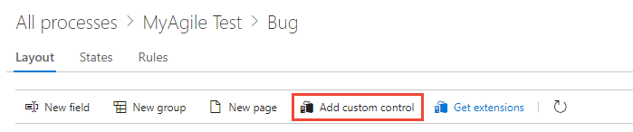 

For more information, see [Add extensions and custom controls to a work item type](custom-controls-process.md).

<a id="extension"></a> 

## Add an extension to a work item type

An extension is an installable unit that contributes new capabilities to your project.
  
> [!NOTE]   
> Group and Page extensions are automatically added to all WITs for all processes, both system and  inherited . You can hide an extension for selected WITs within an inherited process. 

1. Select your inherited process and the WIT, and then select **Get extensions**.
 
	> [!div class="mx-imgBorder"]  
	> 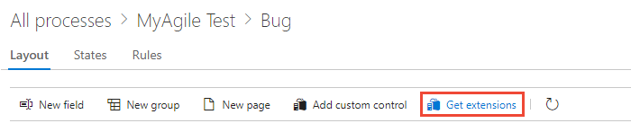 

2. Select the extension you want to add. Here we select the Work item checklist.

3. Choose the organization you want to add it to and select **Install**.  

	> [!div class="mx-imgBorder"]  
	> 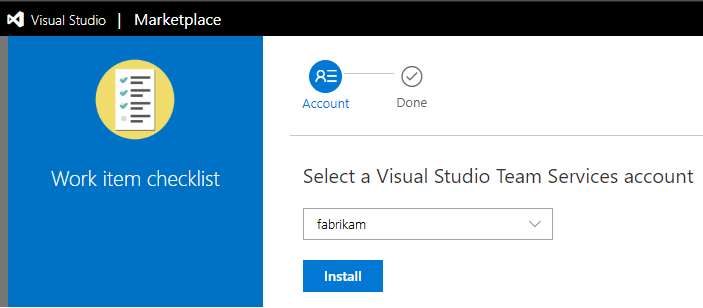 

	You can add extensions to all projects and processes. 

4. Return to the process and WIT and verify the location of the extension is where you want it. Look for it at the bottom of the middle column and drag it to where you want it on the form. 

	> [!div class="mx-imgBorder"]  
	> 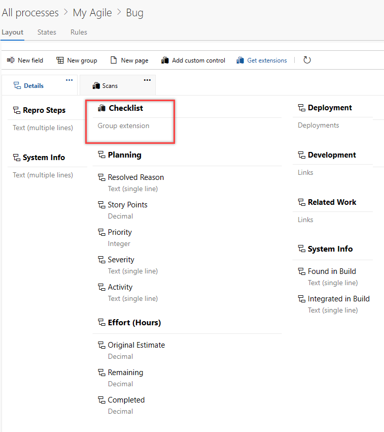 

## Modify the backlog and boards 

You can add more WITs to a backlog level or add another portfolio backlog. As shown in the following example, we added a third level portfolio backlog labeled *Initiatives*, which tracks the custom *Initiative* WIT. We renamed the product backlog to *Stories and Tickets* to indicate that we track *User stories* and *Customer tickets* on the product backlog. 
 
> [!div class="mx-imgBorder"]  
> 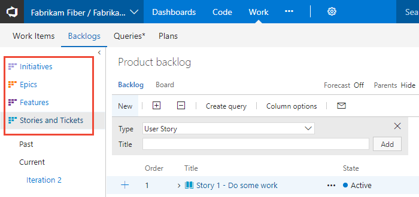 

1. From the **Process** page, select your inherited process > **Backlog levels**. 

	> [!div class="mx-imgBorder"]  
	> 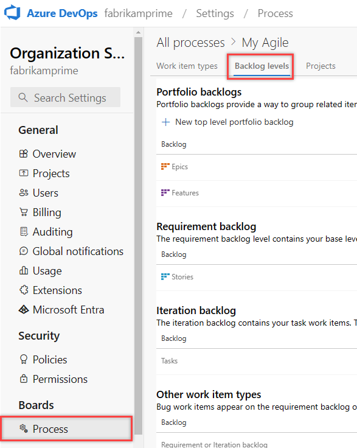 

2. You can modify the backlog and board configuration in the following ways:    
	- [Add a custom WIT to a backlog or board](customize-process-backlogs-boards.md)  
	- [Change the default WIT](customize-process-backlogs-boards.md)  
	- [Rename the requirement backlog](customize-process-backlogs-boards.md#edit-product-backlog)  
	- [Rename a portfolio backlog](customize-process-backlogs-boards.md#edit-portfolio-backlog)  
	- [Add a portfolio backlog that displays custom WITs](customize-process-backlogs-boards.md#portfolio-backlogs)  
	- [Edit or rename a portfolio backlog](customize-process-backlogs-boards.md#edit-portfolio-backlog)  
	- [Delete the top-level custom portfolio backlog](customize-process-backlogs-boards.md#edit-portfolio-backlog) 

<a id="verify">  </a>

## Verify your customization

We recommend that you create a test project and apply your customized inherited process to it to verify the changes you made. All customizations made to a process go into effect immediately on all projects. If you want to stage your changes, you can do that using one of two methods: 
- [Create a test project and copy of your customized process](#test-project-copy-process)
- [Create a test organization and import/export your process](#test-import-export-process)

<a id="test-project-copy-process"></a>

### Create a test project and copy your customized process

1. From the **Process** page, select the &hellip; context menu for the process you want to use, and then select **New team project**.  

	::: moniker range=">= azure-devops-2020"
	> [!div class="mx-imgBorder"]  
	> 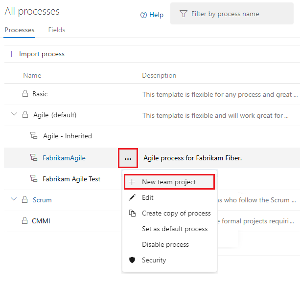 
	::: moniker-end
	::: moniker range="azure-devops-2019"
	> [!div class="mx-imgBorder"]  
	> 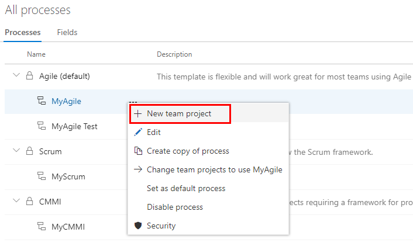 
	::: moniker-end

2. Enter information into the form. For more information, see [Create a project](../../projects/create-project.md).

	::: moniker range=">= azure-devops-2020"
	> [!div class="mx-imgBorder"]  
	> 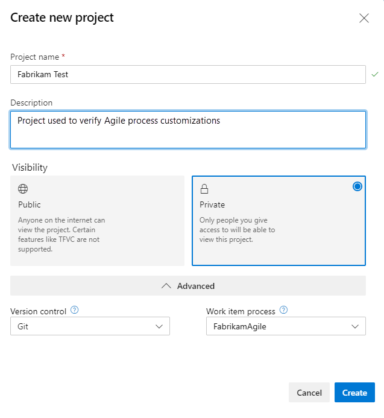 
	::: moniker-end
	::: moniker range="azure-devops-2019"
	> [!div class="mx-imgBorder"]  
	>  
	::: moniker-end

3. Select **Work** > **Work Items** > **New Work Item** and select the customized WIT. 
   In the following example, we select **Bug**. 

	> [!div class="mx-imgBorder"]  
	> 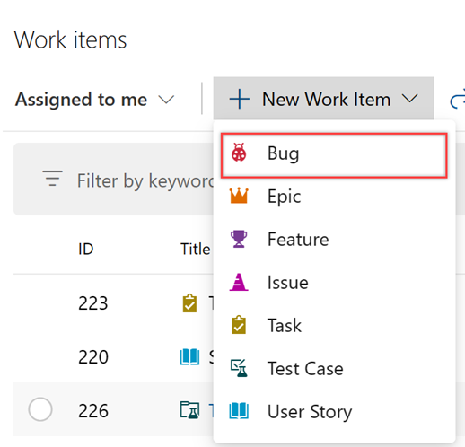 

4. Verify that one or more fields you added appear on the form. The :::image type="icon" source="../../../media/icons/required-icon.png" border="false"::: (exclamation mark) icon indicates the field is required.  

<a id="test-import-export-process"></a>

### Create a test organization and import/export your process

You can also use the following steps to verify the customizations you made to an inherited process. 
 
1. Create a test organization.  
2. Use the [import/export process tool](https://github.com/Microsoft/process-migrator) to copy the process to the test organization.  
3. Verify the process customizations in the test organization.   
4. Use the import/export process tool again to import the modified process to the production organization.  

## Change your project's process

For more information, see [Change a project's process](manage-process.md#migrate).

<a id="process-rest-api">  </a>

## Related articles

- [Use the REST API to manage processes](/rest/api/azure/devops/processes/processes/list)
- [Create an inherited process and change the project to use that process](manage-process.md). 
- [Work tracking object limits](object-limits.md)
- [What is an inherited process?](inheritance-process-model.md)
