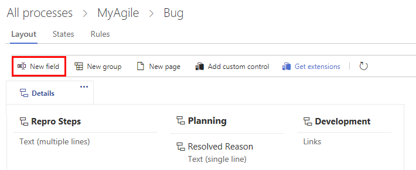
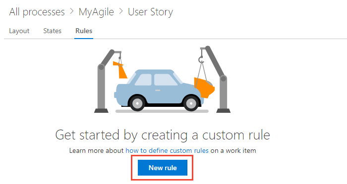
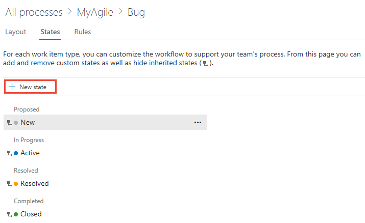
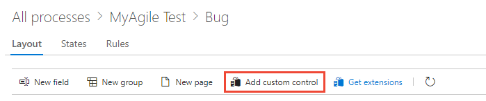
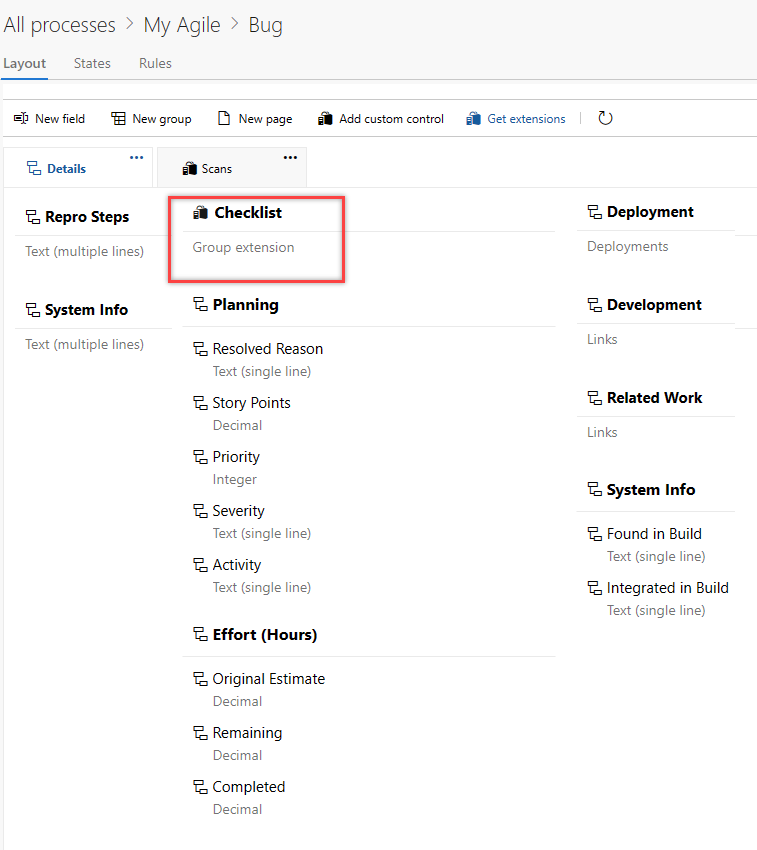
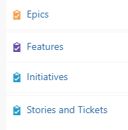
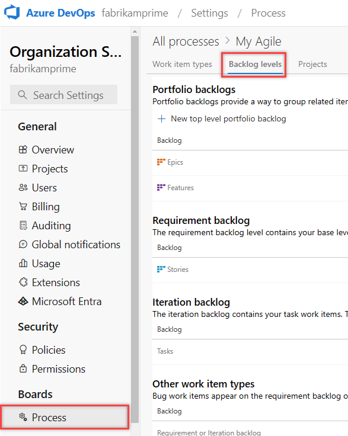
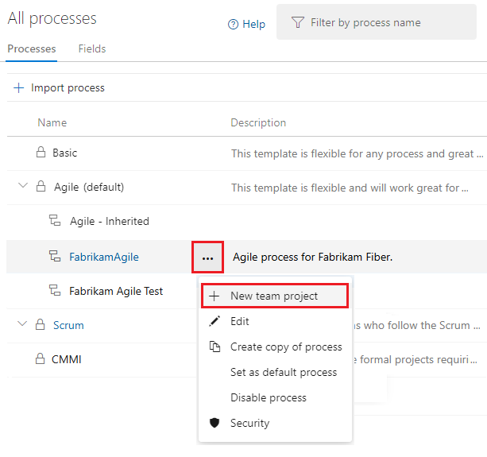
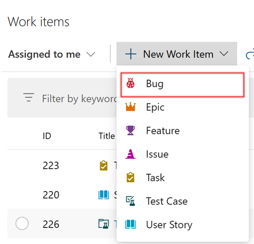

# Customize a project by using an inherited process

[!INCLUDE [version-lt-eq-azure-devops](../../../includes/version-lt-eq-azure-devops.md)]

Each project is based on a process that defines the building blocks for tracking work.
The first project you create uses one of the default processes&mdash;[**Agile**](../../../boards/work-items/guidance/agile-process.md), [**Basic**](../../../boards/get-started/plan-track-work.md), [**Scrum**](../../../boards/work-items/guidance/scrum-process.md), or [**CMMI**](../../../boards/work-items/guidance/cmmi-process.md).

You can only customize inherited processes.
Any changes you make to the inherited process automatically appear in the projects that use that process.
To customize a project, follow this sequence:

1. **Customize an inherited process**: Modify fields, work item types, workflows, forms, and backlogs to align with your requirements.
1. **Verify your customizations**: Create a test project and validate your changes.
1. **Apply the inherited process to a project**: Create a new project based on the inherited process, or change the process used by an existing project.
1. **Refresh and verify**: Refresh the web portal and open a work item of the type you modified.

[!INCLUDE [temp](../includes/note-on-prem-link.md)]

[!INCLUDE [temp](../includes/note-audit-log-support-process.md)]

[!INCLUDE [ai-assistance-mcp-server-tip](../../../includes/ai-assistance-mcp-server-tip.md)]

## Prerequisites

[!INCLUDE [temp](../includes/process-prerequisites.md)]

[!INCLUDE [temp](../includes/automatic-update-project.md)]

## Add or modify a field 

Locked :::image type="icon" source="media/process/locked-icon.png" border="false"::: fields and inherited :::image type="icon" source="media/process/inherited-icon.png" border="false"::: fields correspond to fields from a system process.
You can't customize locked fields, but you can customize some options for inherited fields.
You can fully customize fields that you add to a process.

1. Sign in to your organization (`https://dev.azure.com/{yourorganization}`).
1. Select  **Organization settings**.

   

1. Select **Process** > your **inherited process** > the **WIT** you want to customize.
1. To add a field, select the :::image type="icon" source="media/process/new-field-icon.png" border="false"::: (**New Field** icon).

	> [!div class="mx-imgBorder"]
	> 

	In the dialog, select the type of field that you want to add.
	For example: [integer](customize-process-field.md#add-field), [picklist (dropdown menu)](customize-process-field.md#pick-list), [person-name/Identity](customize-process-field.md#identity), [rich-text or HTML](customize-process-field.md#html), or [checkbox (boolean)](customize-process-field.md#boolean-field).

1. Modify an existing field in the following ways:
	- [Change the field label](customize-process-field.md#rename-field)
	- [Show or hide field on form](customize-process-field.md#show-hide-field)
	- [Set Required or Default options](customize-process-field.md#options)
	- [Move the field within the layout](customize-process-form.md#move-field)
	- [Remove field from the form](customize-process-field.md#remove-field)

## Add or modify a rule for a work item type

Add rules to support specific workflow and business use cases.
Rules let you clear the value of a field, copy a value into a field, and apply values based on dependencies between different fields' values.

1. Select your inherited process and the work item type.
1. Select **Rules** > **New rule**.

> [!div class="mx-imgBorder"]
> 

For more information, see [Rules and rule evaluation](custom-rules.md).

## Add or modify work item types

Use different work item types (WITs) to plan and track different types of work.
Add a custom WIT to customize the web form and workflow states for specific business use cases.

1. Select your inherited process and the WIT you want to customize.

1. From the **Work Item Types** page, select the :::image type="icon" source="../../../media/icons/blue-add-icon.png" border="false"::: **New work item type**.

	:::image type="content" source="media/process/cpwit-add-new-wit.png" alt-text="Screenshot of Process, Inherited process, Work Item Types, Add new work item type.":::

1. Name the WIT and optionally specify a description, icon, and color.
	The icon and color appear throughout the web portal, including on the work item form, backlogs, boards, and query results.

	:::image type="content" source="media/process/cwit-create-wit-ticket.png" alt-text="Screenshot of Create new work item type dialog.":::

1. Select **Create** to save.

    You can now add fields to the WIT or customize it in the following ways:
	- [Modify the workflow](#workflow)
	- [Add or remove a custom control](#custom-control)
	- [Add an extension](#extension)
	- [Add, move, or remove custom groups](customize-process-form.md#groups)
	- [Add, move, or delete custom pages](customize-process-form.md#pages)

## Modify the workflow of a work item type

Workflow states help you track the status of a work item as it moves from new to completed.

1. To modify a workflow, select your inherited process, the work item type, and then the **States** page.

	> [!div class="mx-imgBorder"]
	> 

1. Modify the workflow by using the following options:
	- [Hide a workflow state](customize-process-workflow.md#hide-state)
	- [Add a state](customize-process-workflow.md#add-states)
	- [Edit a state (change color or category)](customize-process-workflow.md#edit-state)
	- [Remove a state](customize-process-workflow.md#remove-state)
 

## Add a custom control

Custom controls add more functionality to a work item form.

From the **Process** page, select your inherited process, select the work item type, and then select **Add custom control**.

   > [!div class="mx-imgBorder"]
   > 

## Add an extension to a work item type

An extension is an installable unit that adds new capabilities to your project.

> [!NOTE]
> Group and page extensions automatically add to all work item types (WITs) for all processes, both system and inherited.
> You can hide an extension for selected WITs within an inherited process.

1. Go to the [Visual Studio Marketplace](https://marketplace.visualstudio.com/azuredevops), find an extension, and select **Get it free**.

   :::image type="content" source="media/process/marketplace-extension-work-item-checklist.png" alt-text="Screenshot of Marketplace extension, Work item checklist.":::

1. Select the organization you want to add it to from the dropdown menu, and then select **Install**.

   :::image type="content" source="media/process/install-work-item-checklist-extension.png" alt-text="Screenshot of selected organization and install button.":::

1. Return to the process and WIT and verify the extension is where you want it.
	You can drag it to where you want it on the form.

	> [!div class="mx-imgBorder"]
	> 

## Modify the backlog and boards

You can add more work item types (WITs) to a backlog level or create another portfolio backlog.
For example:

- You introduce a third-level portfolio backlog called **Initiatives** to track the custom **Initiative** WIT.
- You rename the product backlog to **Stories** and **Tickets** to encompass both **User stories** and **Customer tickets**.

> [!div class="mx-imgBorder"]
> 

1. From the **Process** page, select your inherited process and then select **Backlog levels**.

	> [!div class="mx-imgBorder"]
	> 

1. Modify the backlog and board configuration in the following ways:
	- [Add a custom WIT to a backlog or board](customize-process-backlogs-boards.md)
	- [Change the default WIT](customize-process-backlogs-boards.md)
	- [Rename the requirement backlog](customize-process-backlogs-boards.md#edit-product-backlog)
	- [Rename a portfolio backlog](customize-process-backlogs-boards.md#edit-portfolio-backlog)
	- [Add a portfolio backlog that displays custom WITs](customize-process-backlogs-boards.md#portfolio-backlogs)
	- [Edit or rename a portfolio backlog](customize-process-backlogs-boards.md#edit-portfolio-backlog)
	- [Delete the top-level custom portfolio backlog](customize-process-backlogs-boards.md#edit-portfolio-backlog)

## Verify your customization

Create a test project and apply your customized inherited process to verify your changes.
All customizations to a process take effect immediately on all projects.
To stage your changes, use one of the following methods:
- [Create a test project and copy of your customized process](#test-project-copy-process)
- [Create a test organization and import/export your process](#test-import-export-process)

### Create a test project and copy your customized process

1. From the **Process** page, select the &hellip; context menu for the process you want to use, and then select **New team project**.

	::: moniker range="<=azure-devops"
	> [!div class="mx-imgBorder"]
	> 
	::: moniker-end

1. Enter information into the form, and then select **Create**.
	For more information, see [Create a project](../../projects/create-project.md).

1. From your project, select **Boards** > **Work Items**, and then select the customized WIT from the **New Work Item** dropdown menu.
   In the following example, select **Bug**.

	> [!div class="mx-imgBorder"]
	> 

1. Verify that the fields you added appear on the form.
	The :::image type="icon" source="../../../media/icons/required-icon.png" border="false"::: (exclamation mark) icon indicates the field is required.

### Create a test organization and import or export your process

Use the following steps to verify the customizations you made to an inherited process.

1. Create a test organization.
1. Use the [import/export process tool](https://github.com/Microsoft/process-migrator) to copy the process to the test organization.
1. Verify the process customizations in the test organization.
1. Use the import/export process tool again to import the modified process to the production organization.

## Change your project's process

For more information, see [Change a project's process](manage-process.md#migrate).

## Use AI to customize your project process

[!INCLUDE [ai-assistance-mcp-server-tip](../../../includes/ai-assistance-mcp-server-tip.md)]

If you use GitHub Copilot, the [Azure DevOps MCP Server](../../../mcp-server/mcp-server-overview.md) can help you customize inherited processes for your projects through natural language prompts.

### Example prompts for process customization

| Task | Example prompt |
|---|---|
| Plan a full process customization | `I'm adopting an inherited Agile process for a regulated healthcare project. Walk me through adding custom fields for Compliance Status and Regulatory Reference, a new 'Compliance Review' state, and rules that enforce sign-off before items can move to Done` |
| Add a custom work item type | `Create a 'Risk' work item type in my inherited process with fields for Likelihood, Impact, Mitigation Plan, and Risk Owner. Add it to the Requirements backlog level so it shows on our board` |
| Verify customizations in a test project | `I made several customizations to my inherited process — new fields, a custom WIT, and modified workflow states. Help me create a test project to validate everything works correctly before applying the process to our production project` |
| Compare two inherited processes | `I have two inherited processes, TeamAlpha-Agile and TeamBeta-Agile. List the differences between them in fields, work item types, states, and rules so I can decide whether to consolidate into one process` |
| Troubleshoot customization problems | `After customizing my inherited process, some fields aren't appearing on the work item form and a custom state is missing from the board. Help me diagnose what went wrong and how to fix it` |
| Revert unwanted customizations | `I made changes to the Bug work item type in my inherited process that are causing problems. Show me how to revert specific field and layout changes back to the default inherited behavior without losing other customizations` |

> [!TIP]
> For the best results, use these prompts in agent mode with the Azure DevOps MCP Server connected. Customize the prompts with your specific process name, work item types, or business requirements.

## Related content

- [Use the REST API to manage processes](/rest/api/azure/devops/processes/processes/list)
- [Create an inherited process and change the project to use that process](manage-process.md)
- [Learn work tracking object limits](object-limits.md)
