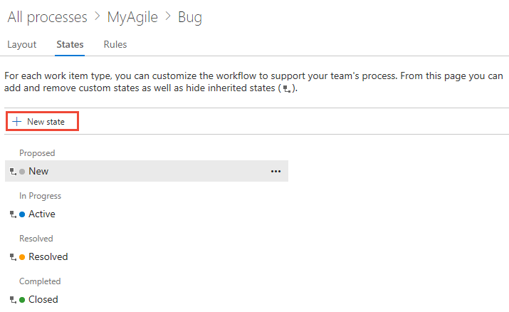
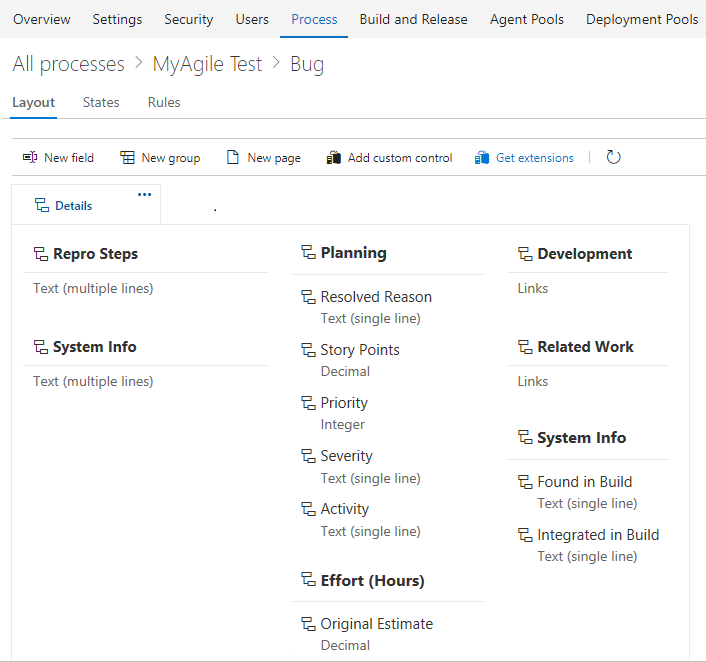

# Customize a project using an inherited process

[!INCLUDE [temp](../../../boards/_shared/version-vsts-plus-azdevserver-2019.md)]

Each project is based on a process that defines the building blocks for tracking work. The first project you create uses one of the default processes&mdash;[Agile](/azure/devops/boards/work-items/guidance/agile-process), [Scrum](/azure/devops/boards/work-items/guidance/scrum-process), or [CMMI](/azure/devops/boards/work-items/guidance/cmmi-process). 
You can only customize inherited processes.  Any changes you make to the inherited process automatically appears in the projects that use that process. 

[!INCLUDE [temp](../_shared/note-on-prem-link.md)]

The general sequence for customizing a project is to customize an inherited process, verify your customizations, and then change the process of the project(s) to use that process. 

  

You primarily customize a process by adding or modifying a work item type (WIT) defined for that process.  

Learn how to perform these tasks:  

> [!div class="checklist"] 
> * Open **Settings>Process**
> * Create an  inherited process to customize   
> * Add or modify a field 
> * Add or modify a rule for a work item type 
> * Add or modify work item types 
> * Modify the workflow of a work item type 
> * Add or modify a custom control   
> * Add an extension to a work item type
> * Verify the customizations you made  
> * Change the process used by a project 
 

[!INCLUDE [temp](../_shared/process-prerequisites.md)] 

[!INCLUDE [temp](../_shared/open-process-admin-context-ts.md)]

[!INCLUDE [temp](../_shared/automatic-update-project.md)] 
 
[!INCLUDE [temp](../_shared/create-inherited-process.md)] 

## Add or modify a field 

Locked  fields and inherited  fields correspond to fields inherited from a system process. You can't customize locked fields. You can customize some options for inherited fields. You can fully customize fields that you add to a process. 

1. To begin, choose your inherited process, and then choose the WIT you want to customize. 

2. To add a field, choose the  (**New Field** icon).  

	> [!div class="mx-imgBorder"]  
	> 

	In the dialog that opens, choose the type of field that you want to add. To learn more, see the following articles:   
	- [Integer](customize-process-field.md#add-field)  
	- [Picklist (drop-down menu)](customize-process-field.md#pick-list)  
	- [Person-name/Identity](customize-process-field.md#identity)  
	- [Rich-text or HTML](customize-process-field.md#html)  
	- [Checkbox (Boolean)](customize-process-field.md#boolean-field)

0. To modify an existing field, you can exercise these choices: 

	- [Change the field label](customize-process-field.md#rename-field)  
	- [Show/Hide field on form](customize-process-field.md#show-hide-field)  
	- [Set Required/Default options](customize-process-field.md#options)  
	- [Move the field within the layout](customize-process-form.md#move-field)
	- [Remove field from the form](customize-process-field.md#remove-field) 

## Add or modify a rule for a work item type
 
You add rules to support specific workflow and business use cases. Rules allow you to clear the value of a field, copy a value into a field, and apply values based on dependencies between different fields' values. 

To add a rule, choose your inherited process, the work item type, and then choose **Rules**, and then choose **New rule**.   

> [!div class="mx-imgBorder"]  
>  

To learn more, see [Add a rule to a work item type](custom-rules.md).

## Add or modify work item types

You use different WITs to plan and track different types of work. The main reason you add a custom WIT is to customize the web form and workflow states to meet specific business use cases.

0. To begin, choose your inherited process, and then choose the WIT you want to customize. 

0. From the **Work Item Types** page, choose the  **New work item type**.

	

1. Name the WIT and optionally specify a description, icon and color. The icon and color you specify appear throughout the web portal, including on the work item form and when associated work items appear on a backlog, boards, query results, and more. 

	 

	Click **Create** to save. 

0. You can now add fields to the WIT, or customize it in the following ways:  
	- [Modify the workflow](#workflow)  
	- [Add or remove a custom control](#custom-control)  
	- [Add an extension](#extension) 
	- [Add/move/remove custom groups](customize-process-form.md#groups)  
	- [Add/move/delete custom pages](customize-process-form.md#pages)  

<a id="workflow" />
## Modify the workflow of a work item type 

Workflow states allow you to track the status of a work item as it moves from new to completed. 

0. To modify a workflow, choose your inherited process, the WIT, and then the **States** page.  

	> [!div class="mx-imgBorder"]  
	>  

0. You can modify the workflow in the following ways:   
	- [Hide a workflow state](customize-process-workflow.md#hide-state) 
	- [Add a state](customize-process-workflow.md#add-states)  
	- [Edit a state (change color or category)](customize-process-workflow.md#edit-state)  
	- [Remove a state](customize-process-workflow.md#remove-state)     
 
<a id="custom-control" />
## Add a custom control    

Custom controls provide additional functionality to a work item form. 

- To add a custom control, choose your inherited process, the WIT, and then **Add custom control**.

	> [!div class="mx-imgBorder"]  
	>  

To learn more, see [Add extensions and custom controls to a work item type](custom-controls-process.md).

<a id="extension" /> 
## Add an extension to a work item type

An extension is an installable unit that contributes new capabilities to your project.
  
> [!NOTE]   
> Group and Page extensions are automatically added to all WITs for all processes, both system and  inherited . You can choose to hide an extension for selected WITs within an  inherited process. 

0. To add an extension to a work item type, choose your inherited process, the WIT, and then choose **Get extensions**.
 
	> [!div class="mx-imgBorder"]  
	>  

0. Select the extension you want to add. Here we choose the Work item checklist.

0. Select the organization you want to add it to and choose **Install**.  

	> [!div class="mx-imgBorder"]  
	>  

	Extensions are available to add to all projects and processes. 

0. Return to the process and WIT and verify the location of the extension is where you want it. Look for it at the bottom of the middle column and drag it to where you want it on the form. 

	> [!div class="mx-imgBorder"]  
	>  

## Modify the backlog and boards 

You can add additional WITs to a backlog level or add another portfolio backlog. As shown below, we've added a third level portfolio backlog labeled *Initiatives* which tracks the custom *Initiative* WIT, and we've renamed the product backlog to *Stories and Tickets* to indicate that we not only track *User Stories*, but also *Customer Tickets* on the product backlog. 
 
> [!div class="mx-imgBorder"]  
>  

0. To modify the backlogs  and boards configuration, begin by choosing your inherited process, and then choose the **Backlog levels** page. 

	> [!div class="mx-imgBorder"]  
	>  

0. You can modify the backlog and board configuration in the following ways:  	
	- [Add a custom WIT to a backlog or board](customize-process-backlogs-boards.md)  
	- [Change the default WIT](customize-process-backlogs-boards.md)  
	- [Rename the requirement backlog](customize-process-backlogs-boards.md#edit-product-backlog)  
	- [Rename a portfolio backlog](customize-process-backlogs-boards.md#edit-portfolio-backlog)  
	- [Add a portfolio backlog which displays custom WITs](customize-process-backlogs-boards.md#portfolio-backlogs)  
	- [Edit or rename a portfolio backlog](customize-process-backlogs-boards.md#edit-portfolio-backlog)  
	- [Delete the top-level custom portfolio backlog](customize-process-backlogs-boards.md#edit-portfolio-backlog) 

## Verify the customization you made 

We recommend that you create a test project and apply your customized inherited process to it to verify the changes you've made. All customizations made to a process go into effect immediately on all projects. If you want to stage your changes, you can do that using one of two methods: 
- [Create a test project and copy of your customized process](#test-project-copy-process)
- [Create a test organization and import/export your process](#test-import-export-process)

<a id="test-project-copy-process" />
### Create a test project and copy of your customized process

0. Open the **All processes** page, and choose the &hellip; context menu for the process you want to use, and then select **New project**.  

	> [!div class="mx-imgBorder"]  
	>  

0. The Create new project page opens. Fill out the form. 

	> [!div class="mx-imgBorder"]  
	>  

0. Open the **Work>Work Items** page (user context) and choose **New Work Item** and select a WIT you customized. Here we choose **Bug**. 

	> [!div class="mx-imgBorder"]  
	>  

0.  Verify that the field(s) you added appear on the form. Note that the  (exclamation mark) icon indicates the field is required.  

<a id="test-import-export-process" />
### Create a test organization and import/export your process

You can also use the following steps to verify the customizations you've made to an inherited process. 
 
1. Create a test organization.  
2. Use the [import/export process tool](https://github.com/Microsoft/process-migrator) to copy the process to the test organization.  
3. Verify the process customizations in the test organization.   
4. Use the import/export process tool again to import the modified process to the production organization.  

[!INCLUDE [temp](../_shared/change-project-to-inherited-process.md)] 

## Programmatically work with processes 

You can get, create, update, and delete processes defined for an organization using the [REST API, Processes](/rest/api/azure/devops/processes/processes).

## Related articles

Keep in mind that all projects that reference the inherited process that you're customizing automatically updates to contain the modifications you make.

To customize a single project, always start by [creating an inherited process and changing the project to use that process](manage-process.md). Then, all the customizations that you make to the inherited process automatically appear for the project you migrated.  

See also: 
- [Work tracking object limits](object-limits.md)
- [What is an inherited process?](inheritance-process-model.md) 

<!---
For example, the following image shows the work item form layout for the Bug WIT. From this page, you can add fields, groups, pages, and custom controls. To modify the workflow, you click **States**.

 
-->

