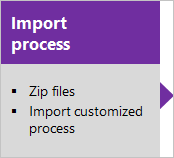

# Hosted XML process model  

[!INCLUDE [version-eq-azure-devops](../../../includes/version-eq-azure-devops.md)]

<a id="hosted-xml-process-model">  </a>


> [!NOTE]   
> **Feature availability**: The Hosted XML process model is only supported for organizations that have migrated to Azure DevOps using the data migration tool for Azure DevOps.

The Hosted XML process model provides support for customizing work tracking objects and Agile tools for a project by modifying and importing a process template. Updates made to the process template are applied to projects that were created using that process.

[!INCLUDE [temp](../../../boards/includes/note-configure-customize.md)]

## Supported customizations

You can perform the following tasks with the Hosted XML process model. 


:::row:::
   :::column span="1":::
   **Area**
   :::column-end:::
   :::column span="3":::
   **Customization support**
   :::column-end:::
:::row-end:::
:::row:::
   :::column span="1":::
   Fields  
   :::column-end:::
   :::column span="3":::   
   
   - [Add or modify a field](../../../reference/add-modify-field.md)
   - [Add a checkbox (Boolean) field](../../../reference/add-modify-field.md#boolean-field)
   - [Add rules to a field](../../../reference/add-modify-field.md#add-rules)
   - [Change a field label](../../../reference/add-modify-field.md#change-label)
   - [Add a custom control field](../../../reference/add-modify-field.md#custom-control)
   - [Remove a field](../../../reference/add-modify-field.md#change-label)    
   :::column-end:::
:::row-end:::

:::row:::
   :::column span="1":::
   Pick lists  
   :::column-end:::
   :::column span="3":::   
   
   - [Area paths](../set-area-paths.md)- [Iteration paths](../set-iteration-paths-sprints.md)
   - [State or Reason fields](../../../reference/xml/change-workflow-wit.md)
   - [Person-name field (add users)](../../security/add-users-team-project.md)
   - [Add a custom pick list](../../../reference/add-modify-field.md#picklist)
   - [Predefined field](../../../reference/add-modify-field.md#picklist)
   - [Resolution State or Failure Type](../../../reference/customize-work.md)
   - [Define global lists](/previous-versions/azure/devops/reference/xml/define-global-lists)    
   :::column-end:::
:::row-end:::

:::row:::
   :::column span="1":::
   Work item types
   :::column-end:::
   :::column span="3":::   
   
   - [Add or modify a work item type](../../../reference/add-modify-wit.md)
   - [Change the workflow (States, Reasons, Transitions)](../../../reference/xml/change-workflow-wit.md)
   - [Customize the form](/previous-versions/azure/devops/reference/xml/change-work-item-form-layout)
   - [Specify the WIT color](../../../reference/xml/process-configuration-xml-element.md#wit-colors)
   - [Specify the WIT icon](../../../reference/xml/process-configuration-xml-element.md)
   - [Specify the workflow state color](../../../reference/xml/process-configuration-xml-element.md#state-colors)     
   :::column-end:::
:::row-end:::

:::row:::
   :::column span="1":::
   Backlogs and process configuration  
   :::column-end:::
   :::column span="3":::   
   
   - [Add WITs to backlogs or boards](../../../reference/add-wits-to-backlogs-and-boards.md)
   - [Add portfolio backlogs](../../../reference/add-portfolio-backlogs.md)
   - [Configure the quick add panel](../../../reference/xml/process-configuration-xml-element.md#add)
   - [Configure the default backlog columns](../../../reference/xml/process-configuration-xml-element.md#columns)
   - [Set maximum number of Taskboard items](../../../reference/xml/process-configuration-xml-element.md#number_items)
   - [Set default weekend days (Scrum)](../../../reference/xml/process-configuration-xml-element.md#weekend_days) 
   - [Set default bug management behavior](../../../reference/xml/process-configuration-xml-element.md#behaviors)
   - [Set default hidden backlogs](../../../reference/xml/process-configuration-xml-element.md#behaviors)
   - [Process configuration](../../../reference/xml/process-configuration-xml-element.md)
   - [Categories](/previous-versions/azure/devops/reference/xml/categories-xml-element-reference)     
   :::column-end:::
:::row-end:::

:::row:::
   :::column span="1":::
   Process template 
   :::column-end:::
   :::column span="3":::    
   
   - [Import a process template](import-process/import-process.md#import-from-TFS)
   - [Export a process template](import-process/import-process.md#export-process)
   - [Customize a process template](import-process/customize-process.md)
   
   :::column-end:::
:::row-end:::

<a id="add-support-wit" />

## Add release deployment support to a work item type

The release deployments control shows release information for only those work items that have been associated to a commit that is part of a build being released. To add the release deployments control to a work item type, you need to add the following syntax to a work item type XML definition. To learn more about this control, see [Link work items to deployments](../../../boards/work-items/work-item-deployments-control.md). 

> [!div class="tabbedCodeSnippets"]
```XML
<Group Label="Deployment">
    <Control Type="DeploymentsControl" Name="Deployments" />
</Group>
```

This syntax has been been added to the following work item type definitions of the default process templates.

> [!div class="mx-tdBreakAll"]  
> |Agile|Basic|Scrum|CMMI |  
> |-----|-----|-----|-----|  
> |- Bug<br/>- Epic<br/>- Feature<br/>- Issue<br/>- Task<br/>- Test Case<br/>- User Story|- Issue<br/>- Task<br/>- Test Case|- Bug<br/>- Epic<br/>- Feature<br/> - Impediment<br/> - Product Backlog Item<br/>- Task<br/>- Test Case|- Bug<br/>- Change Request<br/>- Epic<br/>- Feature<br/>- Issue<br/>- Requirement<br/>- Review<br/>- Risk<br/>- Task|


<a id="hosted-xml-sequence"></a>
 
## Customization sequence

Use the following sequences when you manage customizations using the Hosted XML process model. This sequence requires you to update your project by updating the process template that it uses. We recommend that you maintain your process templates in a repository for version control.  

[](import-process/import-process.md#export-process)[](/previous-versions/azure/devops/reference/xml/weblayout-xml-elements)[](import-process/import-process.md)  


## Related articles
- [Customize a Hosted XML process](./import-process/customize-process.md)  
- [Import a process](./import-process/import-process.md)  
- [Change a project from Hosted XML to Inheritance](change-process-from-hosted-to-inherited.md) 
- [Differences between Inheritance and Hosted XML](./inheritance-versus-hosted-xml.md) 
- [Work tracking object limits](object-limits.md)
- [REST APIS: Processes](/rest/api/azure/devops/processes/processes/list)


