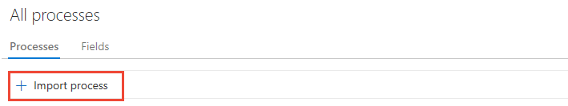
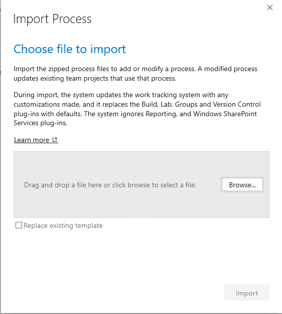
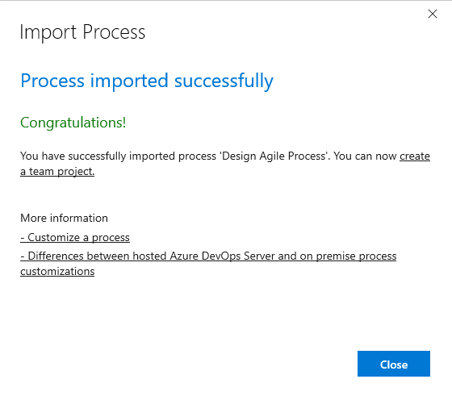
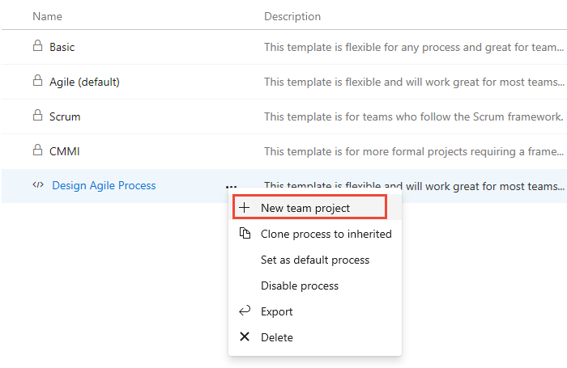
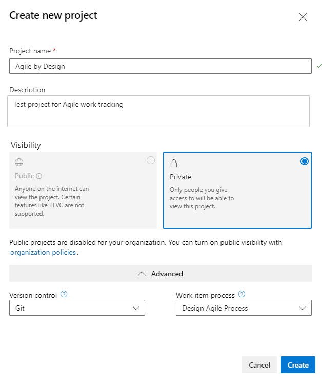
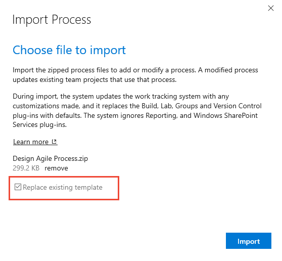
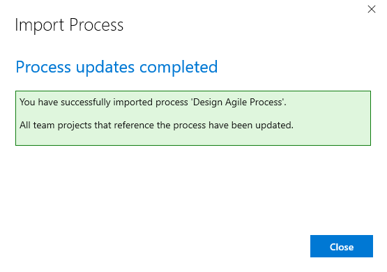
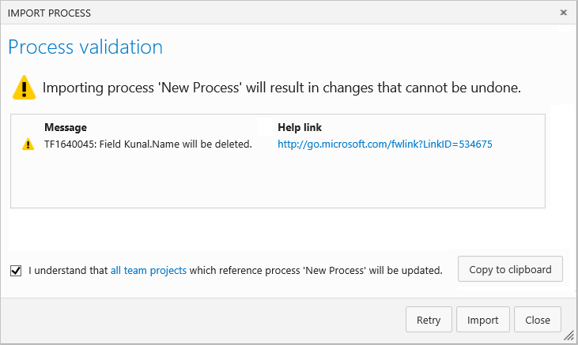
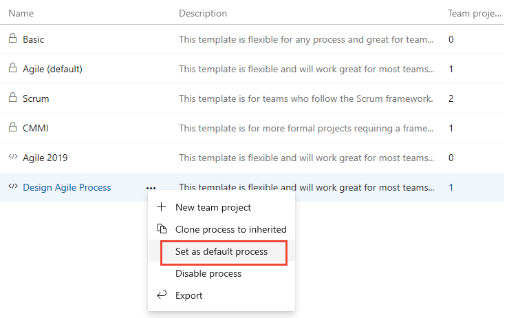

# Import and export a Hosted XML process  

**Azure DevOps Services (Hosted XML)**

> [!IMPORTANT]  
> Import process supports the Hosted XML process model which allows you to manage customizations through updating the WIT definition of a process template. This feature is only available for organizations that have been migrated to Azure DevOps Services using the [TFS Database Import Service](../../../../migrate/migration-overview.md).  
>
> If you use the Inheritance process model, you can customize your work tracking through the user interface by [creating an inherited process](../manage-process.md). If you use the On-premises XML process model, you can customize a process template, see [Upload or download a process template](../../../../boards/work-items/guidance/manage-process-templates.md) and [Customize a process template](../../../../reference/process-templates/customize-process.md).
>
> To learn more about process models, see [Customize work tracking](../../../../reference/customize-work.md). 

In Azure DevOps Services, you manage customization of work tracking objects through a process.
Hosted XML processes are imported and exported through a web based administration experience. 

When you import a new process, you're able to create new projects using it.  
When you import an existing process, all projects that use that process are updated to reflect the changes. 

For example, updates made to any of the custom processes listed below automatically update the two projects that use the process.
 

As you discover additional customizations that you need to make, you can export the existing process, update the process XML definition files, 
zip the result and re-import the newly updated process. Your changes are applied to all your existing projects that use that process.    

Import process supports the following scenarios:   
*   [Import an existing process from an on-premises Azure DevOps Server](#import-from-TFS)  
*   [Import a new process created from an existing exported process](#import-process)  
*   [Import an update to an existing process, and have all projects using that process be updated](#update-process)  

## Import a process from an on-premises Azure DevOps 

If you want to test your process in an on-premises Azure DevOps Server (formerly named Team Foundation Server (TFS)) to see if it works in Azure DevOps Services, perform the steps that follow.

In an on-premises Azure DevOps Server, each project has its own copy of a process so careful consideration needs to be made as to which processes should exist for your organization. 
Migration to Azure DevOps Services is a great time to think about process alignment across your organization and reducing the number of variants of that centralized process.  
 
1.  Run the [process export script](customize-process.md#open-process-wit) to generate a process for a given project.   

2.  (Optional) Edit the ProcessTemplate.xml file name and description. Ensure it conforms to the rules and constraints outlined in [Customize a process](customize-process.md).

3.  Create a zip file of the process folder and files.  

4.  [Import the zip file of your custom process by following the steps in the next section](#import-process).  

5.  Repeat the above process for each process you want to import to Azure DevOps Services.

6.  Using the imported process(es), create projects on Azure DevOps Services for each you want to migrate. 

[!INCLUDE [temp](../../includes/open-process-admin-context-ts-only.md)]

## Import a process

Prior to importing a process, you'll want to [customize it to support your work tracking needs](customize-process.md). 
Name your process something other than Scrum, Agile, or CMMI. These system processes are locked and you're prevented from overwriting them.   

1. Only administrators can import a process so if you aren't the organization owner or a member of the Project Collection Administrator's group, [get added](../../../security/set-project-collection-level-permissions.md).  

2.  From the **Processes** tab, choose import and then drag-and-drop or browse to the zip file of the process you've customized.  
  
    > [!NOTE]    
    > If you don't see the **Import process** link, then your organization isn't set up to support the Hosted XML process model. You should work with the [Inheritance process model](../manage-process.md) for your customization needs. The Hosted XML process model is only supported if your account was created through the [Data Import Service](../../../../migrate/migration-overview.md).

	> [!div class="mx-imgBorder"]  
	> 

3.  Choose the file to upload. Your [custom process must meet specific constraints](customize-process.md) in order to pass validation checks during import.  

	> [!div class="mx-imgBorder"]  
	> 

	Check the **Replace existing template** if you are updating an existing template. The import process overwrites any template that has the same name as the one you import and requires that you check this box to confirm you want it replaced.

	> [!IMPORTANT]  
	> You can't update one of the locked processes: Agile, CMMI, and Scrum.  

3.  Upon successful import, you'll see the following message.  

	> [!div class="mx-imgBorder"]  
	> 

    If the process doesn't pass the validation checks performed on import, you'll receive a list of error messages.  
    [Correct each error](resolve-errors.md) and then retry the import. 

4.  You can immediately create a project using the newly imported process. 

	> [!div class="mx-imgBorder"]  
	> 

5. Fill out the form that appears. To learn more about the different options, see [Create a project](../../../projects/create-project.md).

	> [!div class="mx-imgBorder"]  
	> 

## Update an existing process

Once you've added a process, you can update it by importing a zip file where you've modified one or more files within the process template.

> [!NOTE]    
>It's a best practice to [Export a process](#export-process) before making changes so that you don't accidentally overwrite changes made by other users.

1.  Import the process according to steps 2 and 3 from the previous procedure.     

2.  Check the **Replace existing template** to indicate you want to overwrite the existing process.   

	> [!div class="mx-imgBorder"]  
	> 

3.  The Import Process dialog indicates that the system is updating projects that reference the Hosted XML process.    

4.  Upon successful import, you'll see the following message. All projects that were created with the process are updated with the modifications. 

	> [!div class="mx-imgBorder"]  
	> 

5.  If you renamed or deleted fields or work item types, you receive a confirmation message.
    Go ahead and check the box and proceed with the import. To learn more about each message, select the forward link provided. 
    [Information messages](resolve-errors.md#info-only) don't require any action on your part.  

	  

## Set the default process

Set a process as the default to have it preselected for all new projects you plan to create.  

> [!div class="mx-imgBorder"]  
>  

## Export a process

Export a process when you want to update it or use it as the basis for creating another process. 

The system exports a zip file containing an XML representation of the process.  This can be modified and later imported.  

## Related articles

- [Customize a Hosted XML process](customize-process.md)
- [Change a project from Hosted XML to an inherited process](../change-process-from-hosted-to-inherited.md)
- [Clone a Hosted XML process to an Inheritance process](../upgrade-hosted-to-inherited.md)
- [Supported operations when moving from Hosted XML to an inherited process](../upgrade-support-hosted-to-inherited.md)