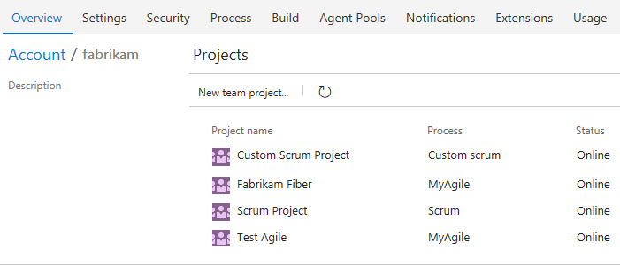
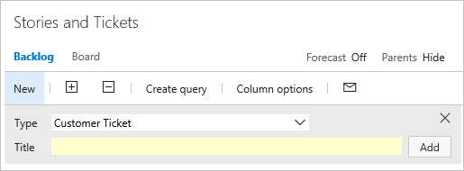

# About process customization and inherited processes  

[!INCLUDE [temp](../../../boards/_shared/version-vsts-plus-azdevserver-2019.md)]

<a id=" inherited "> </a> 

To customize the work tracking system, you *customize* an inherited process through the administrative user interface for the organization. All projects that use an inherited process get the customizations made to that process. On the other hand, you *configure* your Agile tools&mdash;[Backlogs, Sprints, Kanban boards, and Taskboard](../about-teams-and-settings.md)&mdash;for each team. 

> [!IMPORTANT]  
> To customize an on-premises project or update XML definition files to support customization, see [On-premises XML process model](../../../reference/on-premises-xml-process-model.md). This article applies to Azure DevOps Services and Azure DevOps Server 2019 only. 

There are a number of customizations you can make. The primary ones are adding custom work item types (WITs) or modifying an existing WIT to add custom fields, modify the layout, or change the workflow. 


<a id="what-you-can-customize">  </a>
Below you'll find an index to those tasks you can perform to customize an inherited process. Some options of inherited elements are locked and can't be customized.  


## System versus inherited processes 

You'll see two types of processes:

-  System processes &mdash;[Scrum, Agile, and CMMI](../../../boards/work-items/guidance/choose-process.md)&mdash;which are locked from being changed.   
-  Inherited processes, which you can customize and that inherit definitions from the system process from which they were created. System processes are owned and updated periodically by Microsoft. Any updates made to a system process automatically updates your inherited process. 

In addition, all processes are shared. That is, one or more projects can use a single process. Instead of customizing a single project, you customize a process. Changes made to the process automatically update all projects that use that process. 

Once you've created an inherited process, you can customize it, create projects based on it, make a copy of it, and change existing projects to use it. 

For example, as shown in the following image, you see a list of  projects defined for the *fabrikam* organization. The second column shows the process used by each project. To change the customizations of the *Fabrikam Fiber* project, you need to modify the *MyAgile* process (which inherits from the *Agile* system process). Any changes you make to the *MyAgile* process also update the *Test Agile* project. You can't customize the *Scrum Project*, on the other hand, until you change it to a process which inherits from Scrum.

> [!div class="mx-imgBorder"]  
> 


<a id="process-naming"></a>
### Process name restrictions  
Process names must be unique and 128 Unicode characters or less. Also, names can't contain the following characters: ```.,;'`:~\/\*|?"&%$!+=()[]{}<>```. 

To rename a process, open the &hellip; context menu for the process and choose **Edit**. 


## Inherited objects versus custom objects 

Each inherited process you create inherits the WITs defined in the system process&mdash;Agile, Scrum, or CMMI. For example, the Agile process provides bug, task, user story, feature, epic, issue and test-related WITs. 


You can add fields and modify the workflow and work item form for all inherited WITs that display on the **Work Item Types** page. If you don't want users to create a WIT, you can disable it. In addition, you can add custom WITs. 


<a id="field-customizations" />
## Field customizations 

Fields defined in the system process appear with an  inherited icon, indicating that you can make limited modifications to it in your inherited process. 

Fields are defined for all projects and processes in the organization. That means that any custom field you defined for a WIT in one process can be added to any other WIT defined for another process.   


<table width="80%">
<tbody valign="top">
<tr>
<th width="35%">Field type</th>
<th width="65%">Customization support</th>
</tr>
<tr>
<td> Inherited fields</td>
<td>
<ul>
<li>[Change the field label](customize-process-field.md#rename-field)</li>
<li>[Show/Hide field on form](customize-process-field.md#show-hide-field)</li>
</ul>
</td>
</tr>
<tr>
<td>Custom fields</td>
<td>
<ul>
<li>[Add a custom field](customize-process-field.md#add-field)</li>
<li>[Add picklist (drop-down menu)](customize-process-field.md#pick-list)</li>
<li>[Add person-name/Identity](customize-process-field.md#identity)</li>
<li>[Add a rich-text (HTML) field](customize-process-field.md#html) </li>
<li>[Add a checkbox (Boolean) field](customize-process-field.md#boolean-field)</li>
<li>[Add a custom control](custom-controls-process.md) </li>
<li>[Add custom rules to a field](custom-rules.md)</li>
<li>[Change the field label](customize-process-field.md#rename-field)</li>
<li>[Set Required/Default options](customize-process-field.md#options)</li>
<li>[Move the field within the layout](customize-process-form.md#move-field)</li>
<li>[Remove field from form](customize-process-field.md#remove-field)</li>
<li>[Delete field](customize-process-field.md#delete-field)</li> 
</ul>
</td>
</tr>
</tbody>
</table>

When adding custom fields, note the following limits:  
*   A maximum of 64 fields can be defined for each WIT  
*   A maximum of 512 fields can be defined per process   

In addition, you can [add an existing field](customize-process-field.md#add-existing-field) to another WIT within the process. For example, you can add Due Date to the user story or bug WITs.    

### What you can't customize 
- You can't change the field name or data type once you've defined it  
- With regards to picklists, you currently can't perform these operations:
	- Change the picklist of an inherited field, such as the Activity or Discipline field  
	- Change the picklist order, picklists display in alphabetic order
- Import or define a global list as supported by the Hosted XML and On-premises XML process models. To learn more, see [Define global lists](../../../reference/xml/define-global-lists.md).  

> [!NOTE]    
> With the inherited process, you can't modify the picklists of pre-defined fields&mdash;such as [Activity](../../../boards/queries/query-numeric.md), [Automation Status](../../../boards/queries/build-test-integration.md), [Discipline](../../../boards/queries/query-numeric.md), [Priority](../../../boards/queries/planning-ranking-priorities.md), plus others.  


### Configurable picklists 

The following picklists are configured for each project and not customizable through an inherited process.   
- [Area paths](../../../organizations/settings/set-area-paths.md)  
- [Iteration paths](../../../organizations/settings/set-iteration-paths-sprints.md)

Picklists associated with person-name fields, such as Assigned To and Changed By, are managed based on the users you add to a [project or team](../../accounts/add-team-members.md).   


<a id="rename-field">  </a>
### Can a field be renamed or its field type changed?   
Renaming a field or changing the field type aren't supported actions.  

However, you can change the label that appears for a field on the work item form from the Layout tab. When selecting the field in a query you need to select the field name and not the field label. 

[!INCLUDE [temp](../_shared/field-reference.md)] 

[!INCLUDE [temp](../_shared/fields-become-invalid-after-customization.md)] 


<a id="system-rules">  </a>
## Custom rules and system rules

Each WIT&mdash;bug, task, user story, etc.&mdash;has several system rules already defined. Some are simple, like making the Title field required or setting a default for the Value Area field. In addition, a number of system rules define actions to take when a workflow state changes. 

For example, several rules exist to copy the current user identity under the following conditions: 
- When a work item is modified, copy the user identity to the Changed By field
- When the workflow state changes to Closed or Done, copy the user identity to the Closed By field. 
 
> [!IMPORTANT]  
> Predefined system rules take precedent over any custom rule that you define which would overwrite it.  

Custom rules provide support for a number of business use cases, allowing you to go beyond setting a default value for a field or make it required. Rules allow you to clear the value of a field, copy a value into a field, and apply values based on dependencies between different fields' values. 

With a custom rule, you can define a number of actions based on specific conditions. For example, you can apply a rule to support these types of scenarios: 

- When a value is defined for Priority, then make Risk a required field 
- When a change is made to the value of Release, then clear the value of "Milestone"     
- When a change was made to the value of Remaining Work, then make Completed Work a required field
- When the value of Approved is True, then make Approved By a required field 
- When a user story is created, make the following fields required: Priority, Risk, and  Effort

[!INCLUDE [temp](../_shared/tip-formula-rule.md)]

For details on defining custom rules, see [Add a rule to a work item type](../../../organizations/settings/work/custom-rules.md). 


## WIT customizations 

Here are your customization options for inherited and custom WITs. 

<table width="80%">
<tbody valign="top">
<tr>
<th width="35%">WIT type</th>
<th width="65%">Customization support</th>
</tr>
<tr>
<td> Inherited WITs </td>
<td>
<ul>
<li>[Add custom rules to a WIT](custom-rules.md)</li>
<li>[Add/remove custom fields](customize-process-field.md)</li>
<li>[Add/remove custom groups](customize-process-form.md#groups)</li>
<li>[Add/remove custom pages](customize-process-form.md#pages)</li>
<li>[Add/remove a custom control](custom-controls-process.md)</li>
<li>[Enable/disable](customize-process-wit.md#enable-disable)</li> 
</ul>
</td>
</tr>
<tr>
<td>Custom WITs </td>
<td>
<ul>
<li>[Add custom WIT](customize-process-wit.md#add-wit)</li>
<li>[Change color or description](customize-process-wit.md#overview)</li>
<li>[Add/remove custom fields](customize-process-field.md)</li>
<li>[Add/remove custom groups](customize-process-form.md#groups)</li>
<li>[Add/remove custom pages](customize-process-form.md#pages)</li>
<li>[Add/remove a custom control](custom-controls-process.md)</li> 
<li>[Add custom rules to a wit](custom-rules.md)</li>
<li>[Add, edit, or remove a workflow state](customize-process-workflow.md#states)</li>
<li>[Enable/disable](customize-process-wit.md#enable-disable)</li>
<li>[Delete](customize-process-wit.md#destroy)</li> 
</ul>
</td>
</tr>
</tbody>
</table>
**What you can't customize**  
- You can't add or remove an inherited WIT to or from a backlog  
- You can't change the position of an inherited field within the form layout (however, you can hide the field in one area of the form and add it elsewhere in the form) 
- You can't remove the inherited portfolio level from the product (but you can rename them)
- You can't change the name of a custom WIT. 


### Work item form customizations 

You can make the following customizations to a WIT form. 


<table width="80%">
<tbody valign="top">
<tr>
<th width="35%">Group or page type</th>
<th width="65%">Customization support</th>
</tr>
<tr>
<td> Inherited groups  </td>
<td>
<ul>
<li>[Relabel](customize-process-form.md#groups)</li>
<li>[Add/remove custom fields](customize-process-field.md)</li>
<li>[Show/hide fields](customize-process-field.md#remove-field)</li>
</ul>
</td>
</tr>
<tr>
<td>Custom groups </td>
<td>
<ul>
<li>[Add, modify, re-sequence, delete](customize-process-form.md#groups)</li>
<li>[Add/remove custom fields](customize-process-field.md)</li>
<li>[Add/Hide a group extension](custom-controls-process.md)</li>
</ul>
</td>
</tr>
<tr>
<td> Inherited pages  </td>
<td>
<ul>
<li>[Relabel](customize-process-form.md#pages)</li>
<li>[Add/remove custom fields](customize-process-field.md)</li>
<li>[Add/remove a custom group](customize-process-form.md#groups) </li>
</ul>
</td>
</tr>
<tr>
<td>Custom pages </td>
<td>
<ul>
<li>[Add, modify, re-sequence, delete](customize-process-form.md#pages)</li>
<li>[Add/delete custom fields](customize-process-field.md)</li>
<li>[Add/hide a page extension](custom-controls-process.md)</li> 
</ul>
</td>
</tr>
</tbody>
</table>

<a id="resizing">  </a>  
### Layout and resizing 

The web form layout is organized into three columns as shown in the image below. 


If you only add groups and fields to the first two columns, then the layout reflects a two column layout. Likewise, if you only add groups and fields to the first column, then the layout reflects a one column layout. 

The web form resizes depending on the width available and the number of columns in the layout.  At maximum width, in most web browsers, each column within a page displays within its own column. As the display width decreases, each column resizes proportionally as follows: 

- For three columns: 50%, 25%, and 25%  
- For two columns: 66% and 33%  
- For one column: 100%.  

When the display width won't accommodate all columns, columns appear stacked within the column to the left. 

## Workflow customizations

You can customize the workflow of any WIT by hiding inherited states or adding custom states. By default, each WIT is defined with three or four workflow states. Inherited states differ based on the system process &mdash;[Agile](../../../boards/work-items/guidance/agile-process.md), [Scrum](../../../boards/work-items/guidance/scrum-process.md), or [CMMI](../../../boards/work-items/guidance/cmmi-process.md)&mdash;you chose from which to create your custom process. 

> [!NOTE]    
> Before adding a workflow state, review [Workflow states and state categories](../../../boards/work-items/workflow-and-state-categories.md) to learn how workflow states are used to support several Agile tools. 


<table width="80%">
<tbody valign="top">
<tr>
<th width="35%">State types</th>
<th width="65%">Customization support</th>
</tr>
<tr>
<td> Inherited states   </td>
<td>
<ul>
<li>[View workflow states](customize-process-workflow.md#hide-state)</li>
<li>[Hide a state](customize-process-workflow.md#hide-state)</li>
</ul>
</td>
</tr>
<tr>
<td>Custom states  </td>
<td>
<ul>
<li>[Add a state](customize-process-workflow.md#add-states)</li>
<li>[Edit a state (change color or category)](customize-process-workflow.md#edit-state)</li>
<li>[Remove a state](customize-process-workflow.md#remove-state)</li>  
</ul>
</td>
</tr>
</tbody>
</table>

**The workflow states must conform to the following rules:** 
- At least one state must be defined for either the *Proposed* or *In Progress* state categories 
- At a minimum, there must be at least two workflow states defined

**What you can't customize**  
- You can't modify an inherited state (you can't change its name, color, or category), but you can hide it
- You can't modify the state assigned to the *Completed* state category for any WIT, custom or inherited 
- You can't change the name of a custom state 
- You can't change the order of states (states are listed in the order you add them within the States page, and they're listed  alphabetically within the drop down list of a work item form)  
- You can't specify a Reason for a state, instead, default reasons are defined such as *Moved to state Triaged*, *Moved out of state Triaged* 
- You can't restrict transitions, all transitions are defined from any state to another state.  


## Backlog and board customizations 

Backlogs and boards are essential Agile tools for creating and managing work for a team. The standard backlogs&mdash;product, iteration, and portfolio&mdash;inherited from the system process are fully customizable.  In addition, you can add two custom portfolio backlogs. 


<table width="80%">
<tbody valign="top">
<tr>
<th width="35%">Backlog types</th>
<th width="65%">Customization support</th>
</tr>
<tr>
<td>Standard backlogs  </td>
<td>
<ul>
<li>[Add a custom WIT](customize-process-backlogs-boards.md)</li>
<li>[Change the default WIT](customize-process-backlogs-boards.md)</li>
<li>[Rename the requirement backlog](customize-process-backlogs-boards.md#edit-product-backlog)</li>
<li>[Rename a portfolio backlog](customize-process-backlogs-boards.md#edit-portfolio-backlog) </li>
</ul>
</td>
</tr>
<tr>
<td>Custom portfolio backlogs </td>
<td>
<ul>
<li>[Add a portfolio backlog which displays custom WITs](customize-process-backlogs-boards.md#portfolio-backlogs)</li>
<li>[Edit or rename a portfolio backlog](customize-process-backlogs-boards.md#edit-portfolio-backlog)</li>
<li>[Delete the top-level custom portfolio backlog](customize-process-backlogs-boards.md#edit-portfolio-backlog) </li>
</ul>
</td>
</tr>
</tbody>
</table>

When you change the default WIT for a backlog level, it causes that WIT to appear by default in the quick add panel. For example, *Customer Ticket* appears by default in the following quick add panel for the product backlog. 

 


**What you can't customize**  
- You can't add or remove an inherited WIT to or from a backlog, for example, you can't add the Issue WIT to the product backlog    
- You can't remove an inherited portfolio level from the product (but you can rename them)
- You can't insert a backlog level within the existing set of defined backlogs
- You can't reorder the backlog levels  
- You can't create a custom task level, although you can add custom WITs to the iteration backlog  
- You can't add the *Bug* WIT to any backlog level. Instead, the system allows each team to decide how they want to manage bugs. To learn more, see [Show bugs on backlogs and boards](../show-bugs-on-backlog.md).


### Fields added to WITs associated with a backlog level 

When you add a WIT to a backlog level, the following fields are added to the WIT definition as hidden fields (that is, they don't appear on the work item form) to support select Agile tool features.    

| Backlog level | Fields added | 
|---------------|--------------|
| Portfolio backlog |- Stack rank (Agile, CMMI)<br/>- Backlog Priority (Scrum) | 
| Requirement backlog |- Stack Rank, Story Points (Agile)<br/>- Stack Rank, Size (CMMI)<br/>- Backlog Priority, Effort (Scrum) |
| Iteration backlog |- Activity, Remaining Work, Stack Rank (Agile)<br/>- Discipline, Remaining Work, Stack Rank (CMMI)<br/>- Activity, Remaining Work, Backlog Priority (Scrum) |

The Stack Rank and Backlog Priority fields capture the relative priority of work items as they are reordered on a backlog or board. For details on it's usage, see [Behind the scenes: the Backlog Priority or Stack Rank field](https://blogs.msdn.microsoft.com/devops/2014/05/14/behind-the-scenes-the-backlog-priority-or-stack-rank-field/). 

The Story Points, Size, and Effort fields capture the relative work required to complete a WIT assigned to the Requirement backlog. This value is used to compute [velocity](../../../report/dashboards/velocity-chart-data-store.md).  

And, lastly, Remaining Work is used [Sprint burndown and capacity charts](../../../boards/sprints/define-sprints.md). 

## Object limits

For a list of limits placed on the number of fields, WITs, backlog levels, and other objects you can customize, see [Work tracking object limits](object-limits.md). 

