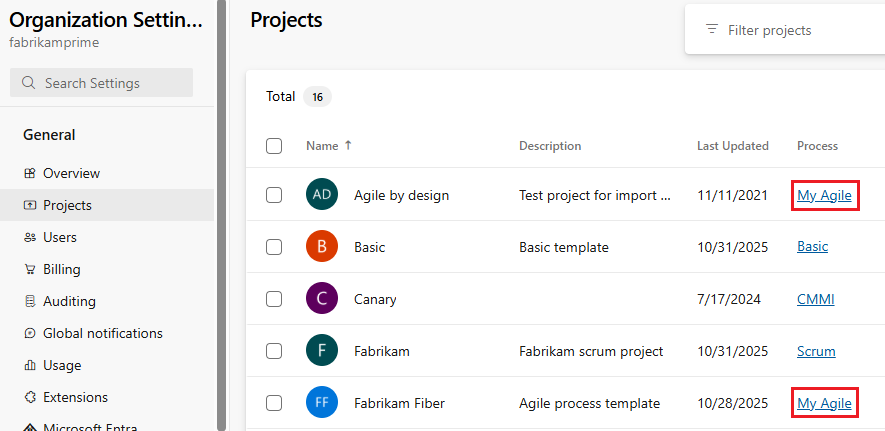
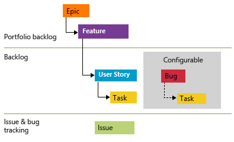
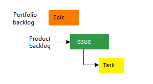
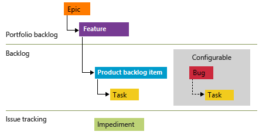
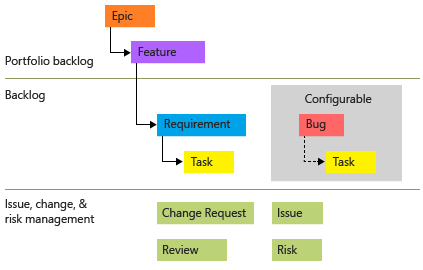
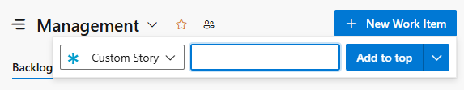

# About process customization and inherited processes  

[!INCLUDE [temp](../../../boards/includes/version-vsts-plus-azdevserver-2019.md)]

<a id="inherited" /> 

To customize the work tracking system, you *customize* an inherited process through the administrative user interface for the organization. All projects that use an inherited process get the customizations made to that process. On the other hand, you *configure* your Agile tools&mdash;[Backlogs, Sprints, Kanban boards, and Taskboard](../about-teams-and-settings.md)&mdash;for each team. 

> [!IMPORTANT]  
> To customize an on-premises project or update XML definition files to support customization, see [On-premises XML process model](../../../reference/on-premises-xml-process-model.md). This article applies to Azure DevOps Services and Azure DevOps Server 2019 only. 

There are a number of customizations you can make. The primary ones are adding custom work item types (WITs) or modifying an existing WIT to add custom fields, modify the layout, or change the workflow. 

<a id="what-you-can-customize">  </a>

[!INCLUDE [temp](../includes/note-audit-log-support-process.md)]

Below you'll find an index to those tasks you can perform to customize an inherited process. Some options of inherited elements are locked and can't be customized.  

[!INCLUDE [temp](../../../boards/includes/note-configure-customize.md)]


## System versus inherited processes 

You'll see two types of processes:

-  System processes &mdash;[Agile, Basic, Scrum, and CMMI](../../../boards/work-items/guidance/choose-process.md)&mdash;which are locked from being changed.   
-  Inherited processes, which you can customize and that inherit definitions from the system process from which they were created. System processes are owned and updated periodically by Microsoft. Any updates made to a system process automatically cause an update to your inherited processes. 

::: moniker range="azure-devops-2019"
> [!NOTE]   
> The Basic process is available with Azure DevOps Server 2019 Update 1 and later versions.  
::: moniker-end

In addition, all processes are shared. That is, one or more projects can use a single process. Instead of customizing a single project, you customize a process. Changes made to the process automatically update all projects that use that process. 
Once you've created an inherited process, you can customize it, create projects based on it, make a copy of it, and change existing projects to use it. 

For example, as shown in the following image, you see a list of  projects defined for the *fabrikam* organization. The second column shows the process used by each project. To change the customizations of the *Fabrikam Fiber* project, you need to modify the *MyScrum* process (which inherits from the *Scrum* system process). Any changes you make to the *MyScrum* process also update other projects that use that process. You can't customize the *Query test* project, on the other hand, until you change it to a process which inherits from *Agile*.

> [!div class="mx-imgBorder"]  
> 

<a id="process-naming"></a>

### Process name restrictions  

Process names must be unique and 128 Unicode characters or less. Also, names can't contain the following characters: ```.,;'`:~\/\*|?"&%$!+=()[]{}<>```. 

To rename a process, open the &hellip; context menu for the process and choose **Edit**. 

::: moniker range="azure-devops"

## Change the reference process of a project 

If you want to switch the process a project uses from one system process to another, you can do that. To make these changes, you must create an inherited process based on the process you want to switch to. For example, instructions are provided to support the following changes: 

- [From Basic to Agile](change-process-basic-to-agile.md)
- [From Scrum to Agile](change-process-scrum-to-agile.md)
- [From Agile to Scrum](change-process-agile-to-scrum.md)

Following the guidance provided in the above listed articles, you can also make additional changes, for example, from CMMI to Agile or Agile to CMMI. 

Prior to making this change, we recommend you familiarize yourself with the process you are changing to. The system processes are summarized in [Choose a process](../../../boards/work-items/guidance/choose-process.md).


::: moniker-end

## Inherited objects versus custom objects 

Each inherited process you create inherits the WITs defined in the system process&mdash;Basic, Agile, Scrum, or CMMI. For example, the Agile process provides bug, task, user story, feature, epic, issue and test-related WITs. 


#### [Agile process](#tab/agile-process) 



#### [Basic process](#tab/basic-process) 



> [!NOTE]  
> The Basic process is available when you create a new project from Azure DevOps Services or [Azure DevOps Server 2019.1](https://go.microsoft.com/fwlink/?LinkId=2097609). For earlier on-premises deployments, choose Agile, Scrum, or CMMI process. 

#### [Scrum process](#tab/scrum-process) 



#### [CMMI process](#tab/cmmi-process) 



* * * 

You can add fields and modify the workflow and work item form for all inherited WITs that display on the **Work Item Types** page. If you don't want users to create a WIT, you can disable it. In addition, you can add custom WITs. 


<a id="field-customizations" />

## Field customizations 

Fields defined in the system process appear with an :::image type="icon" source="media/process/inherited-icon.png" border="false"::: inherited icon, indicating that you can make limited modifications to it in your inherited process. 

Fields are defined for all projects and processes in the organization. That means that any custom field you defined for a WIT in one process can be added to any other WIT defined for another process. 

---
:::row:::
   :::column span="":::
      **Field type**
   :::column-end:::
   :::column span="2":::
      **Customization support**  
   :::column-end:::
:::row-end:::
---
:::row:::
   :::column span="":::
      :::image type="icon" source="media/process/inherited-icon.png" border="false":::**Inherited fields** 
   :::column-end:::
   :::column span="2":::
      - [Change the field label](customize-process-field.md#rename-field)  
      - [Show/Hide field on form](customize-process-field.md#show-hide-field)  
      ::: moniker range=">= azure-devops-2020"
      - [Modify picklist (drop-down menu)](customize-process-field.md#pick-list)  
      ::: moniker-end  
      ::: moniker range="azure-devops"
      - [Modify Description help text](customize-process-field.md#modify-description)  
      ::: moniker-end  
   :::column-end:::
:::row-end:::
---
:::row:::
   :::column span="":::
      **Custom fields**
   :::column-end:::
   :::column span="2":::
      - [Add a custom field](customize-process-field.md#add-field)  
      - [Add picklist (drop-down menu)](customize-process-field.md#pick-list)  
      - [Add person-name/Identity](customize-process-field.md#identity)  
      - [Add a rich-text (HTML) field](customize-process-field.md#html)  
      - [Add a checkbox (Boolean) field](customize-process-field.md#boolean-field)  
      - [Add a custom control](custom-controls-process.md)  
      - [Add custom rules to a field](custom-rules.md)  
      - [Change the field label](customize-process-field.md#rename-field)  
      - [Set Required/Default options](customize-process-field.md#options)  
      - [Move the field within the layout](customize-process-form.md#move-field)  
      ::: moniker range=">= azure-devops-2020"
      - [Modify Description help text](customize-process-field.md#modify-description)  
      - [Show/Hide field on form](customize-process-field.md#show-hide-field)
      ::: moniker-end  
      - [Remove field from form](customize-process-field.md#remove-field)  
      - [Delete field](customize-process-field.md#delete-field)  
   :::column-end:::
:::row-end:::
---
:::row:::
   :::column span="":::
      **Custom control**
   :::column-end:::
   :::column span="2":::
      - [Add a field-level contribution or custom control](custom-controls-process.md#add-field-control)  
      - [Add a group-level or page-level contribution](custom-controls-process.md#group-level)  
      - [Move the control within the layout](customize-process-form.md#move-field)  
      - [Show/Hide control on form](customize-process-field.md#show-hide-field)  
   :::column-end:::
:::row-end:::
---

When adding custom fields, note the following limits:  
*   A maximum of 64 fields can be defined for each WIT  
*   A maximum of 512 fields can be defined per process   

In addition, you can [add an existing field](customize-process-field.md#add-existing-field) to another WIT within the process. For example, you can add Due Date to the user story or bug WITs.    

### What you can't customize 

::: moniker range=">= azure-devops-2020"

- You can't change the field name or data type once you've defined it
- You can't modify the gray area on the form where the State, Reason, Area Path, and iteration path fields are located  
- You can't import or define a global list as supported by the Hosted XML and On-premises XML process models. To learn more, see [Define global lists](../../../reference/xml/define-global-lists.md).  

::: moniker-end

::: moniker range="azure-devops-2019"

- You can't change the field name or data type once you've defined it
- You can't modify the gray area on the form where the State, Reason, Area Path, and iteration path fields are located  
- With regards to picklists, you currently can't perform these operations:
    - Change the picklist of an inherited field, such as the Activity or Discipline field  
    - Change the picklist order, picklists display in alphabetic order
- You can't modify the Description help text of inherited fields
- Import or define a global list as supported by the Hosted XML and On-premises XML process models. To learn more, see [Define global lists](../../../reference/xml/define-global-lists.md).  

> [!NOTE]    
> With the inherited process, you can't modify the picklists of pre-defined fields&mdash;such as [Activity](../../../boards/queries/query-numeric.md), [Automation Status](../../../boards/queries/build-test-integration.md), [Discipline](../../../boards/queries/query-numeric.md), [Priority](../../../boards/queries/planning-ranking-priorities.md), plus others.  

::: moniker-end

### Configurable picklists 

The following picklists are configured for each project and not customizable through an inherited process.   
- [Area paths](../../../organizations/settings/set-area-paths.md)  
- [Iteration paths](../../../organizations/settings/set-iteration-paths-sprints.md)

Picklists associated with person-name fields, such as Assigned To and Changed By, are managed based on the users you [add to a project or team](../../security/add-users-team-project.md).   


<a id="rename-field">  </a>

### Can I rename a field or change its data type?   

Renaming a field or changing the data type aren't supported actions. However, you can change the label that appears for a field on the work item form from the Layout tab. When selecting the field in a query you need to select the field name and not the field label. 

<a id="delete-restore" />

### Can I delete or restore a deleted field? 

You can delete a field, and later restore it. Deleting a field deletes all data associated with that field, including historical values. Once deleted, you can only restore the field and recover the data using the [Fields - Update REST API](/rest/api/azure/devops/wit/fields/update). 

Instead of deleting a field, you may want to instead hide or remove the field from a work item form. For details, see [Add and manage fields, Show, hide, or remove a field](customize-process-field.md#show-hide-remove-field).

[!INCLUDE [temp](../includes/field-reference.md)] 

[!INCLUDE [temp](../includes/fields-become-invalid-after-customization.md)] 


<a id="system-rules">  </a>

## Custom rules and system rules

Each WIT&mdash;bug, task, user story, etc.&mdash;has several system rules already defined. Some are simple, like making the Title field required or setting a default for the Value Area field. In addition, a number of system rules define actions to take when a workflow state changes. 

For example, several rules exist to copy the current user identity under the following conditions: 
- When a work item is modified, copy the user identity to the Changed By field
- When the workflow state changes to Closed or Done, copy the user identity to the Closed By field. 

> [!IMPORTANT]  
> Predefined system rules take precedent over any custom rule that you define which would overwrite it.  

Custom rules provide support for a number of business use cases, allowing you to go beyond setting a default value for a field or make it required. Rules allow you to clear the value of a field, copy a value into a field, and apply values based on dependencies between different fields' values. 

With a custom rule, you can define a number of actions based on specific conditions. For example, you can apply a rule to support these types of scenarios: 

- When a value is defined for Priority, then make Risk a required field 
- When a change is made to the value of Release, then clear the value of "Milestone"     
- When a change was made to the value of Remaining Work, then make Completed Work a required field
- When the value of Approved is True, then make Approved By a required field 
- When a user story is created, make the following fields required: Priority, Risk, and  Effort

[!INCLUDE [temp](../includes/tip-formula-rule.md)]

For details on defining custom rules, see [Rules and rule evaluation](../../../organizations/settings/work/custom-rules.md). 

::: moniker range=">= azure-devops-2020"

### Restrict modification of select fields for select user groups

Using one of the following two conditions, you can make select fields required for a user of a security group or who are not a member of a security group. 

- `current user is a member of a group...`
- `current user is not a member of a group...`

For example, you can make the Title or the State field Read-only for select users or groups. 

::: moniker-end


### Restrict modification of work items based on Area Path 

You can disallow users from modifying select work items by setting permissions on an Area path. This is not a rule setting, but a permission setting. To learn more, see [Create child nodes, modify work items under an area path](../../security/set-permissions-access-work-tracking.md#create-child-nodes-modify-work-items-under-an-area-path).

## Work item type (WIT) customizations 

Here are your customization options for inherited and custom WITs. 

---
:::row:::
   :::column span="":::
      **Work item type**
   :::column-end:::
   :::column span="2":::
      **Customization support**  
   :::column-end:::
:::row-end:::
---
:::row:::
   :::column span="":::
      :::image type="icon" source="media/process/inherited-icon.png" border="false":::**Inherited work item types** 
   :::column-end:::
   :::column span="2":::
      - [Add custom rules to a WIT](custom-rules.md)  
      - [Add/remove custom fields](customize-process-field.md)  
      - [Add/remove custom groups](customize-process-form.md#groups)  
      - [Add/remove custom pages](customize-process-form.md#pages) 
      - [Add/remove a custom control](custom-controls-process.md)  
      - [Enable/disable](customize-process-work-item-type.md#enable-disable)  
   :::column-end:::
:::row-end:::
---
:::row:::
   :::column span="":::
      **Custom work item types**
   :::column-end:::
   :::column span="2":::
      - [Add custom WIT](customize-process-work-item-type.md#add-wit)  
      - [Change color or description](customize-process-work-item-type.md#overview)  
      - [Add/remove custom fields](customize-process-field.md)  
      - [Add/remove custom groups](customize-process-form.md#groups)  
      - [Add/remove custom pages](customize-process-form.md#pages)  
      - [Add/remove a custom control](custom-controls-process.md)  
      - [Add custom rules to a wit](custom-rules.md)  
      - [Add, edit, or remove a workflow state](customize-process-workflow.md#states)  
      - [Enable/disable](customize-process-work-item-type.md#enable-disable)  
      - [Delete](customize-process-work-item-type.md#destroy)  
   :::column-end:::
:::row-end:::
---


#### What you can't customize  

- You can't add or remove an inherited WIT to or from a backlog
- You can't change the position of an inherited field within the form layout (however, you can hide the field in one area of the form and add it elsewhere in the form) 
- You can't remove the inherited portfolio level from the product (but you can rename them)
- You can't change the name of a custom WIT. 


### Work item form customizations 

You can make the following customizations to a WIT form. 

---
:::row:::
   :::column span="":::
      **Group or page type**
   :::column-end:::
   :::column span="2":::
      **Customization support**  
   :::column-end:::
:::row-end:::
---
:::row:::
   :::column span="":::
      :::image type="icon" source="media/process/inherited-icon.png" border="false":::**Inherited groups** 
   :::column-end:::
   :::column span="2":::
      - [Relabel](customize-process-form.md#groups)   
      - [Add/remove custom fields](customize-process-field.md)  
      - [Show/hide fields](customize-process-field.md#remove-field)  
   :::column-end:::
:::row-end:::
---
:::row:::
   :::column span="":::
      **Custom groups**
   :::column-end:::
   :::column span="2":::
      - [Add, modify, re-sequence, delete](customize-process-form.md#groups)  
      - [Add/remove custom fields](customize-process-field.md)  
      - [Add/Hide a group extension](custom-controls-process.md) 
   :::column-end:::
:::row-end:::
---
:::row:::
   :::column span="":::
      :::image type="icon" source="media/process/inherited-icon.png" border="false":::**Inherited pages** 
   :::column-end:::
   :::column span="2":::
      - [Relabel](customize-process-form.md#pages) 
      - [Add/remove custom fields](customize-process-field.md) 
      - [Add/remove a custom group](customize-process-form.md#groups)   
   :::column-end:::
:::row-end:::
---
:::row:::
   :::column span="":::
      **Custom pages**
   :::column-end:::
   :::column span="2":::
      - [Add, modify, re-sequence, delete](customize-process-form.md#pages) 
      - [Add/delete custom fields](customize-process-field.md) 
      - [Add/hide a page extension](custom-controls-process.md) 
   :::column-end:::
:::row-end:::
---


<a id="resizing">  </a>  

### Layout and resizing 

The web form layout is organized into three columns as shown in the image below. 


If you only add groups and fields to the first two columns, then the layout reflects a two-column layout. Likewise, if you only add groups and fields to the first column, then the layout reflects a one-column layout. 

The web form resizes depending on the width available and the number of columns in the layout.  At maximum width, in most web browsers, each column within a page displays within its own column. As the display width decreases, each column resizes proportionally as follows: 

- For three columns: 50%, 25%, and 25%  
- For two columns: 66% and 33%  
- For one column: 100%.  

When the display width won't accommodate all columns, columns appear stacked within the column to the left. 

## Workflow customizations

[!INCLUDE [temp](../includes/process-customize-workflow.md)]

## Backlog and board customizations 

[!INCLUDE [temp](../includes/process-customize-backlogs.md)]

[!INCLUDE [temp](../../../boards/includes/note-azure-devops-2020-1-updates.md)]

When you change the default WIT for a backlog level, it causes that WIT to appear by default in the quick add panel. For example, *Customer Ticket* appears by default in the following quick add panel for the product backlog. 

  

 

## Object limits

For a list of limits placed on the number of fields, WITs, backlog levels, and other objects you can customize, see [Work tracking object limits](object-limits.md). 


