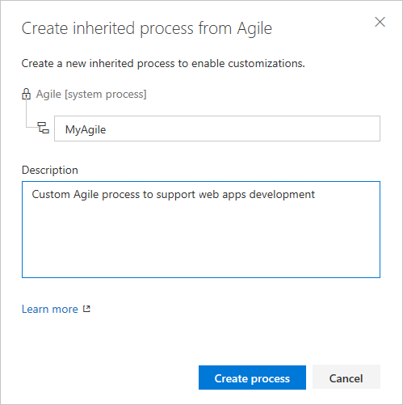
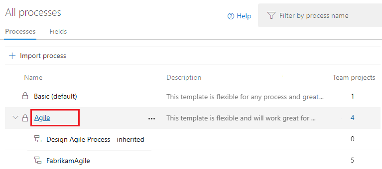
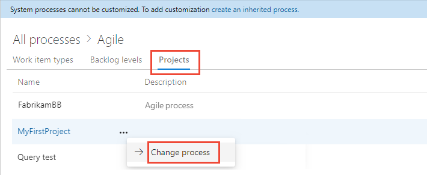
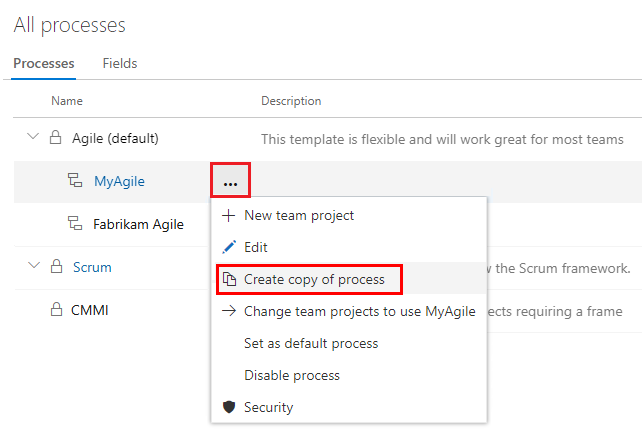
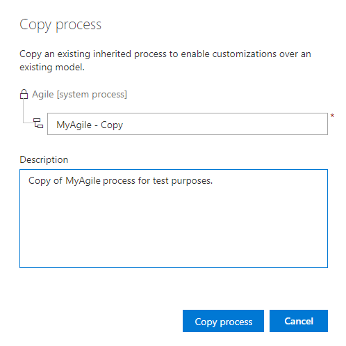

<!-- supports the FWLink: https://go.microsoft.com/fwlink/?LinkID=616878 --> 

# Create and manage inherited processes 

[!INCLUDE [version-lt-eq-azure-devops](../../../includes/version-lt-eq-azure-devops.md)]

In Azure DevOps, you have the flexibility to customize your project, Agile tools, and the work tracking system by using inherited processes. These customizations apply to all projects that utilize the same process.

An inherited process serves as the foundation for your work tracking system. When you create a new project, you choose a process to define its building blocks. These building blocks include work item types, states, fields, and rules. By customizing an inherited process, you tailor it to your team’s specific needs.

[!INCLUDE [temp](../includes/note-on-prem-link.md)]

For more information about what you can customize, see [About process customization and inherited processes](inheritance-process-model.md).

[!INCLUDE [temp](../includes/note-audit-log-support-process.md)]

[!INCLUDE [temp](../includes/process-prerequisites.md)]

<a id="create-inherited-process"></a>

## Create an inherited process 

Do the following steps to create an inherited process that you can customize. The default, system processes are locked, so you can't customize them.

::: moniker range="azure-devops"

1. Sign in to your organization (```https://dev.azure.com/{yourorganization}```).
2. Select  **Organization settings**.  
   
3. Select **Process** > **...** (More actions) > **Create inherited process**.
   Choose the same system process&mdash;[Agile](../../../boards/work-items/guidance/agile-process.md), [Basic](../../../boards/get-started/plan-track-work.md), [Scrum](../../../boards/work-items/guidance/scrum-process.md), or [CMMI](../../../boards/work-items/guidance/cmmi-process.md)&mdash;that was used to create the project that you want to customize.  

	In the following example, we create an inherited process from the Agile system process.

	> [!div class="mx-imgBorder"]  
	:::image type="content" source="media/process/create-inherited-process-menu-agile.png" alt-text="Screenshot of Context menu, Choose Create inherited process, Azure DevOps.":::

   If you don't have access to these options, ask a member of your **Project Collection Administrators** group to grant you permissions. To find a member, see [Look up a Project Collection Administrator](../../security/look-up-project-collection-administrators.md).

2.	Enter a name for your process and optionally a description. 
    Process names must be unique and no more than 128 characters. For other restrictions, see [Create and manage inheritance processes, Process name restrictions](../work/inheritance-process-model.md#process-naming).

	

::: moniker-end

::: moniker range=" < azure-devops"

1. Sign in to your collection.
2. Select **Collection settings** or **Admin settings**. 
3. Select **Process**. 
   
	> [!div class="mx-imgBorder"]  
	>  

	> [!IMPORTANT]  
	> If you don't have the **Create inherited process** menu option, then the collection you selected is set to work with the on-premises XML process model. For more information, see [On-premises XML process model](../../../reference/customize-work.md).

Inherited child processes automatically update, based on their parent system processes. Updates to processes are documented in [Release Notes for Azure DevOps Server](/azure/devops/server/release-notes/azuredevops2020u1).

::: moniker-end

After you define the inherited process, you can do the following tasks: 
- [Customize a project using an inherited process](customize-process.md)   
- [Create a project](#create-team-project) that uses the inherited process  
- [Change project to use the inherited process](#migrate)        

<a id="migrate"></a>

## Change a project's process

You can change a project’s process from one inherited process to another with the following methods:

- **Switch within the same base process:** Move a project between processes that share the same base, such as Agile or Scrum.
- **Migrate to a different process model:** Change the project’s process model, for instance, from Agile to Scrum or Basic to Agile.

We provide detailed steps for the second method, covering the following common scenarios of process change:

- [Scrum to Agile](./change-process-scrum-to-agile.md)
- [Agile to Scrum](./change-process-agile-to-scrum.md)
- [Basic to Agile](./change-process-basic-to-agile.md)

> [!NOTE]    
> - You can change the process of a project as long as you don't have any undeleted work items of a custom work item type that isn't also defined in the target process. 
> - If you change a project to a system process or other inherited process that doesn't contain the same custom fields, data is still maintained. But, the custom fields that aren't represented in the current process won't appear on the work item form. You can still access the field data through a query or REST APIs. These fields are essentially locked from changes and appear as read-only values.  

1. Select your project's process. For example, to change a project from Agile to Scrum, then choose the **Agile** process.

   > [!div class="mx-imgBorder"]  
   > 

2. Select **Projects** > the :::image type="icon" source="../../../media/icons/actions-icon.png" border="false"::: actions icon for the project > **Change process**. 

   > [!div class="mx-imgBorder"]  
   > 

3. Complete the steps in the wizard.

> [!IMPORTANT]  
> When you switch a project to an inherited process, some Agile tools or work items might become invalid. For example:
> - If you designate a field as required, work items lacking that field display an error message. Resolve these errors to proceed with further changes and save the work item.
> - When you add or modify workflow states for a WIT visible on your board, remember to update the board column configurations for all teams within the project. 

<a id="create-team-project">  </a>

## Create a project from a process 

1. Open the &hellip; context menu for the process you want to use and select **New team project**.  

	::: moniker range=">= azure-devops-2020"
	> [!div class="mx-imgBorder"]  
	>  
	::: moniker-end
	::: moniker range="azure-devops-2019"
	> [!div class="mx-imgBorder"]  
	>  
	::: moniker-end

2. Enter your project information, and then select **Create**. For more information, see [Create a project](../../projects/create-project.md).

	::: moniker range=">= azure-devops-2020"
	> [!div class="mx-imgBorder"]  
	>  
	::: moniker-end
	::: moniker range="azure-devops-2019"
	> [!div class="mx-imgBorder"]  
	>  
	::: moniker-end

<a id="copy-process">  </a>

## Copy a process

Before you implement customizations across your organization, it's essential to test them by doing the following steps.  
 
> [!TIP]
> If you modify a process used by multiple projects, each project immediately reflects the incremental process change. To bundle process changes before rolling them out to all projects, do the following steps.

1. From the Process page, open the &hellip; context menu for the process and select **Create copy of process**.  

	> [!div class="mx-imgBorder"]  
	>  

2. Enter a name and optional description for the copied process and select **Copy process**.

	> [!div class="mx-imgBorder"]  
	>  
	
3. Make your changes to the copied process. Since no project is using this process, these changes don't affect any projects. 
4. Verify your changes by creating a test project based on the copied and updated process. If you already created a test project, select [**Change project to use <em>ProcessName</em>**](#migrate). 
5. Roll out your updates by changing the process of the projects that need the new changes. Select [**Change project to use <em>ProcessName</em>**](#migrate).
6. Disable or delete the original process. 

<a id="enable-process">  </a>

## Enable/disable a process

To prevent projects being created from a specific process, you can disable it. You might choose this option when you want to apply several customizations and don't want the process used until they're complete. Or, you might retire use of a specific process in favor of moving projects to a new process. 

All system processes and newly created inherited processes are enabled by default. To disable or enable a process, open the &hellip; context menu for the process and choose **Disable process** or **Enable process**. 

<a id="default-process">  </a>

## Set the default process

To have an inherited process preselected for other projects you plan to create, set it as the default. This action ensures that any new projects automatically use the inherited process you choose. 

To set a process as the default, open the &hellip; context menu for the inherited process and choose **Set as default process**. This option isn't available with any of the system processes. 

Project Collection Administrators can [add projects](../../projects/create-project.md) from the **Projects** page. 

## Next steps

> [!div class="nextstepaction"]
> [Add and manage fields for an inherited process](customize-process-field.md) 
> or
> [Add and manage work item types](customize-process-work-item-type.md)

## Related articles  

- [About process customization and inherited processes](inheritance-process-model.md)
- [Customize a project using an inherited process](customize-process.md). 
- [Use the REST API for processes](/rest/api/azure/devops/processes/processes/list).
<a id="process-rest-api">  </a>
