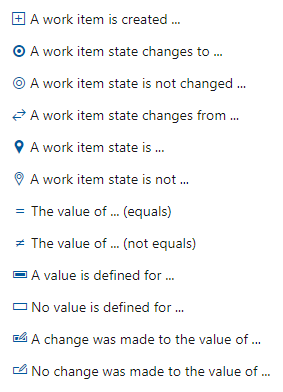
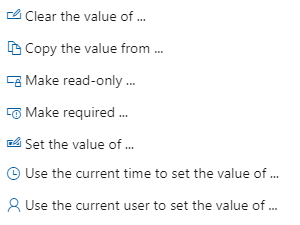
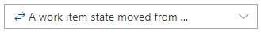
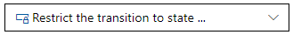
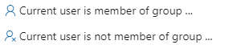
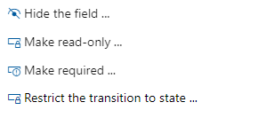

# Rules and rule evaluation    


[!INCLUDE [temp](../../../includes/version-tfs-all-versions.md)]

Rules are used to set or restrict value assignments to a work item field. There are two main types of rules, auto-generated rules and custom rules defined for a process or project. Auto-generated rules minimize the need to add custom rules for areas that should work in a standard way. 

You define custom rules in order to support your business use cases. Depending on a field's data type, you can set various restrictions on what data can be entered into that field. You can specify values for a pick list (drop-down menu), set default values, clear entries, or restrict changes. With conditional rules, you can apply rules to a field based on dependencies between different fields' values. You can also restrict who can modify a field or scope a rule to only apply to a group.

Read this article to understand the following:

- How the system applies auto-generated rules 
- Restrictions placed on definition of custom rules on system fields
- The different types of custom rules you can apply 
- How rules are evaluated
- Difference between rules defined for an Inheritance process versus an On-premises XML process
- Why you should minimize the number of custom rules you define 

Prior to defining custom rules, read [Configure and customize Azure Boards](../../../boards/configure-customize.md) to gain a broad understanding of how to customize Azure Boards to meet your business needs. 

> [!TIP]    
> Minimize the number of rules you define for a WIT. While you can create multiple rules for a WIT, addition rules can negatively impact performance when a user adds and modifies work items. When users save work items, the system validates all rules associated with the fields for its work item type. Under certain conditions, the rule validation expression is too complex for SQL to evaluate.


## Auto-generated rules 

Auto-generated rules minimize the need to add custom rules for areas that should work in a standard way. 


### State transition rules

Inherited processes generate the entire set of any-to-any state transition rules dynamically for each custom work item type and custom state added to a workflow. A transition from any state to any state is valid.  

For On-premises XML processes, you must specify the valid transitions within the `WORKFLOW` section of the work item type definition. 

### State transitions and By/Date field rules

By/Date fields correspond to **Created By/Date**, **Activated By/Date**, **Resolved By/Date**, and **Closed By/Date**. 

For inherited processes, these fields are automatically set or cleared when you transition a work item from one state to another. The Changed By/Date fields aren't included as they are updated with each work item save and are unrelated to state transitions. 

Default rules and behaviors that govern these fields include: 

1. The *Closed* state is always contained in the *Completed* state category.
1. The *Completed* state category is not configurable, and is associated with one and only one State.  
1. This *Closed* state is always *Closed* for Agile and CMMI processes, and always *Done* for Scrum and Basic processes.
1. Auto-generation of these rules are affected by locale as the rule condition contains the State name, which is localized. The system generates different rules for different locales.
1. Auto-generated rules for these fields are only specified for work item types that include these fields. It is possible for a work item type to not include one or more of these fields.  
1. These rules are needed when a work item type has custom states, or the work item type is a custom work item type.
1. These rules only apply to inherited processes; they are never generated for the Hosted XML or On-premises XML processes. 

Workflow states are associated with state categories to support the workflow on Kanban boards. To learn more, see [How workflow states and state categories are used in Backlogs and Boards](../../../boards/work-items/workflow-and-state-categories.md).
 

### State Change Date field rules

These rules are technically a lot simpler than Closed By/Closed Date rules because they are not dependent on any particular state. For any work item type, the same rules will always work. They need to be auto-generated because some OOB work item types do not contain the State Change Date field, so when the user adds this field to a custom work item type, these rules need to be auto-generated as well. The same principles for Closed By/Closed Date rules apply here as well.
 

<a id="custom-rules" /> 

## Custom rules


All custom rules are optional. For an inherited process, you specify a rule which consists of a condition plus action. For an On-premises XML process, you specify rules for a field or within the workflow. 

There isn't a one-to-one mapping between the two processes. In some cases, the XML element rule is defined within the **Edit field** dialog for the inherited process and not as a rule. Other XML elements, such as `FROZEN`, `MATCH`, `NOTSAMEAS`, aren't supported in the inherited process.  

Note the following:  
- Rules are always enforced, not only when you are interacting with the form but also when interfacing through other tools. For example, setting a field as read-only not only applies the rule on the work item form, but also through the API and Excel Azure DevOps Server Add-in.
- Inherited process entries specify conditions and actions to make a complete rule. XML elements don't make those distinctions.  
- Field rules don't support assigning values that are the sum of two other fields or performing other- mathematical calculations. However, you may find a solution that fits your needs via the [TFS Aggregator (Web Service)](https://marketplace.visualstudio.com/items?itemName=tfsaggregatorteam.tfs-aggregator-web-service) Marketplace extension. See also [Rollup of work and other fields](../../../reference/xml/support-rollup-of-work-and-other-fields.md).
- You may find additional solutions to applying custom rules to fields using a Marketplace extensions, such as the [Work item form control library extension](https://marketplace.visualstudio.com/items?itemName=mohitbagra.vsts-wit-control-library&ssr=false#overview). 


### Rule composition

<a id="ip-rule-composition" /> 

# [Inheritance process](#tab/inheritance)

For an inherited process, each rule consists of two parts: Conditions and Actions. Conditions define the circumstances which must be met in order for the rule to be applied. Actions define the operations to perform. For most rules, you can specify a maximum of two conditions and 10 actions per rule. All custom rules require all conditions to be met in order to be run. 

As an example, you can make a field required based on the value assigned to the state and another field. For example:

&nbsp;&nbsp;&nbsp;```(Condition) When a work item State is``` *Active*  
&nbsp;&nbsp;&nbsp;```(Condition) And when the value of``` *Value Area* = *Business*  
&nbsp;&nbsp;&nbsp;```(Action) Then make required``` *Story Points*  


> [!NOTE]  
> Currently, only one condition is supported for state-transition rules. If you're applying rules based on State, see [Apply rules to workflow states](apply-rules-to-workflow-states.md). 

The following table summaries the Actions that are available with the selected Conditions.

:::row:::
   :::column span="2":::
      **Condition**
   :::column-end:::
   :::column span="2":::
      **Supported Actions**
   :::column-end:::
:::row-end:::  
:::row:::  
   :::column span="4":::
      **Set field value or make required or read-only**
   :::column-end:::
:::row-end:::
:::row:::  
   :::column span="2":::
      > [!div class="mx-imgBorder"]  
      > 
   :::column-end:::
   :::column span="2":::
      > [!div class="mx-imgBorder"]  
      > 
   :::column-end:::
:::row-end:::
::: moniker range=">= azure-devops-2020"
:::row:::  
   :::column span="4":::
      **Restrict a transition based on State**
   :::column-end:::
:::row-end:::
:::row:::  
   :::column span="2":::
      > [!div class="mx-imgBorder"]  
      > 
   :::column-end:::
   :::column span="2":::
      > [!div class="mx-imgBorder"]  
      > 
:::row-end:::
::: moniker-end
::: moniker range="azure-devops-2020"
:::row:::  
   :::column span="4":::
      **Hide field or make field read-only or required based on State and user or group membership**
   :::column-end:::
:::row-end:::
:::row:::  
   :::column span="2":::
      > [!div class="mx-imgBorder"]  
      > 
   :::column-end:::
   :::column span="2":::
      > [!div class="mx-imgBorder"]  
      > 
   :::column-end:::
:::row-end:::
::: moniker-end
::: moniker range="azure-devops"
:::row:::  
   :::column span="4":::
      **Based on and user or group membership, set field attribute or restrict a State transition**
   :::column-end:::
:::row-end:::
:::row:::  
   :::column span="2":::
      > [!div class="mx-imgBorder"]  
      > 
   :::column-end:::
   :::column span="2":::
      > [!div class="mx-imgBorder"]  
      > 
   :::column-end:::
:::row-end:::
::: moniker-end


# [On-premises XML process](#tab/on-premises)

The On-premises XML process defines rules using XML elements. All of these rule elements can be defined within the `FIELD` definition of a work item type definition. And, with the exception of the `HELPTEXT` element, you can specify these rules to take affect during a workflow transition or as child elements within a `FIELD` (Global workflow) element.

 

> [!NOTE]   
> For TFS 2017 and later versions, the `VALIDUSER` element isn't supported. 


### Where to apply a field rule   

When you want a rule to apply to a field throughout the life of the work item, specify it within the `FIELD` section. For example, a field that is required for a bug that is new and active remains required until the bug is closed. Otherwise, if you want it applied based on a change in State, Reason, or transition, specify it within the `WORKFLOW` section.

**State** (System.State) and **Reason** (System.Reason) fields are defined within the `WORKFLOW` section. You can specify most field rules to apply to a field during a change of state, selection of a reason, or for a specific transition. To learn more, see [Change the workflow for a work item type](../../../reference/add-modify-wit.md).
 
 
Otherwise, specify a rule to be evaluated only during a change in state. These rules are defined within the `WORKFLOW` section under the `STATE`, `REASON`, or `TRANSITION` elements. All rules, except for `HELPTEXT`, can be applied within a `FIELD` (Workflow) element.

Field rules are additive. That is, you can specify four sets of rules for the same field which will all be evaluated by the rule-engine.

-   **Work item type-specific** rules apply regardless of the location of a work item in its state model. For example, a `<REQUIRED \>` rule performs the following check:

    `"MyField Value" != NULL`

-   **State-specific** rules are scoped to a work item instance when it is in a certain state. A state-specific rule is enforced when the following condition is true:

    `State field value == "MyState" && "MyField Value" != NULL`

-   **Transition-specific** rules that you specify for a specific transition are scoped to a work item that is undergoing a certain transition. These rules are enforced when the following conditions are true:

    `State field value == "ToState"  &&`  
    `"Previous State Before Edit/New" == "FromState"`  
    `&& "MyField Value" != NULL`  

-   **Reason-specific** rules that you specify for a specific reason are scoped to a particular reason for a particular transition. They are processed when the following conditions are true:

    `Reason field == "MyReason" &&`  
    `State field value == "ToState"  &&`  
    `"Previous State Before Edit/New" == "FromState" && "MyField Value" != NULL`  

The following example restricts modification of the customer severity field when the work item is in the Active state.

> [!div class="tabbedCodeSnippets"]
> ```XML
> <STATE name="Active">
>       <FIELDS>
>       <FIELD refname="MyCorp.Severity" >
>          <READONLY />
>       </FIELD>
>       </FIELDS>
> </STATE>
> ```

--- 


## What happens if too many rules are defined

A single SQL expression is defined per project to validate work items whenever they are created or updated. This expression grows with the number of rules you specify for all work item types defined for the project. Each behavioral qualifier specified for a field results in an increase in the number of sub-expressions. Nested rules, rules that apply only on a transition or conditioned on the value of some other field, cause more conditions to be added to an `IF` statement. Once the expression reaches a certain size or complexity, SQL can't evaluate it any more and generates an error. Removing some WITs or eliminating some rules, can resolve the error.

You can specify values for a pick list (drop-down menu), set default values, clear entries, or restrict changes. With conditional rules, you can apply rules to a field based on dependencies between different fields' values. You can also restrict who can modify a field or scope a rule to only apply to a group.

Work item rules do not exist as a single collection. The rules are actually dynamically generated and merged from different data sources. The merge logic is a simple one, consolidate identical rules, but don't trim conflicting rules.  


## Bypass rules

In general, all work items are validated by the rule engine when users modify the work item. However, to support certain scenarios, users assigned the **Bypass rules on work item updates** project-level permission can save work items without rules being evaluated. 

Rules can be bypassed in one of two ways. The first is through the [Work Items - update REST API](/rest/api/azure/devops/wit/work%20items/update) and setting the `bypassRules` parameter to `true`. The second is through the client object model, by initializing in bypassrules mode (initialize `WorkItemStore` with `WorkItemStoreFlags.BypassRules`).


<a name="system"></a>

## System fields and custom rules

System fields have System.*Name* reference names, for example **System.Title** and **System.State**. 

The following system fields are required to have a value: **Area ID**, **Changed Date**, **Created Date**, **Created By**, **State**, and **Reason**. 

The rule engine restricts setting conditions or actions to system fields except as follows: 

- You can make **State** and **Reason** fields read-only. 
- You can apply most rules to the **Title**, **Assigned To**, **Description**, and **Changed By** fields. 

If you don't see a field listed in the drop-down menu of the rule user interface for the Inheritance process, this is why. For example, if you try to make **Area Path** (System.AreaPath) read-only based on a condition, the Area Path field isn't available for selection. Even if you're able to specify a system field, the rule engine may restrict you from saving the rule. 
 

<a id="clear" /> 

## Default and copy rules 

Default and copy rules modify the values of work item fields. They define run-time behavior and constraints, such as specifying default values, clearing fields, requiring fields to be defined, and more. 

::: moniker range="<= tfs-2018 || azure-devops-2020 || azure-devops"
You can restrict application of these rules based on the current user's group membership as described in [User or group membership rule restrictions](#membership).
::: moniker-end

# [Inheritance process](#tab/inheritance)

Most of these rule actions can be applied with the selection of any condition.  

:::row:::
   :::column span="2":::
      **Inherited process action**
   :::column-end:::
   :::column span="3":::
      **Description**
   :::column-end:::
:::row-end::: 
:::row:::
   :::column span="2":::
       `Copy the value from...` 
   :::column-end:::
   :::column span="3":::
      Specifies another field that contains a value to be copied into the current field.
   :::column-end:::
:::row-end:::  
:::row:::
   :::column span="2":::
      `Clear the value of...` 
   :::column-end:::
   :::column span="3":::
      Clears the field of any value that it contains. 
   :::column-end:::
:::row-end:::  
:::row:::
   :::column span="2":::
      `Use the current time to set the value of ...`  
   :::column-end:::
   :::column span="3":::
      Sets the time for a field based on the current user's time setting. <!--- TBD --> 
   :::column-end:::
:::row-end:::  


# [On-premises XML process](#tab/on-premises)

These rules support setting defaults, copying values from one field to another, or enforcing a field value to match a prescribed pattern. For the syntax structure and examples, see [Define a default value or copy a value to a field](../../../reference/xml/define-default-copy-value-field.md).

:::row:::
   :::column span="1":::
      **XML element**
   :::column-end:::
   :::column span="3":::
      **Usage**
   :::column-end:::
:::row-end:::  
:::row:::
   :::column span="1":::
      `COPY`
   :::column-end:::
   :::column span="3":::
      Copies a specified value to a field when a user creates or modifies a work item.  
      > [!div class="tabbedCodeSnippets"]  
      > ```XML  
      > <FIELD refname="MyCorp.Status" name="Status" type="String">  
      >    <COPY from="value" value=" " />  
      > </FIELD> 
      > ```  
   :::column-end:::
:::row-end:::  
:::row:::
   :::column span="1":::
      `DEFAULT`
   :::column-end:::
   :::column span="3":::
      Specifies a value for a field that is empty when a user creates or modifies a work item. If a field already has a value, the `DEFAULT` rule is ignored.  Default rules execute only if the `Is` value of the field is currently empty. Supported values include the current time (`from = "clock"`), the current user (`from = "currentuser"`), a literal value (`from = "value"  value = "literal"`), or the value of another field (`from = field  field = "referenceNameField"`).
      > [!div class="tabbedCodeSnippets"]  
      > ```XML  
      > <FIELD refname="MyCorp.Priority" name="Priority" type="String" 
      > <HELPTEXT>Specify the severity of the problem</HELPTEXT 
      >    <ALLOWEDVALUES 
      >       <LISTITEM value="P1"/ 
      >       <LISTITEM value="P2"/ 
      >       <LISTITEM value="P3"/ 
      >    </ALLOWEDVALUES 
      > <DEFAULT from="value" value="P3"/ 
      > </FIELD 
      ```  
   :::column-end:::
:::row-end:::  
:::row:::
   :::column span="1":::
      `SERVERDEFAULT`
   :::column-end:::
   :::column span="3":::
      Specifies the server clock or the current user to define a field value.  
      > [!div class="tabbedCodeSnippets"]  
      > ```XML  
      > <TRANSITION from="New" to="Active">  
      >    <ACTIONS>  
      >       <ACTION value="Microsoft.VSTS.Actions.StartWork" />  
      >    </ACTIONS>  
      >    <REASONS>  
      >       <DEFAULTREASON value="Work started" />  
      >    </REASONS>  
      >    <FIELDS>  
      >       <FIELD refname="Microsoft.VSTS.Common.ActivatedBy">  
      >             <COPY from="currentuser" />  
      >             <VALIDUSER />  
      >             <REQUIRED />  
      >       </FIELD>  
      >       <FIELD refname="Microsoft.VSTS.Common.ActivatedDate">  
      >          <SERVERDEFAULT from="clock" />  
      >       </FIELD>  
      >       <FIELD refname="System.AssignedTo">  
      >       <DEFAULT from="currentuser" />  
      >       </FIELD>  
      >    </FIELDS>  
      > </TRANSITION>  
      > ```  
   :::column-end:::
:::row-end:::  


---  


<a id="require" /> 

## Constraint rules

Constraint rules restrict changing the value of a field. They define the valid states for a work item. Each constraint operates on a single field. Constraints are evaluated on the server on work item save, and if any constraint is violated the save operation is rejected.  
 
::: moniker range="<= tfs-2018 || azure-devops-2020 || azure-devops"
You can restrict application of these rules based on the current user's group membership as described in [User or group membership rule restrictions](#membership).
::: moniker-end
 
# [Inheritance process](#tab/inheritance)

Most of these rule actions can be applied with the selection of any condition.
:::row:::
   :::column span="2":::
      **Inherited process action**
   :::column-end:::
   :::column span="3":::
      **Description**
   :::column-end:::
:::row-end:::  
::: moniker range=">= azure-devops-2020" 
:::row:::
   :::column span="2":::
       `Hide the field...`   
       *Only available when a group membership condition is selected.* 
   :::column-end:::
   :::column span="3":::
      Specifies to not show the field on the work item form, essentially removing the ability for the current user to change the field's value.  
   :::column-end:::
:::row-end:::  
::: moniker-end
:::row:::
   :::column span="2":::
      `Make read-only`    
   :::column-end:::
   :::column span="3":::
      Prevents a field from being modified at all. You might want to apply this rule under certain conditions. For example, after a work item is closed, you want to make a field read-only to preserve the data for reporting purposes.  
      To specify the field default is read-only, specify in Edit field dialog, **Options** tab. 
   :::column-end:::
:::row-end:::  
:::row:::
   :::column span="2":::
      `Make required`  
   :::column-end:::
   :::column span="3":::
      Requires a user to specify a value for the field. Users cannot save a work item until they have assigned values to all required fields.  
      To specify the field default is required, specify in Edit field dialog, **Options** tab. 
   :::column-end:::
:::row-end:::  


# [On-premises XML process](#tab/on-premises)

:::row:::
   :::column span="1":::
      **XML element**
   :::column-end:::
   :::column span="3":::
      **Usage**
   :::column-end:::
:::row-end:::  
:::row:::
   :::column span="1":::
      `ALLOWEDVALUES`
   :::column-end:::
   :::column span="3":::
      Defines a list of allowed values for the field. Allowed values are values that are available for selection in a field list on work item forms and in the query builder. You must select from one of these values.
   :::column-end:::
:::row-end:::  
:::row:::
   :::column span="1":::
      `CANNOTLOSEVALUE`
   :::column-end:::
   :::column span="3":::
      Prevents users from clearing a field of a value once a value has been specified. This element keeps the current field value and it cannot be cleared or made empty.   
      > [!div class="tabbedCodeSnippets"]  
      > ```XML  
      > <FIELD refname="MyCorp.Priority" name="Management Priority" type="String">  
      >     <CANNOTLOSEVALUE /> 
      > </FIELD> 
      > ```  
   :::column-end:::
:::row-end:::  
:::row:::
   :::column span="1":::
      `FROZEN`
   :::column-end:::
   :::column span="3":::
      Prevents users from changing the value of a field once it contains a value. As soon as a user saves the work item with a value in that field, the value can no longer be modified. A frozen field cannot be changed to any non-empty value after changes are committed. However, you can manually clear the field, save the work item, and then specify a different value.  
      > [!div class="tabbedCodeSnippets"]  
      > ```XML  
      > <FIELD refname="MyCorp.Priority" name="Management Priority" type="String">  
      >     <FROZEN not="[Project]\Management Team" /> 
      > </FIELD> 
      > ```  
   :::column-end:::
:::row-end:::  
:::row:::
   :::column span="1":::
      `EMPTY`
   :::column-end:::
   :::column span="3":::
      Clears the field of any value that it contains and then makes the field read-only when a user saves the work item. You shouldn't use `EMPTY` with `READONLY`.  
      `EMPTY` is primarily used [during state transition](../../../reference/xml/transition-xml-element.md) to clear fields that apply to the state to which the item is transitioning.  
      > [!div class="tabbedCodeSnippets"]  
      > ```XML  
      > <FIELD refname="MyCorp.SubStatus" />  
      >    <WHEN field="MyCorp.Status" value="Approve" >  
      >      <EMPTY />
      >    </WHEN>  
      > </FIELD>  
   :::column-end:::
:::row-end:::  
:::row:::
   :::column span="1":::
      `MATCH`
   :::column-end:::
   :::column span="3":::
      Forces entries made to a String field to conform to a [specified pattern of characters or numbers](../../../reference/xml/apply-pattern-matching-to-string-field.md). If you define multiple `MATCH` elements, the value is considered valid if it matches any of the patterns that you specify. If at least one element succeeds, the field has a valid value.  
      > [!div class="tabbedCodeSnippets"]  
      > ```XML  
      > <FIELD refname="MyCorp.GitHubURL" name="GitHub URL" type="String">  
      >    <MATCH pattern="https:\/\/github\.com\/\S+[\.md|\.yml]$"/>  
      > </FIELD>
      > ```  
   :::column-end:::
:::row-end:::  
:::row:::
   :::column span="1":::
      `NOTSAMEAS`
   :::column-end:::
   :::column span="3":::
      Prevents a field from being assigned the same value as that which was assigned to another field.  
      > [!div class="tabbedCodeSnippets"]  
      > ```XML  
      > <FIELD refname="MyCorp.Status" name="Status" type="String">  
      >     <NOTSAMEAS field="MyCorp.SubStatus" /> 
      > </FIELD> 
      > ```  
   :::column-end:::
:::row-end:::  
:::row:::
   :::column span="1":::
      `PROHIBITEDVALUES`
   :::column-end:::
   :::column span="3":::
      Defines a list of prohibited values for the field. If multiple `ALLOWEDVALUES` and/or `PROHIBITEDVALUES` rules apply to a particular field, the full list of valid values is the intersection of all allowed values lists&mdash;or everything, if there are no allowed values lists&mdash;minus&mdash;that is, set difference&mdash;the union of all prohibited values lists.
   :::column-end:::
:::row-end::: 
:::row:::
   :::column span="1":::
      `READONLY`
   :::column-end:::
   :::column span="3":::
      Prevents a field from being modified at all. You might want to apply this rule under certain conditions. For example, after a work item is closed, you want to make a field read-only to preserve the data for reporting purposes.  
      Do not use `READONLY` with the `EMPTY` element because `EMPTY` also makes a field read-only. Combining these elements may yield inconsistent results.  
      In addition, you can make a field appear as read-only from the work item form using the `Control` element `ReadOnly` attribute. The field can be written to by other clients, but not through the work item form.  
      > [!div class="tabbedCodeSnippets"]  
      > ```XML  
      > <FIELD refname="MyCorp.Status" name="Status" type="String">  
      >     <READONLY />  
      > </FIELD> 
      > ```  
   :::column-end:::
:::row-end:::  
:::row:::
   :::column span="1":::
      `REQUIRED`
   :::column-end:::
   :::column span="3":::
      Requires a user to specify a value for the field. Users cannot save a work item until they have assigned values to all required fields.
      > [!div class="tabbedCodeSnippets"]  
      > ```XML  
      > <FIELD refname="MyCorp.Status" name="Status" type="String">  
      >     <REQUIRED />  
      > </FIELD> 
      > ```  
   :::column-end:::
:::row-end:::  
::: moniker range="<= tfs-2015"
:::row:::
   :::column span="1":::
      `VALIDUSER`
   :::column-end:::
   :::column span="3":::
      The value of the field must be a user or group within the specified group, or within the full list of valid users if no group is specified.
      > [!div class="tabbedCodeSnippets"]  
      > ```XML  
      > <FIELD refname="MyCorp.ChangedBy" name="Custom Changed By" type="String">  
      >     <VALIDUSER group="[Project]\Contributor Leads"/>  
      > </FIELD> 
      > ```  
   :::column-end:::
:::row-end:::  
::: moniker-end
---  


<a id="pick-list" /> 

## Pick lists 

Pick lists define the values that a user can or can't choose for a String or Integer field. Values defined in a pick list appear on a work item form and the query editor. 

# [Inheritance process](#tab/inheritance)

For an Inherited process, pick lists are defined through the Edit field dialog. 


:::row:::
   :::column span="2":::
      **Edit field dialog**
   :::column-end:::
   :::column span="3":::
      **Description**
   :::column-end:::
:::row-end:::  
:::row:::
   :::column span="2":::
      **Definition** tab for a picklist field  
   :::column-end:::
   :::column span="3":::
      Defines a list of allowed values for the field. Allowed values are values that are available for selection in a field list on work item forms and in the query builder. You must select from one of these values.
   :::column-end:::
:::row-end:::  
:::row:::
   :::column span="2":::
      Check the **Allow users to enter their own values** checkbox within the **Options** tab to allow users to specify their own entries
   :::column-end:::
   :::column span="3":::
      Defines a list of suggested values for the field. Suggested values are values that are available for selection in a field list on work item forms and in the query builder. You can enter other values additionally to the ones in the list.
   :::column-end:::
:::row-end:::  


# [On-premises XML process](#tab/on-premises)

You define pick lists using XML elements listed in the following table. For syntax structure and examples, see [Define pick lists](../../../reference/xml/define-pick-lists.md).

You can combine lists, and expand or contract lists. Also, you can restrict application of these rules based on the current user's group membership as described in [User or group membership rule restrictions](#membership).

:::row:::
   :::column span="1":::
      **XML element**
   :::column-end:::
   :::column span="3":::
      **Description**
   :::column-end:::
:::row-end:::  
:::row:::
   :::column span="1":::
      `ALLOWEDVALUES`
   :::column-end:::
   :::column span="3":::
      Defines a list of allowed values for the field. Allowed values are values that are available for selection in a field list on work item forms and in the query builder. You must select from one of these values.
   :::column-end:::
:::row-end:::  
:::row:::
   :::column span="1":::
      `ALLOWEXISTINGVALUE`
   :::column-end:::
   :::column span="3":::
      Defines the field to allow existing values. This element allows the field values that already exist to be used, even if they are not valid. All new field values must be valid.
   :::column-end:::
:::row-end:::  
:::row:::
   :::column span="1":::
      `PROHIBITEDVALUES`
   :::column-end:::
   :::column span="3":::
      Defines a list of prohibited values for the field.
   :::column-end:::
:::row-end:::  
:::row:::
   :::column span="1":::
      `SUGGESTEDVALUES`
   :::column-end:::
   :::column span="3":::
      Defines a list of suggested values for the field. Suggested values are values that are available for selection in a field list on work item forms and in the query builder. You can enter other values additionally to the ones in the list.
   :::column-end:::
:::row-end:::  


**Identity fields and validation errors**

To avoid validation errors that would otherwise occur when members leave the team and are no longer registered as project contributors, include the **ALLOWEXISTINGVALUE** element for the **Assigned To** field.

> [!div class="tabbedCodeSnippets"]
> ```XML
> <FIELD name="Assigned To" refname="System.AssignedTo" type="String" syncnamechanges="true" reportable="dimension">
>       <HELPTEXT>The user who is working on this work item</HELPTEXT>
>       <ALLOWEXISTINGVALUE />
>       <VALIDUSER />
>       <ALLOWEDVALUES expanditems="true" filteritems="excludegroups">
>       <LISTITEM value="Active" />
>       <LISTITEM value="[project]\Contributors" />
>       </ALLOWEDVALUES>
>       <DEFAULT from="field" field="System.CreatedBy" />
> </FIELD>
> ```

---  


<a id="conditional-rules" />

## Conditional field values or changes 

Conditional rules specify an action based on the value of a field equaling or not equaling a specific value, or if a change was or wasn't made to the value of a specific field. In general, conditional rules are applied first over unconditional rules. When multiple conditional rules evaluate to true, the order of execution is: When, WhenNot, WhenChanged, WhenNotChanged. 
 
# [Inheritance process](#tab/inheritance)
 
You can specify multiple conditional rules per field. However, you can only specify a single driving field per conditional rule. 

:::row:::
   :::column span="2":::
      **Inherited condition**
   :::column-end:::
   :::column span="3":::
      **Description**
   :::column-end:::
:::row-end:::  
:::row:::
   :::column span="2":::
      `The value of ... (equals)` [When] 
   :::column-end:::
   :::column span="3":::
      Specifies one or more rules to apply to the current field when another field has a specific value.
   :::column-end:::
:::row-end:::  
:::row:::
   :::column span="2":::
       `A change was made to the value of ...`  [WhenChanged] 
   :::column-end:::
   :::column span="3":::
      Applies one or more rules to the current field when a specific field's value is changed.
   :::column-end:::
:::row-end:::  
:::row:::
   :::column span="2":::
       `The value of ... (not equals)`  [WhenNot] 
   :::column-end:::
   :::column span="3":::
      Applies one or more rules to the current field when another field does not have a specific value.
   :::column-end:::
:::row-end:::  
:::row:::
   :::column span="2":::
       `No change was made to the value of ...`  [WhenNotChanged] 
   :::column-end:::
   :::column span="3":::
      Applies one or more rules to the current field when a specific field's value is not changed.
   :::column-end:::
:::row-end:::  

<br/> 

:::row:::
   :::column span="2":::
      **Inherited action**
   :::column-end:::
   :::column span="3":::
      **Description**
   :::column-end:::
:::row-end:::  
:::row:::
   :::column span="2":::
      `Clear the value of ...`  
      `Copy the value from ...`  
      `Make read-only ...`  
      `Make required ...`  
      `Set the value of ...`  
      `Use the current time to set the value of ...`  
      `Use the current user to set the value of ...`  
   :::column-end:::
   :::column span="3":::
      Specifies the action to take on a specific field.  
   :::column-end:::
:::row-end:::  


# [On-premises XML process](#tab/on-premises)

The following XML elements are used to set conditions for when other rules are evaluated. You can specify multiple conditional rules per field. However, you can only specify a single driving field per conditional rule. You can't nest conditional rules. Supported actions for each process model include those listed in the following table.  

For syntax structure and examples, see [Assign conditional-based values and rules](../../../reference/xml/assign-conditional-based-values-and-rules.md). You can restrict application of these rules based on the current user's group membership as described in [User or group membership rule restrictions](#membership).

:::row:::
   :::column span="1":::
      **XML element**
   :::column-end:::
   :::column span="3":::
      **Usage**
   :::column-end:::
:::row-end:::  
:::row:::
   :::column span="1":::
      `WHEN`
   :::column-end:::
   :::column span="3":::
      Specifies one or more rules to apply to the current field when another field has a specific value. The parent element defines the current field.  
      When the specified field has the specified value, the rules in this element are applied to the current field.
   :::column-end:::
:::row-end:::  
:::row:::
   :::column span="1":::
      `WHENCHANGED`
   :::column-end:::
   :::column span="3":::
      Specifies a condition under which to apply one or more rules to the current field. The rules apply to the current field when the value of another field is changed in a revision to a work item. The parent element defines the current field.      
   :::column-end:::
:::row-end:::  
:::row:::
   :::column span="1":::
      `WHENNOT`
   :::column-end:::
   :::column span="3":::
      Specifies a condition under which to apply one or more rules to the current field. The rules apply to the current field when the value of another field changes. The parent element defines the current field.  
      When the specified field does not contain the specified value, the rules in this element are applied to the current field.
   :::column-end:::
:::row-end:::  
:::row:::
   :::column span="1":::
      `WHENNOTCHANGED`
   :::column-end:::
   :::column span="3":::
       Specifies a condition under which to apply one or more rules to the current field. The rules apply to the current field when the value of another field is not changed in a revision to a work item. The parent element defines the current field.
   :::column-end:::
:::row-end:::  


 

---  


<a id="apply-ignore" /> 
<a id="membership" /> 
<a id="apply-or-ignore-rules-based-on-user-or-group" /> 

## User or group membership rule restrictions   

You can restrict application of a rule based on the current user's membership. We recommend you scope the rule to an Azure DevOps security group, and not a single user, although you can specify the latter. To have the rule scoped to multiple groups, you must create a parent Azure DevOps group that includes the set of groups that you want to use.  


### Process implementation 


> [!TIP]    
> To avoid rule evaluation issues that may arise, specify Azure DevOps security groups and not Azure Active Directory or Active Directory security groups. To learn more, see [Default rules and the rule engine](rule-reference.md). 

# [Inheritance process](#tab/inheritance)

As indicated in the following table, to restrict a rule based on the current user's membership, you specify one of two conditions for an Inherited process. These rules are active for Azure DevOps 2020 and later versions. 

::: moniker range=">= azure-devops-2020" 
:::row:::
   :::column span="1":::
      **Applies to**
   :::column-end:::
   :::column span="3":::
      **Rule**
:::row-end:::  
:::row:::
   :::column span="1":::
      Condition
   :::column-end:::
   :::column span="3":::
       `Current user is a member of group ...`  
       `Current user is not member of group ...`  
   :::column-end:::
:::row-end::: 
:::row:::
   :::column span="1":::
      Action
   :::column-end:::
   :::column span="3":::
       `Hide the field ...`  
       `Make read-only ...`  
       `Make required ...`  
       `Restrict the transition to state ...`  
   :::column-end:::
:::row-end::: 
::: moniker-end


# [On-premises XML process](#tab/on-premises)

To restrict a rule based on the current user's membership, you specify either the `for` or `not` attributes in the rule element. You specify the scope of the rule. To have the rule scoped to multiple groups, you must create a parent Azure DevOps group that includes the set of groups that you want to use.  

:::row:::
   :::column span="2":::
      **Scenario**
   :::column-end:::
   :::column span="3":::
      **Usage**
:::row-end:::  
:::row:::
   :::column span="2":::
      **Make a field required only for a specified group**
   :::column-end:::
   :::column span="3":::
      Use `for` to apply a rule to a group. This example requires any user in the Junior Analysts group to complete the Second Approver field.
      > [!div class="tabbedCodeSnippets"]  
      ```XML  
      <FIELD name="Second Approver">
        <REQUIRED for="Example1\Junior Analysts"/>
      </FIELD>
      ```
   :::column-end:::
:::row-end::: 
:::row:::
   :::column span="2":::
      **Restrict modification of a field to a group of users**
   :::column-end:::
   :::column span="3":::
      Use `not` to exclude a group from a rule. This example defines the Triage Description field as read-only for everyone except those users in the Triage Committee group.
      > [!div class="tabbedCodeSnippets"]  
      ```XML  
      <FIELD name="Triage Description">
         <READONLY not="[Project]\Triage Committee" />
      </FIELD>
      ```
   :::column-end:::
:::row-end::: 
:::row:::
   :::column span="2":::
      **Make a field required for some users and not for others**
   :::column-end:::
   :::column span="3":::
      Use a combination of `for` and `not` to simultaneously apply a rule to some and not for others. This example defines Severity as a required field for users in the Project Members group, but not for those in the Project Admins group. If a user is in both groups, the `for` statement would be enforced, and the field would be required.
      > [!div class="tabbedCodeSnippets"]  
      ```XML  
      <FIELD name="Severity">
         <REQUIRED for="[Project]\Project Members" not="[Global]\Project Admins"/>
      </FIELD>
      ```
   :::column-end:::
:::row-end::: 
 

---  


<a id="tokens" /> 

### Use tokens to reference users or groups

Identity or people-picker fields can accept values that reference both users and groups. When you restrict a rule to a group, you indicate the domain or scope of the group. For some values, you can use tokens. 

# [Inheritance process](#tab/inheritance)

Examples of tokens include the following:

- [*ProjectName*], such as [Fabrikam], [FabrikamFiber], [MyProject]  
- [*OrganizationName*], such as [fabrikam], [myorganization] 
- [*CollectionName*], such as [fabrikam], [myorganization] 


To learn about the scopes available for your project or organization, go to the **Project Settings>Permissions>Groups** or **Organization Settings>Permissions>Groups** page, you can filter the list as needed. For example, the following image shows the first four entries to a filtered list based on *Azure DevOps*. To learn more, see [Set permissions at the project- or collection-level](../../security/set-project-collection-level-permissions.md). 

:::image type="content" source="media/rules/permissions-group-scope.png" alt-text="Screenshot of filtered Permissions groups list.":::

# [On-premises XML process](#tab/on-premises)

Examples of tokens include the following:

- **[Project]**, such as [Project]\Contributors, [Project]\Fabrikam Team, [Project]\Project Approvers 
	The [Project] token specifies a group defined for a project. This can correspond to a team, a default or custom security group, or an Active Directory group that's been added to the project. 
- **[GLOBAL]**, to reference a collection-scoped group, for example, [GLOBAL]\Project Collection Administrators
	Use [GLOBAL] to reference a collection-scoped security group, such as the Project Collection Administrators group or a Windows group added to a collection. For example:  
    ```xml
    <FIELD name="Title">
        <READONLY for="[GLOBAL]\Project Collection Valid Users"/>
    </FIELD>
    ```
- **[Team Foundation]** to reference a server-scoped group, for example, [Team Foundation]\Team Foundation Administrators
    Use [Team Foundation] to reference a server-scoped group, such as a built-in group or a Windows group you add to a server-level group. For example:  
    ```xml
    <FIELD name="Title">
        <READONLY for="[Team Foundation]\Team Foundation Valid Users"/>
    </FIELD>
    ```
- **[*DomainName*]** to reference a server-scoped group, for example, [Team Foundation]\Team Foundation Administrators
	Domain-qualified account name, such as the one shown in the following example, can be used to reference a domain user or group. Some rules only support groups and do not support referencing domain users.  
    ```xml
    <LISTITEM value="FABRIKAM\Christie Church's Direct Reports"/>
    ```

> [!NOTE]    
> [Project], [GLOBAL], and [Team Foundation] are used as is. You don't replace them with the name of the project, collection, or server name. 

To learn about the scopes available for your project or collection, go to the **Project Settings>Permissions>Groups** or **Collection Settings>Permissions>Groups** page. Filter the list as needed. For example, the following image shows the first four entries to a filtered list based on *Azure DevOps*. To learn more, see [Set permissions at the project- or collection-level](../../security/set-project-collection-level-permissions.md). 
 

:::image type="content" source="media/rules/permissions-group-scope.png" alt-text="Screenshot of filtered Permissions groups list.":::
  

All users and groups must be qualified by one of these tokens. For example, the following XML isn't valid because it doesn't qualify the specified group with a valid token.

```xml
<FIELD name="Title">
    <READONLY for="Dev Team"/>
</FIELD>
```


---  

To learn more about default security groups, see [Permissions and groups](../../security/permissions.md) 

### Rule evaluation 

Rules that specify a condition based on the user or group membership of the user modifying a work item are evaluated in one of two ways. When the rule is evaluated, the application needs to determine whether the rule applies to the current user by checking if that user is or isn't a member of the specified group. 
 
- When modifying the work item from the web portal, REST API, or **azure boards** command, a request to the Azure Active Directory or Active Directory is made. No problems occur for this operation.  
- When modifying the work item from Visual Studio, Team Explorer Everywhere, Excel or other custom tool using the WIT Client Object Model, the request to evaluate membership is based on a client cache. The client cache is not aware of Active Directory groups. 

> [!NOTE] 
> Visual Studio 2019 Team Explorer for projects using GIT has been re-written to use REST APIs.

To avoid problems with users updating work items from various clients, specify Azure DevOps security groups instead of Active Directory groups. You can easily create an Azure DevOps security group to correspond to an Active Directory group. To learn how, see [Add a user or group to a security group](../../security/set-project-collection-level-permissions.md#add-a-user-or-group-to-a-security-group). 

 
<!-- add a tip to custom-rules.md --> 

> [!NOTE] 
> The WIT Client OM is deprecated. As of January 1, 2020, it no longer is supported when working against Azure DevOps Services and Azure DevOps Server 2020.  


## Order in which rules are evaluated 


Rules are typically processed in the sequence in which they are listed. However, the complete sequence for evaluation of all rules isn't fully deterministic. 

This section describes the expected behavior and interactions when you apply conditional, copy, and default rules. 


# [Inheritance process](#tab/inheritance)


The following steps show, in the correct sequence, the interactions that Azure DevOps performs and by the user of a work-item form. Only steps 1, 8, and 13 are performed by the user.

1.  From an Azure DevOps client&mdash;such as the web portal, Visual Studio/Team Explorer, or Team Explorer Everywhere&mdash;a user creates a new work item or edits an existing work item.

2.  Fill in field defaults. For all fields, apply any defaults assigned to the field that aren't part of a conditional clause.

3.  Copy or set field values. For all fields, apply any rules to copy a value or set the value of a field that aren't part of a conditional clause.

4.  For all fields with a When conditional rule that matches, apply rules to set or copy a field value.  

5.  For all fields with a When Not conditional rule that matches, apply rules to set or copy a field value.  

    The system always processes **When** rules before **When Not** rules. 

6.  For all fields that have had their values changed since step 1 and that contain **When Changed** rules, apply rules to set or copy a field value.  

7.  Allow the user to start editing. 

8.  The user changes a field value and then moves focus from the field.

9.  Process any **When** rules for that field that match the new value.

10. Process any **When Not** rules for that field that match the new value.

11. Process any **When Changed** rules for that field that match the new value.

12. Return editing ability to the user.

13. The user saves the changes to the data store.

14. For all fields, apply any `Use the current time to set the value of ...` actions that are defined for the field either directly or indirectly under a  conditional rule.

# [On-premises XML process](#tab/on-premises)

Rules are typically processed in the sequence in which they are listed. However, when you use the **WHEN**, **DEFAULT**, and **COPY** elements, additional behaviors may apply. The following steps show, in the correct sequence, the interactions that Azure DevOps performs and by the user of a work-item form. Only steps 1, 8, and 13 are performed by the user.

1.  From an Azure DevOps client&mdash;such as the web portal, Visual Studio/Team Explorer, or Team Explorer Everywhere&mdash;a user creates a new work item or edits an existing work item.

2.  Fill in field defaults. For all fields, apply any **DEFAULT** rules specified outside or **WHEN** rules.

3.  Copy field values. For all fields, use any **COPY** rules that are outside **WHEN** clauses.

4.  For all fields with a **WHEN** rule that matches, first do **DEFAULT** and then **COPY** rules inside.

5.  For all fields with a **WHENNOT** rule that matches, first do **DEFAULT** and then **COPY** rules inside.

    The system always processes **WHEN** rules before **WHENNOT** rules.

6.  For all fields that have had their values changed since step 1 and that contain **WHENCHANGED** rules, first do **DEFAULT** and then **COPY** rules inside.

7.  Allow the user to start editing.

8.  The user changes a field value and then moves focus from the field.

9.  Raise any **WHEN** rules for that field that match the new value.

10. Raise any **WHENNOT** rules for that field that match the new value.

11. Raise any **WHENCHANGED** rules for that field that match the new value.

12. Return editing ability to the user.

13. The user saves the changes to the database.

14. For all fields, perform **SERVERDEFAULT** operations that are defined for the field either directly or indirectly under a **WHEN** or a **WHENNOT** rule.

### Keystroke entries and rule evaluation 

The system sets a new value for a field every time a user enters a keystroke within a field through the work item form. This means that a conditional rule can occur unexpectedly whenever the rule's prerequisite conditions are met.

In the following XML example, the system empties MyCorp.SubStatus  as you type "Approved Again" into the Status field because the **WHEN** rule occurs as soon as the user types the letter "e" in Approved, even if the intended final value is not "Approve". For this reason, think carefully when you are using conditional rules.

> [!div class="tabbedCodeSnippets"]
> ```XML
> <FIELD refname="MyCorp.SubStatus" />
>    <WHEN field="MyCorp.Status" value="Approve" >
>       <EMPTY />
>    </WHEN>
> </FIELD>
> ```

--- 


## Related articles

- [Sample rule scenarios](rule-samples.md)  
- [Work item field index](../../../boards/work-items/guidance/work-item-field.md)
- [Work item fields and attributes](../../../boards/work-items/work-item-fields.md)
- [Set permissions at the project- or collection-level](../../security/set-project-collection-level-permissions.md)
- [Permissions and groups](../../security/permissions.md)
- **Inherited process**  
	- [Add a custom rule to a work item type](custom-rules.md)
	- [Apply rules to workflow states](apply-rules-to-workflow-states.md)
- **On-premises XML process**  
	- [Define a default value or copy a value to a field](../../../reference/xml/define-default-copy-value-field.md)
	- [Define pick lists](../../../reference/xml/define-pick-lists.md)
	- [Assign conditional-based values and rules](../../../reference/xml/assign-conditional-based-values-and-rules.md)

 
<!--- what On-premises rules aren't supported for Inherited? --> 