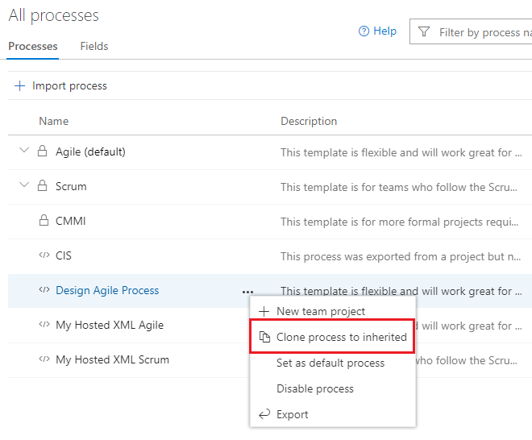
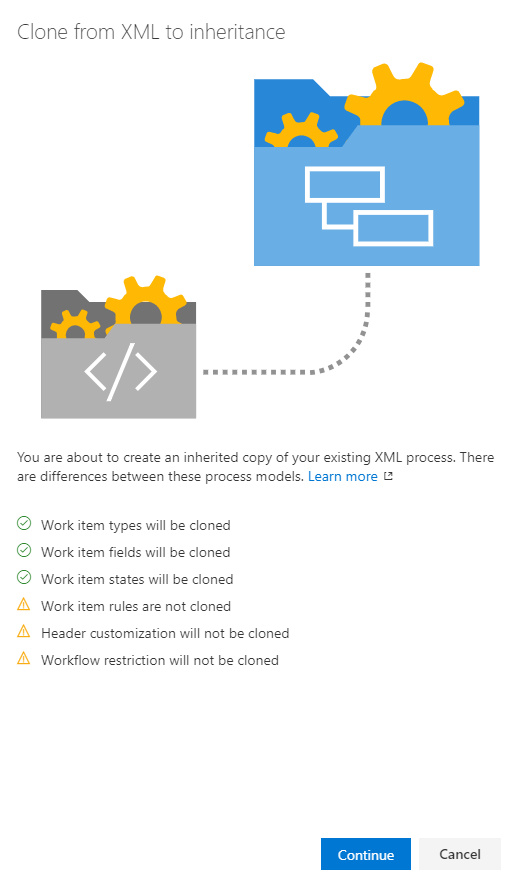
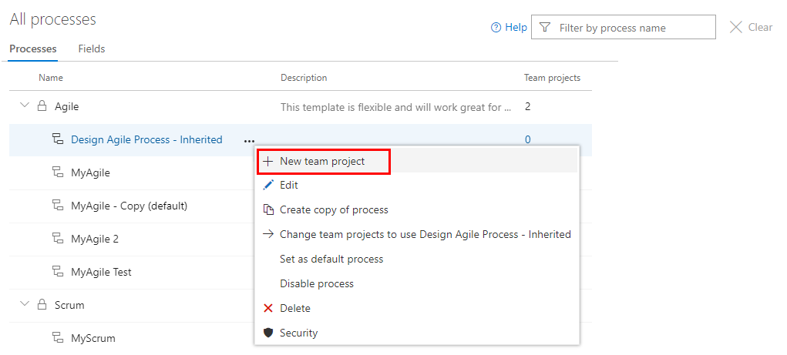

# Clone a Hosted XML process to an Inheritance process   

[!INCLUDE [version-eq-azure-devops](../../../includes/version-eq-azure-devops.md)]

Cloning your Hosted XML process to the Inheritance process model allows you to manage customizations through the user interface versus XML definition files. The inherited process supports the set of customizations described here [About process customization and inherited processes](inheritance-process-model.md). 
 
## Prerequisites

Before you clone a Hosted XML process, review the [supported operations when moving from Hosted XML process to inherited process](change-process-from-hosted-to-inherited.md#supported-operations-for-moving-from-hosted-xml-to-an-inherited-process).

[!INCLUDE [prerequisites-change-process](../includes/prerequisites-change-process.md)]

## Clone a Hosted XML process to an Inheritance process 

1. Sign in to your organization (```https://dev.azure.com/{Your_Organization}```).
2. Select  **Organization settings**.
  
   	> [!div class="mx-imgBorder"]  
	> 
3. Select **Process**. 
2. Open the &hellip; context menu for the Hosted XML process and choose the **Clone process to inherited** option. 

	Here we open the menu for the Design Agile Process. 

	> [!div class="mx-imgBorder"]  
	>  

3. Review the information provided in the dialog that opens and then choose **Continue**.  

	> [!div class="mx-imgBorder"]  
	>    

4. In the next dialog, you can change the name of the inherited process to be created and optionally change the parent process and provide a description. 

	Here, we accept the defaults provided by the system.  

	> [!div class="mx-imgBorder"]  
	>   

	> [!IMPORTANT]  
	> The system performs a best effort to detect the correct parent process. Verify that the process selected meets your expectations, or change it as needed. Once you complete the clone, you can't clone it a second time based on a different system process. 

5. After you confirm that the information is correct, select **Save**. 

[!INCLUDE [temp](../includes/post-upgrade-steps.md)]

<a id="verify">  </a>

## Verify the customization you made 

Create a test project based on the inherited process created in the previous step to verify the customizations preserved and any other changes you make to it. 

1. Open the **All processes** page, and choose the &hellip; context menu for the process you want to use, and then select **New project**.  

	> [!div class="mx-imgBorder"]  
	>   

2. The Create new project page opens. Complete the form. 

	> [!div class="mx-imgBorder"]  
	>  

3. Open the **Work>Work Items** page (user context) and choose **New Work Item** and select a WIT that you previously customized. In the following example, we choose **Bug**. 

	> [!div class="mx-imgBorder"]  
	>  

4. Verify that the customizations you expect appear on the form. 
5. Manually reapply customizations that were ignored during clone.
6. Create a test project to verify customizations.  

## Next steps

> [!div class="nextstepaction"]
> [Change a project from a Hosted XML process to Inheritance](change-process-from-hosted-to-inherited.md) 

## FAQ

### Q: Why are some of my fields missing on the form when I clone a Hosted XML process to Inherited?

During the cloning process, the system makes a best effort to replicate your layout from Hosted XML into the Inherited process. However, it might not always be possible to fully replicate the same layout. Fields and layouts that aren't recognized are ignored during the cloning process, but the fields are still added to the process. You need to manually add these fields to the form layout as needed.
