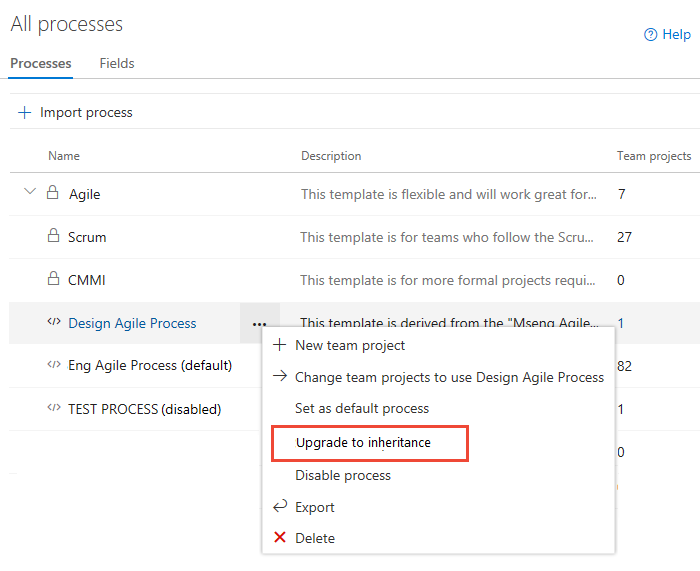
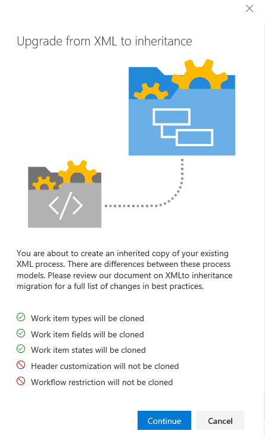
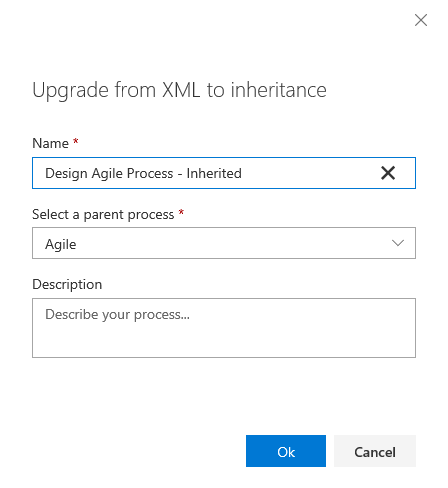

# Clone a Hosted XML process to an Inheritance process   

[!INCLUDE [temp](../../../boards/_shared/version-vsts-only.md)]

Cloning your Hosted XML process to the Inheritance process model allows you to manage customizations through the user interface versus XML definition files. The inherited process supports the set of customizations described here [About process customization and inherited processes](inheritance-process-model.md). 

Before you clone a Hosted XML process, we recommend that you review [Supported operations when moving from Hosted XML process to inherited process](upgrade-support-hosted-to-inherited.md). 
 

## Prerequisites

- Your account currently uses the Hosted XML process model 
- You must be a member of the Project Collection Administrators group, the organization owner, or be granted explicit permissions to edit, create, or manage a specific process and to create a project. 

## Sequence of steps

The general sequence of steps to support clone are:  
0. Open **Settings>Process** 
0. Choose the Hosted XML process you want to clone and select **Clone process to inheritance** from its context menu
0. Verify the customizations that are present in the inherited process created as part of the clone
0. Manually reapply customizations that were ignored during clone
0. Create a test project to verify customizations. 

[!INCLUDE [temp](../_shared/open-process-admin-context-ts-only.md)]

## Clone a Hosted XML process to an Inheritance process 

0. Open the &hellip; context menu for the Hosted XML process and choose the **Clone process to inherited** option. 

	Here we open the menu for the Design Agile Process. 

	> [!div class="mx-imgBorder"]  
	>  

0. Review the information provided in the dialog that opens and then choose **Continue**.  

	> [!div class="mx-imgBorder"]  
	>    

0. In the next dialog, you can change the name of the inherited process to be created and optionally change the parent process and provide a description. 

	Here, we accept the defaults provided by the system.  

	> [!div class="mx-imgBorder"]  
	>   

	> [!IMPORTANT]  
	> The system performs a best effort to detect the correct parent process. Verify that the process selected meets your expectations, or change it as needed. Once you've completed the clone, you can't clone it a second time based on a different system process. 

0. After you've confirmed that the information is correct, choose **Save**. 

[!INCLUDE [temp](../_shared/post-upgrade-steps.md)]

## Verify the customization you made 

We recommend that you create a test project based on the inherited process created in the previous step to verify the customizations preserved and any additional changes you make to it. 

0. Open the **All processes** page, and choose the &hellip; context menu for the process you want to use, and then select **New project**.  

	> [!div class="mx-imgBorder"]  
	>   

0. The Create new project page opens. Fill out the form. 

	> [!div class="mx-imgBorder"]  
	>  

0. Open the **Work>Work Items** page (user context) and choose **New Work Item** and select a WIT that you have previously customized. Here we choose **Bug**. 

	> [!div class="mx-imgBorder"]  
	>  

0.  Verify that the customizations you expect appear on the form.  

## Try this next
> [!div class="nextstepaction"]
> [Change a project from a Hosted XML process to Inheritance](change-process-from-hosted-to-inherited.md) 

## FAQ

### Q: Why are some of my fields missing on the form when I clone a Hosted XML process to Inherited?

During the cloning process we do our best to match your layout from Hosted XML and clone it into Inherited. However, if you have been creative with the form layout, we can't always replicate that same layout in Inherited. They system does a best attempt. Fields and layouts that are not understood get ignored. The fields however are still added to the process. You just need to manually add them to the form layout.