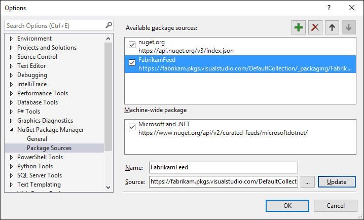
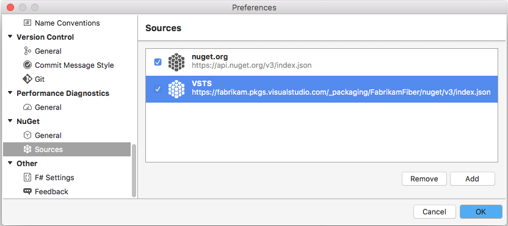
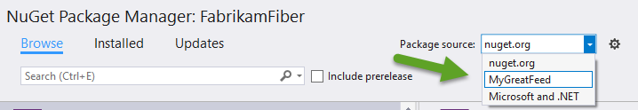

To consume NuGet packages from a feed, add the feed's NuGet endpoint as a package source in Visual Studio.

[!INCLUDE [Package Management and Visual Studio 2015](../_shared/vs2015.md)]

### Get your feed's NuGet package source URL 

[!INCLUDE [get a NuGet URL](../_shared/nuget-consume-endpoint.md)]

### Windows: Add the feed to your NuGet configuration

1. On the **Tools** menu, select **Options...**.
1. Expand **NuGet Package Manager** and select **Package Sources**.
1. Click the **green plus** in the upper right corner.
1. At the bottom of the dialog, enter the feed's name and the URL you got in the last step.
1. Select *Update* and then *OK*.

Then [click here to continue](#consume-packages).

### Mac: Add the feed to your NuGet configuration

1. Get a [Personal Access Token](../../setup-admin/team-services/use-personal-access-tokens-to-authenticate.md) (PAT) and make a note of it.
1. Open the Preferences dialog from the **Visual Studio** menu in the menu bar.
1. Select **NuGet** -> **Sources**.
1. Click **Add** then enter your feed's name, URL, any username, and your PAT as the password.
1. Click **OK**, then **OK** again.

### Consume packages

You can now discover and use packages in this feed. To add a package reference to a project:

1. Find your project in Solution Explorer.
1. Right-click **References**.
1. Select **Manage NuGet Packages...**.
1. In the **Package source** dropdown, select your feed.
1. Look for your package in the list.

### Using Visual Studio 2015 or earlier?
You may need to [download and install](https://dist.nuget.org/) the latest NuGet Package Manager extension.

### Using Visual Studio 2013 or earlier?
You'll need to get a [Personal Access Token](../../setup-admin/team-services/use-personal-access-tokens-to-authenticate.md). When you're prompted for a username and password, use any username and your PAT as the password.