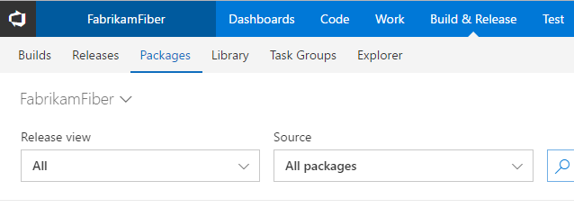
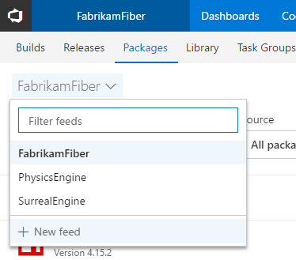

A feed is a container for packages.
You consume and publish packages through a particular feed.

To get started, navigate to the **Package** hub in the **Build & Release** hub group:

_If you don't see the Package hub, then ask your account owner to install the [Package Management extension](https://marketplace.visualstudio.com/items?itemName=ms.feed) from the [Visual Studio Marketplace](../../marketplace/install-vsts-extension.md)._

Click the dropdown in the top left and select **New feed**:

In the dialog:
- Give the feed a name.
- Choose who can read and contribute (or update) packages in your feed.
- Choose the upstream sources for your feed.
- When you're done, choose **Create**.

You can change these settings later by [editing the feed](../feeds/edit-feed.md).
