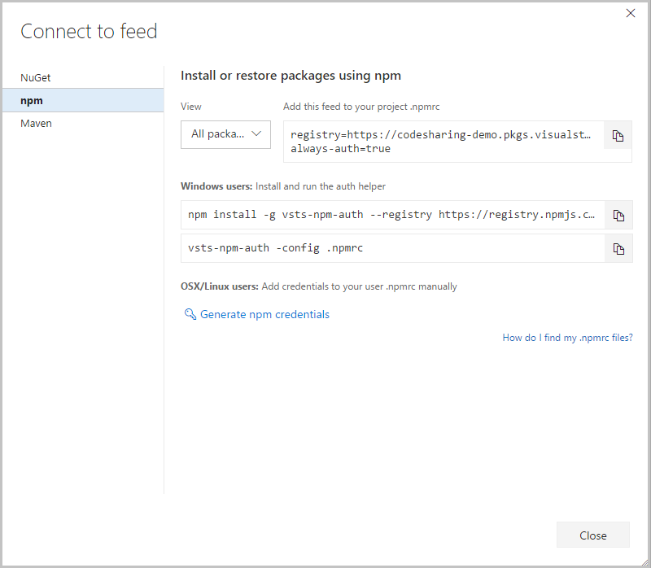
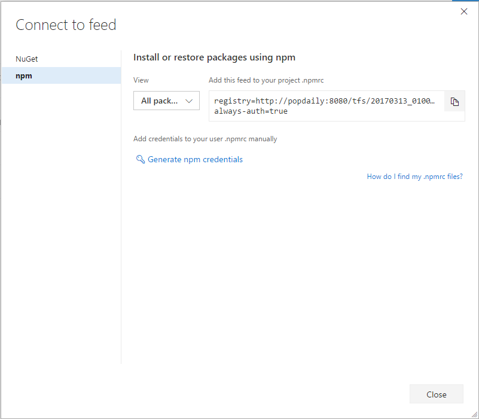

1. Navigate to your feed. If you haven't created a feed, [create one now](../../feeds/create-feed.md).

1. Select **Connect to feed**.

1. Select **npm**.

1. Follow the steps on screen.

   

   **VSTS**

   

   **TFS**

   
