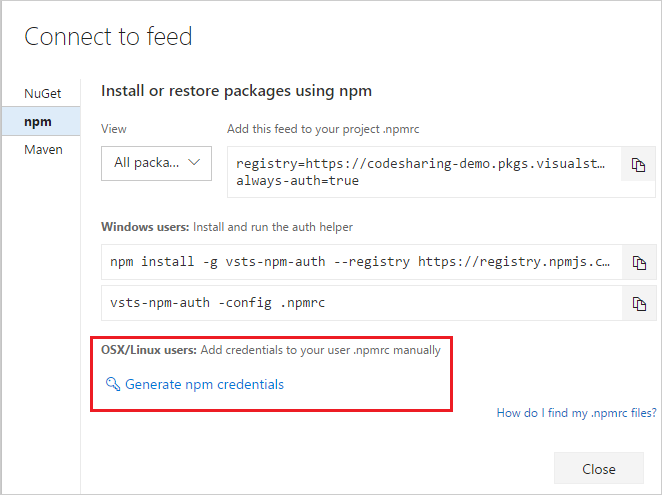

For **Linux** or **Mac** users, the _Connect to feed_ dialog will generate an appropriately-formatted token that you can place into your **_.npmrc_** file with a lifespan of 90 days.

>  If you want to create a token that lasts _longer than 90 days_, skip to the second method below.

**90-day token:**

1. From the **Packages** hub, select _Connect to feed_

1. Select _npm_.

1. Click _Generate npm credentials_ and copy them to add them to your user **_.npmrc_** manually:

    

**Create a token that lasts longer than 90 days:**
1. Navigate to security and generate a [PAT](../../../accounts/use-personal-access-tokens-to-authenticate.md) with a narrow scope of "Packaging (read and write)".
2. Base64 encode the PAT.  On Windows you can use...

    ```powershell
    [Convert]::ToBase64String([system.Text.Encoding]::UTF8.GetBytes("YOUR_PAT_GOES_HERE"))
    ```
3. In your $home/.npmrc add the following lines replacing account, feedname, username, PAT, and email.

    ```json
    //<youraccount>.pkgs.visualstudio.com/_packaging/<yourfeed>/npm/registry/:username=YOUR-USERNAME
    //<youraccount>.pkgs.visualstudio.com/_packaging/<yourfeed>/npm/registry/:_password=BASE64-ENCODED-PAT-GOES-HERE
    //<youraccount>.pkgs.visualstudio.com/_packaging/<yourfeed>/npm/registry/:email=YOUREMAIL@EXAMPLE.COM
    //<youraccount>.pkgs.visualstudio.com/_packaging/<yourfeed>/npm/registry/:always-auth=true
    ```
