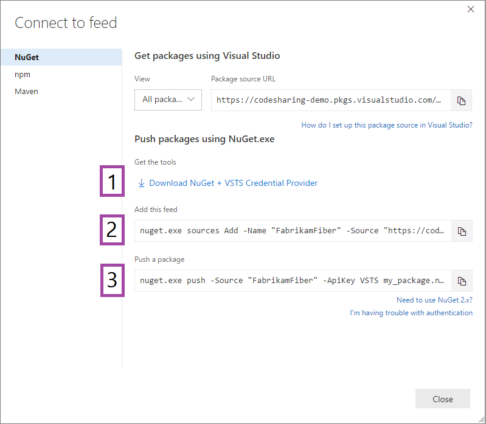

Navigate to your feed ([or create a feed if you haven't](..\feeds\create-feed.md)). 
Then, select **Connect to feed**:

Next, follow steps 1 and 2 to get the tools and add the feed to your local NuGet configuration.

