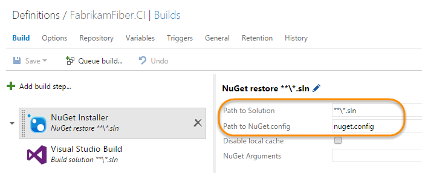
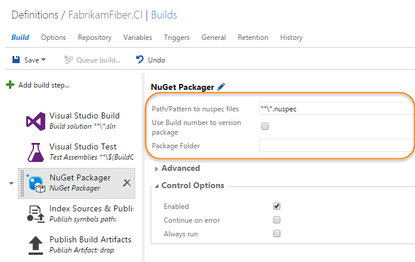
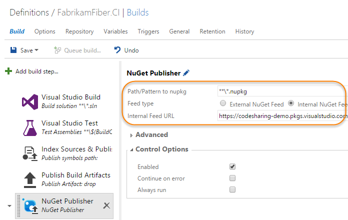

# Use Team Build to restore and publish NuGet packages

**Team Services | TFS 2017**

This guide covers the basics of using Team Build to work with NuGet packages in Package Management feeds.

This walkthrough assumes that you've already:

- [Set up your solution](../nuget/consume.md) to consume packages from a Package Management feed
- [Created a build](https://msdn.microsoft.com/Library/vs/alm/build-release/vs/define-build)
for that solution
- [Added the correct build service identity](../feeds/common-identities.md) to your feed

## Restore packages at the start of your build

To build a solution that relies on NuGet packages from Package Management feeds, 
add the **NuGet Installer** task. 

First, click **Add build step...**, select the **Package** category, and add the
**NuGet Installer** task. Then drag to order the task above any build tasks that require 
your packages.

Next, configure these options:

- **Path to Solution:** The path to the solution your build targets
- **Path to nuget.config:** The path to your solution's [nuget.config](http://docs.nuget.org/Consume/NuGet-Config-File) which specifies the
list of Package Management feeds your solution relies on

*Note: Specifying a Team Services feed using `-Source` as a command-line parameter will not work.
You must specify all your Team Services feeds in nuget.config.*



Finally, save your build.

### Specifying sources in nuget.config

The nuget.config you check in should list all the package sources you want to consume.
The example below demonstrates how that might look.

```xml
<?xml version="1.0" encoding="utf-8"?>
<configuration>
  <packageSources>
    <!-- remove any machine-wide sources with <clear/> -->
    <clear />
    <!-- add a Team Services feed -->
    <add key="MyGreatFeed" value="https://fabrikam.pkgs.visualstudio.com/DefaultCollection/_packaging/MyGreatFeed/nuget/v3/index.json" />
    <!-- also get packages from the NuGet Gallery -->
    <add key="nuget.org" value="https://www.nuget.org/api/v2/" />
  </packageSources>
  <activePackageSource>
    <add key="All" value="(Aggregate source)" />
  </activePackageSource>
</configuration>
```

## Create NuGet packages during your build

There are a variety of ways to create NuGet packages during a build. If you're already using
MSBuild or some other step to create your packages, skip this section and 
[publish those packages](#publish-packages-created-by-your-build). Otherwise, add the **NuGet Packager** task.

First, click **Add build step...**, select the **Package** category, and add the
**NuGet Installer** task. Then drag to order the task above any build tasks that require 
the packages you build (for example, the **NuGet Publisher** task).

Next, configure these options:

- **Path/Pattern to nuspec files:** The path to the nuspec files that you want to package
- **Use Build number to version package:** See the 
[next section](#use-the-build-number-to-version-your-packages)
- **Package Folder:** The destination (within the build drop) for the created packages
  - If you set this, make a note of the location so you can use it in the 
[publish step](#publish-packages-created-by-your-build)



Finally, save your build.

<a name="use-the-build-number-to-version-your-packages"></a>
### Use the build number to version package

Checking the **Use Build number to version package** box requires a change to your build's 
versioning scheme. Work is planned to improve this scenario; right now, it's best to version
packages via other mechanisms (like using the `AssemblyVersionAttribute` from the `csproj`, as
outlined in the [NuGet docs](http://docs.nuget.org/Create/Creating-and-Publishing-a-Package)).

If you choose to use the build number to version your package, you'll need to increment 
the package version for continuous integration builds. This is because specific versions 
of packages in feeds are [immutable](../feeds/immutability.md) and so cannot be updated or replaced.

To use the build number, check the **Use build number to version package** box and follow the line's
instructions (hover over the blue `i` icon) to set the build version format string. You must 
set the build version format string to have at least three parts separated by periods to 
avoid an error in NuGet packaging. The default build version format string is 
`$(date:yyyyMMdd)$(rev:.r)`, so a simple change is to add a zero at the end and a 
period between the date and build counter: `$(date:yyyyMMdd).$(rev:.r).0`.

Don't forget to save your build.

<a name="publish-packages-created-by-your-build"></a>
## Publish packages created by your build

To publish NuGet packages created by your build to Package Management feeds, add the **NuGet Publisher** task. This section assumes that a previous task (for example, a **NuGet Packager** task) in your
build is already producing NuGet packages.

First, click **Add build step...**, select the **Package** category, and add the
**NuGet Publisher** task. Then drag to order the task below the build task producing
your NuGet packages.

Next, configure these options:

- **Path/Pattern to nupkg:** The path or search pattern (relative to the root of the repo) 
to the NuGet packages in your build outputs 
  - The default pattern will publish all packages in the outputs
- **Feed type:** Internal NuGet Feed
- **Internal Feed URL:** The 
[NuGet Package Source URL](../nuget/consume.md#get-nuget-pkg-url) for the feed 
you want to publish to



Finally, save your build.

## Common issues consuming, packing, and publishing packages

<!-- BEGINSECTION class="md-qanda" -->

#### Q: Can I choose feeds using the `-Source` command line parameter?

A: Yes. However, Team Services feeds require authentication. The build task will only attempt to authenticate against feeds listed in nuget.config.

#### Q: Can I use my own copy of nuget.exe?

A: Yes. You can check a copy of nuget.exe into your repo, then edit **Path to NuGet.exe** under **Advanced** in each of the build steps.

*Note: If you choose to use your own nuget.exe, you will need to arrange for [authentication](../nuget/nuget-exe.md) to Team Services feeds.* 

Team Services authentication is implemented as an extension to NuGet.
NuGet extensions must be used with the exact version of nuget.exe for which they are designed.
If you use your own nuget.exe, NuGet extensions included on the build agent may not be compatible and the NuGet build tasks will not load them.

<!-- ENDSECTION -->