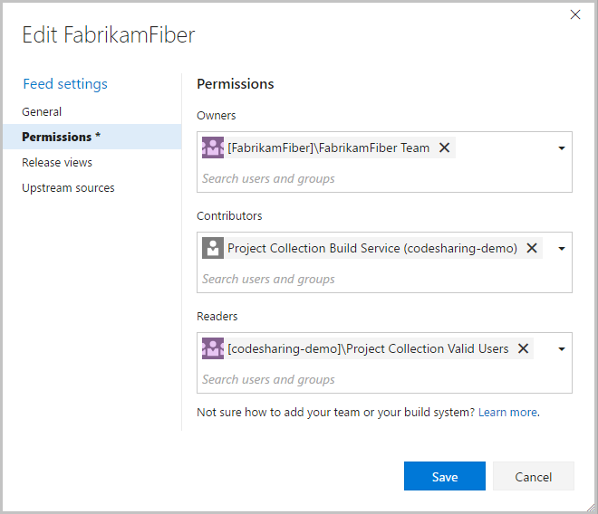

# Give teams and builds access to feeds

**VSTS | TFS 2017**

In addition to individuals, you typically give teams and service identities access to your feeds.
If you aren't familiar with permissions on feeds, read [the overview](../feeds/feed-permissions.md) first.

The most common identities are:
* Project teams
* Anyone who can log into the account
* The build service

## Teams

Feeds exist at the project collection level to allow component sharing across projects.
Each project has one or more teams associated with it.
Projects have a default team with a name derived from the project.
For a project called Fabrikam, its default team is **[Fabrikam]\Fabrikam Team**.
Additional teams can be named almost anything.
Teams in the Fabrikam project begin with "[Fabrikam]\".
To find and give a team access to a feed, search for the team name.

Project collections always have a team called **[DefaultCollection]\Project Collection Valid Users**.
This team automatically contains everyone who is allowed to login to your VSTS account.

## Build service identities

When Team Build runs a build job, it takes actions in the context of a build service identity.
To push to or restore packages from a feed, the build service identity must have access to the feed.
When you create a new build definition, by default it runs with Project Collection scope.
Giving the **Project Collection Build Service** access to a feed allows all build definitions at collection scope to access the feed.

## Example permissions

In the screenshot below, the **FabrikamFiber Team** owns the feed.

The **Project Collection Build Service** is a contributor, so any build which runs with Project Collection scope can add packages to the feed.

**Project Collection Valid Users**, meaning anyone who can log into the VSTS account, can restore packages from the feed.

