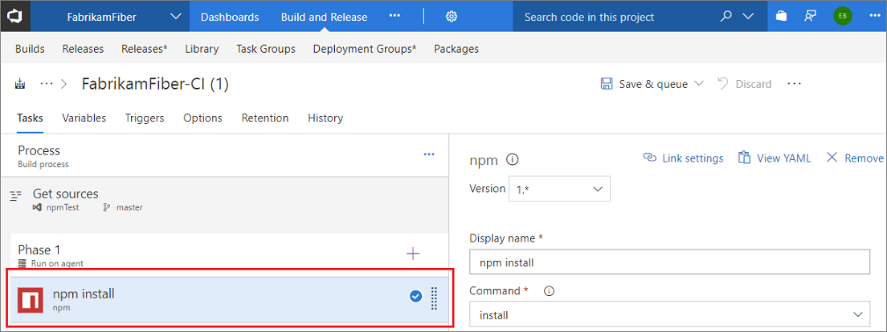
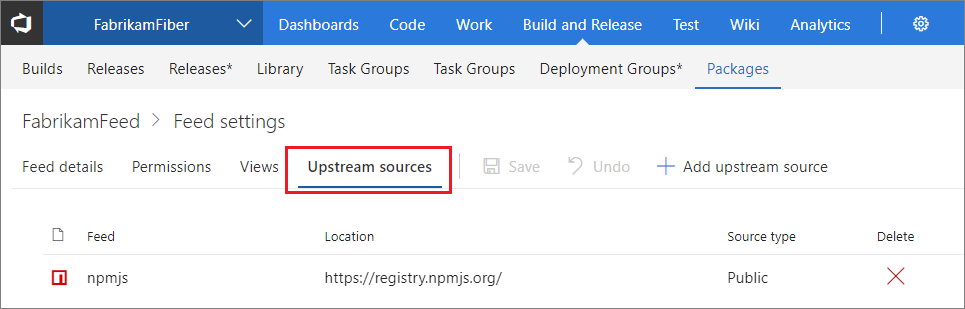

 

# Quickstart: Use npm to store JavaScript packages in VSTS or TFS

**VSTS** | **TFS 2018** | **TFS 2017**

This tutorial is an end-to-end guide on using npm to store JavaScript packages using Visual Studio Team Services or Team Foundation Server. It covers installation, license assigning, and setup.

## Step 1: Install and license the Package Management extension

Package Management is an extension that must be installed from the Marketplace. 

### Install Package Management extension
1. Go to the [Marketplace page for Package Management](https://marketplace.visualstudio.com/items?itemName=ms.feed)

1. Select **Get**

    

1. Select your account into which the Package Management extension should be installed

1. Each account gets five (5) free licenses. If you need more than 5 licenses, click **Buy** and purchase the additional licenses you need.  If you aren't sure you can click **Start 30 day free trial** and every user in your account will be granted access to Package Management for 30 days.  After the 30-day trial period your account will revert back to five (5) entitled users and you must assign licenses to individual users.  If you need additional licenses at this point, you may purchase them from this same dialog in the Marketplace.

1. After the install is completed, select **Proceed to the account**. Then, go to any project and select the **Packages** hub in the **Build & Release** hub group

### Assign licenses
If you selected **Start 30 day free trial** and are still in the trial period, every user is granted access and licenses do not need to be assigned until the trial period has ended. 

If you selected **Buy** or **Get it free**, you will need to assign your licenses by following the instructions below:

1. Go to your account, select the **Users** hub, and select **Package Management**.
1. Select **Assign**, type the users you want to assign licenses to, then select **Ok.**

   > If you have a Visual Studio Enterprise license, you already have access to Package Management and don't need to be assigned a license, just ensure that you've been assigned the "Visual Studio Enterprise" access level.

## Step 2: Create a feed

On your first visit to the **Packages** hub in the **Build and Release** hub group, you'll be welcomed with an image telling you to create a new feed, click the **+ New feed** button.

In the dialog:
* Give the feed a name.
* **Visibility**: Choose who can read and contribute (or update) packages in your feed.  An account visible feed is created with permissions that allow all users in the account to see/use your feed (recommended).  A private feed is created with permissions such that only you have access.
* **Upstream sources**: Clicking _Use packages from public sources through this feed_ will add both the public NPM (registry.npmjs.org) and NuGet (packages.nuget.org) as upstreams to your feed.  When upstreams are enabled your client (i.e. npm and nuget) will be able to fetch packages from the public registry through your private feed and your private feed will cache those packages for you.  If you select _Use packages published to this feed_ your feed will be created without connectivity to public registries. You can connect them at a later date if you desire.
* When you're done, choose _Create_.


You can change these settings later by [editing the feed](./feeds/edit-feed.md).


## Step 3: Set up your npmrc

All Package Management feeds require authentication, so you'll need to store credentials for the feed before you can install or publish packages. npm uses [.npmrc configuration files](https://docs.npmjs.com/files/npmrc) to store feed URLs and credentials.

### Where are my **_.npmrc_** files?

VSTS recommends using two **_.npmrc_** files:

1.	One **_.npmrc_** should live at the root of your git repo adjacent to your project's **_package.json_**.  It should contain a "registry" line for your feed and it should not contain credentials since it will be checked into git.  You can find the registry information for your feed from the _Connect to Feed_ button:

    1. From your **Packages** page, click _Connect to Feed_

        

    2. Copy the "registry" text:

        
        
2.	On your development machine, you will also have a **_.npmrc_** in $home for Linux or Mac systems or $env.HOME for win systems.  This **_.npmrc_** should contain credentials for all of the registries that you need to connect to.  The NPM client will look at your project's **_.npmrc_**, discover the registry, and fetch matching credentials from $home/.npmrc or $env.HOME/.npmrc.  Credential acquisition will be discussed in the next section.

This enables you to share project's **_.npmrc_** with the whole team while keeping your credentials secure.

### Set up authentication on your dev box
At this point you should have a project specific **_.npmrc_** containing only your Feed's registry information that you discovered from the "Connect to Feed" dialog.  There should be no credentials in this file and the file itself is usually adjacent to your project's **_package.json_**.

> **IMPORTANT:** There can only be a single "registry=" line in your **_.npmrc_**.  Multiple registries are possible with [scopes](npm/scopes.md) and our new upstream feature (discussed here).

#### Windows
If you are developing on Windows, we recommend that you use `vsts-npm-auth` to fetch credentials and inject them into your **_~/.npmrc_** on a periodic basis.  The easiest way to set this up is to install `vsts-npm-auth` globally (i.e. `npm install -g vsts-npm-auth`) and then add a run script in your project's **_package.json_**.

```json
"scripts": {
    "refreshVSToken": "vsts-npm-auth -config .npmrc"
}
```

#### Linux or Mac
If you are developing on Linux or Mac, `vsts-npm-auth` is not supported and we recommend generating a token in the following manner for your **_$HOME/.npmrc_**

[!INCLUDE [](./_shared/npm/npmrc.md)]

### Set up authentication in a build task

There are two options for setting up authentication in a build task:
* [Without a task runner](#without-a-task-runner)
* [With a task runner (e.g. gulp)](#with-a-task-runner-eg-make-gulp-work)

#### Without a Task Runner
To set up **npm** authentication in a build task _without_ a task runner, follow the directions below.

1. Add a build definition in VSTS under the **Build and Release** --> **Builds** hub.

    

1. Choose your source **Team project**, **Repository**, and **Default branch** and select _Continue_

1. Select _Empty process_ at the top of the form

1. Add a task to **Phase 1** of your build definition by clicking the **"+"**:

    

1. Select **Package** or search for _npm_ in the search bar, select **npm** and select _Add_:

    

1. Select the **npm install** task underneath **Phase 1**:

    

1. Browse to and select your **Working folder with package.json**:

    

1. Expand **Custom registries and authentication**, here you have a few options: 

    * Registries in my **_.npmrc_**

        

        > You can choose credentials to authenticate to outside of your current account/collection by setting up [service endpoints.](../pipelines/library/service-endpoints.md#sep-npm)

    * Registry I select here

        

        When you choose this option, the task will create a temporary **_.npmrc_** with credentials for the registry you've selected and it will override the project's **_.npmrc_**. This is useful when you want to publish to a specific feed. 


#### With a Task Runner (e.g. make gulp work)

When using a task runner, you'll need to add the **npm Authenticate** build task at the beginning of your build definition. This will inject credentials into your proejct's **_.npmrc_** and persist them for the lifespan of the build. This allows subsequent build steps to use the credentials in the **_.npmrc_**.

1. Add a build definition in VSTS under the **Build and Release** --> **Builds** hub.

    

1. Choose your source **Team project**, **Repository**, and **Default branch** and select _Continue_

1. Select _Empty process_ at the top of the form

1. Add a task to **Phase 1** of your build definition by clicking the **"+"**:

    

1. Select **Package** or search for _npm_ in the search bar, select **npm Authenticate** and select _Add_:

    

1. Select the **npm Authenticate** task underneath **Phase 1**:

    

1. Browse to and select your **.npmrc file to authenticate**:

    

    > You can choose credentials to authenticate to outside of your current account/collection by setting up [service endpoints.](../pipelines/library/service-endpoints.md#sep-npm)

1. After setting up your **npm Authenticate** task, you can add other build task(s) for your task runner like **Gulp**.

## Step 4: Use packages from npmjs.com

In addition to packages you publish, you can use packages from [www.npmjs.com](https://www.npmjs.com/) through this feed via *upstream sources*. Because this feed was created with public registries enabled (see [Step 2](#step-2-create-a-feed)), you should be able to use packages from an upstream source. To try it out, just run an `npm install` command (e.g. `npm install lodash`) in a shell opened to your project's folder. Learn more about upstream sources on the [upstream sources concepts page](concepts/upstream-sources.md).

You can choose to enable or disable upstream sources in the _Settings_ -> _Upstream sources_ tab:



## Step 5: Build your project

At this point your project should have a **_package.json_** and an **_.npmrc_** that are adjacent to each other.  You should run `npm install` from the directory that contains both of these files. Npm will discover your feed in the **_.npmrc_** in the current working directory and will fetch credentials from your home directory's **_.npmrc_** that you configured in [Step 2](#step-2-create-a-feed).


## Step 6: Publish an npm package

If you have followed all of the steps up to this point, you can publish by:
0. Navigating to the directory that contains your package's **_package.json_** file
0. Run `npm publish`

>`npm publish` will work because of the credentials you acquired in [Step 3](#step-3-set-up-your-npmrc).

If you have followed all of the steps up to this point package publishing should simply work.  There are, however, some important considerations:
- If you have npmjs.com configured as an upstream and the package name/version exists in the public registry then you will be blocked from publication.  We do not support overriding packages that exist on the public registry.


