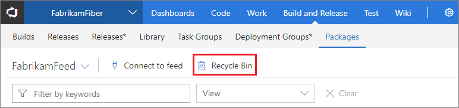
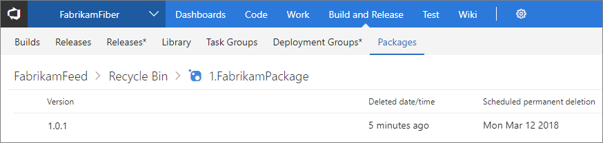
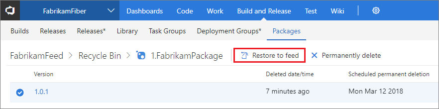

[//]: # (monikerRange: '>= tfs-2017')

# Recover a deleted package from the Recycle Bin in VSTS

**VSTS** | **TFS 2018** | **TFS 2017**

If you've deleted a package from Visual Studio Team Services (VSTS), builds that depend on that package will start to fail.  You won't be able to repush that package to the feed because of [immutability](../feeds/immutability.md).  In order to recover the package and have builds start working again, you can recover it from the Recycle Bin.

## Recover a deleted package

1. Find the Recycle Bin in the **Packages** page underneath the **Build and Release** hub in VSTS: 

    

    > Once in the Recycle Bin, you will see any packages that have been deleted from the current feed in the **past 30 days**.

2. Click a package to get more details such as: *Version*, *Deleted date/time*, and *Scheduled permanent deletion:*

    

3. Select a version to *Restore to feed:*

    

