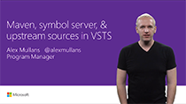

# Package Management

Host your NuGet, npm, and Maven packages in **Visual Studio Team Services (VSTS)** and **Team Foundation Server 2017 Update 1** using Package Management feeds. 

## 5-Minute Quickstarts 

### Learn how to host your packages.

<a href="get-started-nuget.md">NuGet</a>

<a href="get-started-npm.md">npm</a>

<a href="get-started-maven.md">Maven</a>

## Videos

         

## How-to Guides

- [Publish a NuGet package](nuget/publish.md)
- [Publish an npm package](npm/publish.md)
- [Publish a Maven package](maven/publish.md)
- [Publish a Gradle package](gradle/publish-package-gradle.md)

## Resources

- [Build and Release with VSTS](/vsts/pipelines/index)

