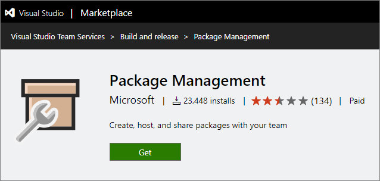
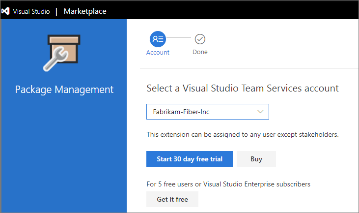

# Install and license Package Management

**VSTS | TFS 2017**

Package Management is an *extension* to VSTS and TFS.  This means you'll need the Package Management extension installed in your account and have Package Management assigned to you in order to view, upload, and download packages.  

## Install Package Management in VSTS

1. Go to the [Marketplace page for Package Management](https://marketplace.visualstudio.com/items?itemName=ms.feed). 

   

1. Select **Start Trial**, then:

   * Select your account
   * Select **Continue**
   * Select **Confirm**

   

   >During the 30-day trial period, everyone in your account (except Stakeholders) can use Package Management for free.

1. After the install is completed, select **Proceed to the account**. Then, go to any project and select the **Packages** hub in the **Build & Release** hub group.

   

## Enable Symbol Server in VSTS

After you've installed Package Management using the instructions in the previous section, you can enable the Symbol Server preview from the preview features panel.

1. Select your profile picture in the top-right
1. Select **Preview features**
1. In the dropdown, select **for this account [account-name]**
1. Toggle the **Symbol server** toggle to **On**
1. Close the panel

## Enable the NuGet.org upstream source in VSTS

After you've installed Package Management using the instructions in the first section, you can enable theNuGet.org upstream source preview from the preview features panel.

1. Select your profile picture in the top-right
1. Select **Preview features**
1. In the dropdown, select **for this account [account-name]**
1. Toggle the **NuGet.org upstream sources** toggle to **On**
1. Close the panel

## Install Package Management in TFS

Package Management is installed by default for TFS 2017 customers.  You must upgrade to TFS 2017 in order to use Package Management.

## Buying Package Management

After your 30-day trial of Package Management is over, you'll either need Package Management assigned to you or have a VS Enterprise subscription to view, upload, and download packages. In VSTS, you can assign 5 users Package Management for free.  In TFS, all Package Management licenses must be purchased in the Marketplace.  

To buy additional licenses of Package Management:

1. If you are using VSTS, navigate to the [Package Management page in the Marketplace](https://marketplace.visualstudio.com/items?itemName=ms.feed).

1. If you are using TFS, navigate to the marketplace using the **Browse Marketplace** link in the top right-hand corner of any page in your account:

   

   Then navigate to the Package Management page.

1. On the Marketplace Package Management page, select **Buy**. In the dialog that appears, select your account then select **Continue.**

   

1. If you don't have an Azure subscription, select **Create new Azure subscription** and follow the process on the following page.
   When you're done, select **Back to Visual Studio Marketplace**.

   

1. Select the number of users and select **Continue.** 

   

1. Select **Confirm** and then **Assign to users.**

For further help on the purchasing process, check out the [documentation on Marketplace](/vsts/marketplace/install-vsts-extension).

## Assign Package Management in VSTS

To assign your five free licenses of Package Management and any additional licenses that you've purchased:

1. Go to your account, select the **Users** hub, and select **Package Management**.

   

1. Select **Assign**, type the users you want to assign licenses to, then select **Ok.**
   
   >If you have a Visual Studio Enterprise license, you already have access to Package Management and don't need to be assigned a license.

## Assign licenses in TFS

1. From any collection in TFS, hover over the settings menu and select the **Users** hub. Then select **Package Management**.

   

1. Select **Assign**, type the user(s) you want to assign licenses, then select **Ok.**

   * Users with Visual Studio Enterprise subscriptions get Package Management for free.  [Ensure that your Visual Studio Enterprise subscribers are assigned VSE access level](../security/change-access-levels.md).

   * Users using an instance of TFS disconnected from the internet (and thus unable to purchase licenses from the marketplace) can still assign licenses purchased through an enterprise agreement.

<!-- BEGINSECTION class="md-qanda" -->

#### Q: How do I know if I'll still be able to use Package Management after my trial expires?

A:  All users who show up under the Package Management section of the Users hub will have access to Package Management after the trial expires. 
You'll need either a Package Management license or Visual Studio Enterprise subscription to show up in this list.  

#### Q:  I am one of my account's 5 free Basic users. Does that mean I can use Package Management as well?

A:  Your account's 5 free Basic users are separate from your 5 free Package Management users. 
The free Package Management licenses must be bought from the Marketplace and assigned in the Package Management section of the Users hub.

#### Q: I have a Visual Studio Professional subscription. Can I use Package Management for free?

A: Unfortunately not. Only Visual Studio Enterprise subscriptions include Package Management.

<!-- ENDSECTION -->
