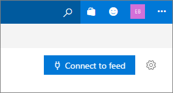
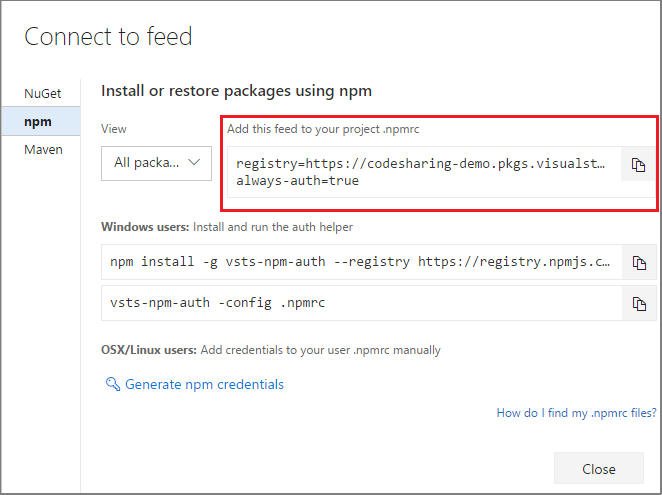
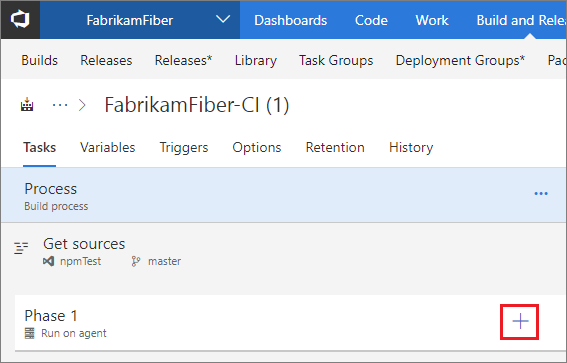
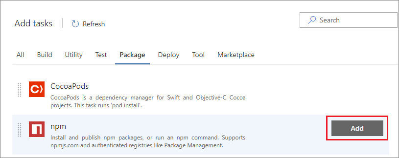
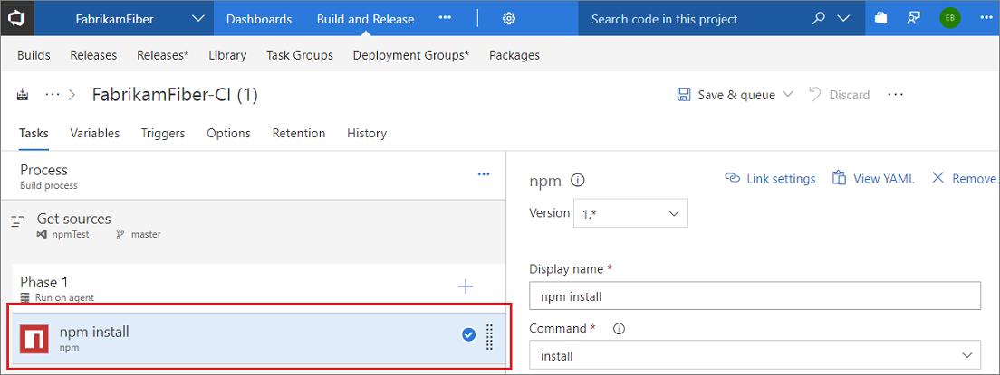
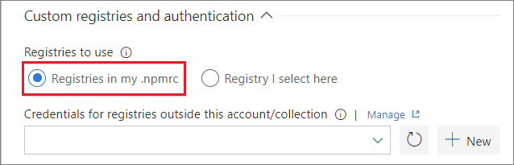
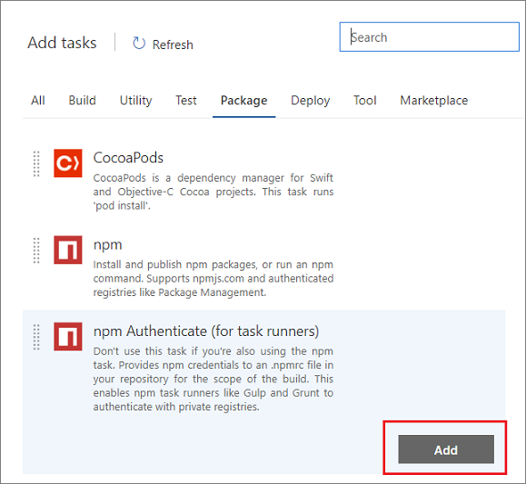
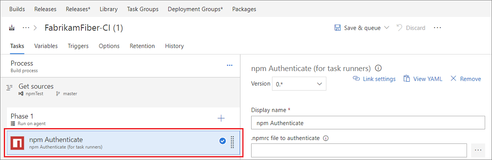
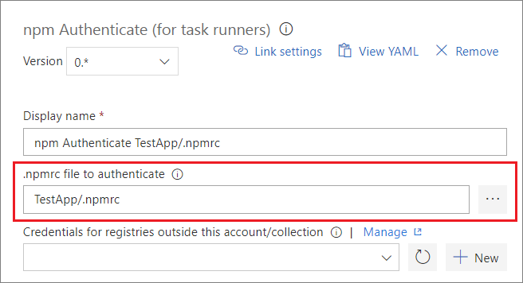

# Set up your client's npmrc

**VSTS** | **TFS 2018** | **TFS 2017**

All Package Management feeds require authentication, so you'll need to store credentials for the feed before you can install or publish packages. npm uses [.npmrc configuration files](https://docs.npmjs.com/files/npmrc) to store feed URLs and credentials.

## Where are my **_.npmrc_** files?

VSTS recommends using two **_.npmrc_** files:

1.	One **_.npmrc_** should live at the root of your git repo adjacent to your project's **_package.json_**.  It should contain a "registry" line for your feed and it should not contain credentials since it will be checked into git.  You can find the registry information for your feed from the _Connect to Feed_ button:

    1. From your **Packages** page, click _Connect to Feed_

        

    2. Copy the "registry" text:

        
        
2.	On your development machine, you will also have a **_.npmrc_** in $home for Linux or Mac systems or $env.HOME for win systems.  This **_.npmrc_** should contain credentials for all of the registries that you need to connect to.  The NPM client will look at your project's **_.npmrc_**, discover the registry, and fetch matching credentials from $home/.npmrc or $env.HOME/.npmrc.  Credential acquisition will be discussed in the next section.

This enables you to share project's **_.npmrc_** with the whole team while keeping your credentials secure.

## Set up authentication on your dev box
You should have a project specific **_.npmrc_** containing only your feed's registry information that you discovered from the "Connect to Feed" dialog.  There should be no credentials in this file and the file itself is usually adjacent to your project's **_package.json_**.

> **IMPORTANT:** There can only be a single "registry=" line in your **_.npmrc_**.  Multiple registries are possible with [upstream sources](../concepts/upstream-sources.md), or by using [scopes](..//npm/scopes.md) (not recommended).

::: moniker range="vsts"

### Windows
If you are developing on Windows, we recommend that you use `vsts-npm-auth` to fetch credentials and inject them into your **_~/.npmrc_** on a periodic basis.  The easiest way to set this up is to install `vsts-npm-auth` globally (i.e. `npm install -g vsts-npm-auth`) and then add a run script in your project's **_package.json_**.

```json
"scripts": {
    "refreshVSToken" : "vsts-npm-auth -config .npmrc"
}
```

### Linux or Mac
If you are developing on Linux or Mac, `vsts-npm-auth` is not supported and we recommend generating a token in the following manner for your **_$HOME/.npmrc_**

[!INCLUDE [](../_shared/npm/npmrc.md)]

::: moniker-end

::: moniker range=">= tfs-2017 < vsts"

[!INCLUDE [](../_shared/npm/npmrc.md)]

`vsts-npm-auth` is not supported on TFS.

::: moniker-end

## Set up authentication in a build task

There are two options for setting up authentication in a build task:
* [Without a task runner](#without-a-task-runner)
* [With a task runner (e.g. gulp)](#with-a-task-runner-eg-make-gulp-work)

### Without a Task Runner
To set up **npm** authentication in a build task _without_ a task runner, follow the directions below.

1. Add a build pipeline in VSTS under the **Build and Release** --> **Builds** hub.

    

1. Choose your source **Project**, **Repository**, and **Default branch** and select _Continue_

1. Select _Empty process_ at the top of the form

1. Add a task to **Phase 1** of your build pipeline by clicking the **"+"**:

    

1. Select **Package** or search for _npm_ in the search bar, select **npm** and select _Add_:

    

1. Select the **npm install** task underneath **Phase 1**:

    

1. Browse to and select your **Working folder with package.json**:

    

1. Expand **Custom registries and authentication**, here you have a few options: 

    * Registries in my **_.npmrc_**

        

        > You can choose credentials to authenticate to outside of your current account/collection by setting up [service connections.](../../pipelines/library/service-endpoints.md#sep-npm)

    * Registry I select here

        

        When you choose this option, the task will create a temporary **_.npmrc_** with credentials for the registry you've selected and it will override the project's **_.npmrc_**. This is useful when you want to publish to a specific feed. 


### With a Task Runner (e.g. make gulp work)

When using a task runner, you'll need to add the **npm Authenticate** build task at the beginning of your build pipeline. This will inject credentials into your proejct's **_.npmrc_** and persist them for the lifespan of the build. This allows subsequent build steps to use the credentials in the **_.npmrc_**.

1. Add a build pipeline in VSTS under the **Build and Release** --> **Builds** hub.

    

1. Choose your source **Project**, **Repository**, and **Default branch** and select _Continue_

1. Select _Empty process_ at the top of the form

1. Add a task to **Phase 1** of your build pipeline by clicking the **"+"**:

    

1. Select **Package** or search for _npm_ in the search bar, select **npm Authenticate** and select _Add_:

    

1. Select the **npm Authenticate** task underneath **Phase 1**:

    

1. Browse to and select your **.npmrc file to authenticate**:

    

    > You can choose credentials to authenticate to outside of your current account/collection by setting up [service connections.](../../pipelines/library/service-endpoints.md#sep-npm)

1. After setting up your **npm Authenticate** task, you can add other build task(s) for your task runner like **Gulp**.

## Troubleshooting `vsts-npm-auth`

If you receive an error like:

* Command Prompt: `'vsts-npm-auth' is not recognized as an internal or external command, operable program or batch file.`
* PowerShell: `vsts-npm-auth : The term 'vsts-npm-auth' is not recognized as the name of a cmdlet, function, script file, or operable program.`

then it's likely that the npm modules folder is not in your path. 

To fix this, re-run Node.js setup and ensure the `Add to PATH` option and its child options are selected for installation.


Alternatively, you can edit the PATH variable to add `%APPDATA%\npm` (Command Prompt) or `$env:APPDATA\npm` (PowerShell).
