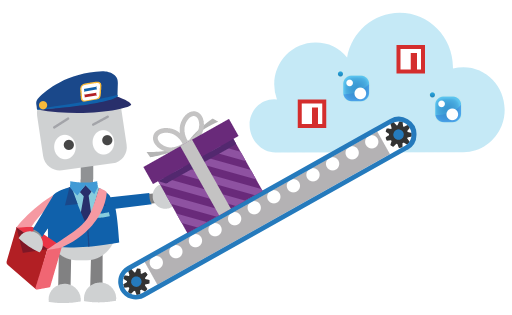

# Package Management in Team Services and TFS

> [!NOTE]
> Package Management is an **[extension](http://go.microsoft.com/fwlink/?LinkId=723595)** that hosts NuGet and npm packages alongside all your other VSTS assets: source code, builds, releases, etc.
> The extension must be installed from the Marketplace to create or consume packages.

## Package Management Overview

Package Management introduces the concept of multiple *feeds* that can be used to organize and control access to your packages. If you're familiar with using packages from [NuGet.org](https://www.nuget.org) or modules from [npmjs](https://www.npmjs.com), you can think of those places each as a single feed. You may also have heard feeds called package *repositories*.

## Get started using Package Management
Get up and running with NuGet or npm in Team Services and TFS in just a few minutes with the [NuGet quick start](get-started-nuget.md) and [npm quick start](get-started-npm.md).

If you haven't used packages before, see the [conceptual introduction](index.md). When you're ready to get started, [install and license Package Management](install.md).

## Versions and compatability
Some package management services are only compatible with specific versions of TFS. Check out the table below to see compatibility.

| Product       | Team Services | TFS                         |
|---------------|---------------|-----------------------------|
| **NuGet**     | Yes           | TFS 2017                    |
| **npm**       | Yes           | TFS 2017 Update 1 and newer |

## Other package types
Need to host other package types (Docker, Cocoapods, etc.)? Tell us on the [Package Management UserVoice](https://visualstudio.uservoice.com/forums/330519-team-services/category/145266-package-management).