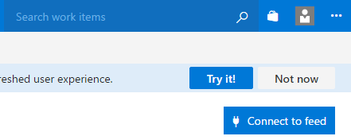
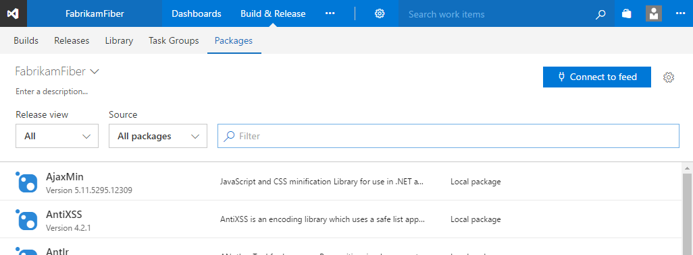
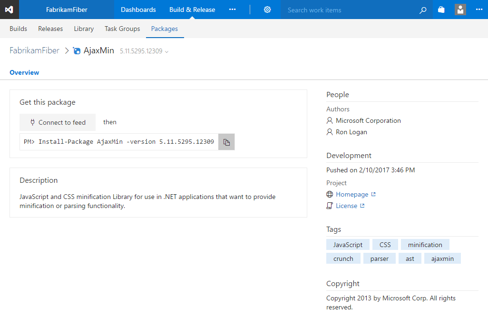

# Updated Package Management UX

**Team Services**

We've made a major update to the Package Management UX in Visual Studio Team Services. You can enable a preview of the update using the toggle in the Packages hub.

## What's new on the feed page

- We've aligned to the two-page list-details paradigm used in build, PR, and elsewhere, and used the additional real estate for metadata like the package description.
- We've made your feed selection sticky and moved the feed selector to a dropdown; if you commonly use just a single feed, you'll no longer have to find it in the list.

 
## What's new on the package page
- We moved package versions to a dropdown, which substantially decreases load times for packages with lots of versions. And, versions are filterable so you can quickly find the one you're looking for.
- We've clarified the instructions to connect to a feed and install a package and brought them together in a new, more prominent location on the page.
- Package commands now use the VSTS-standard position at the top-right of the page; infrequently-used commands are in a menu to avoid cluttering the page.

## Got feedback?

We'd like to hear what you think of the new experience. Send us a smile or frown using the smiley in the upper-right corner of the page.