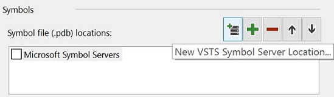
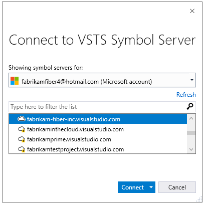
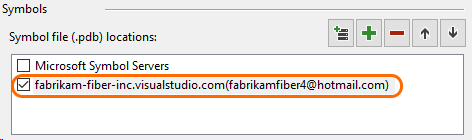

# Use Symbol Server in VSTS

**VSTS**

Symbol servers enable debuggers to automatically retrieve the correct symbol files without knowing product names, build numbers or package names. 
The Symbol Server in VSTS stores content in Azure Storage and provides file identity access to debug artifacts (both symbol files and the binary image) used by debuggers.
The symbols are accessible to valid users in the VSTS account. This makes it easier to debug packages that are shared across multiple teams/projects.
The following sections describe how to publish symbols to VSTS and how to configure Visual Studio to access them. 

## Before you start
The Symbol Server feature in VSTS is currently in private preview. If you'd like to participate in the private preview, please email <asonboard@microsoft.com> with the name of your VSTS account so the feature can be enabled for your account.

Consuming symbols from the VSTS Symbol Server requires Visual Studio 2017 version 15.3 Preview 5 or later.

## Publish symbols
In order to publish symbols to VSTS, include the **Index Sources and Publish Symbols** task in your build definition. Configure the task as follows:

* For **Version**, select the 2.\* (preview).  
* For **Symbol Server Type**, select **VSTS**. 
* Use the **Path to symbols folder** argument to specify the root directory that contains the .pdb files to be published. 
* Use the **Search pattern** argument to specify search criteria to find the .pdb files in the folder that you specify in **Path to symbols folder**. You can use a single-folder wildcard (```*```) and recursive wildcards (```**```).
For example, ```**\bin\**\*.pdb``` searches for all *.pdb* files in all subdirectories named *bin*.


### Publish symbols for NuGet packages
To publish symbols for NuGet packages, include the above task in the build definition that produces the NuGet packages. Then the symbols will be available to all users in the VSTS account. 

## Consume symbols

Visual Studio 2017 version 15.3 Preview 5 and later supports consuming symbols from a VSTS Symbol Server. 
You can select and add VSTS symbol paths to your Visual Studio environment using the Tools->Options->Debugger->Symbols page.



In the **Connect to VSTS Symbol Server** dialog, select the VSTS account to which the symbols have been published and the corresponding user identity that has access to this VSTS account. 



Click **Connect** in the above dialog. The VSTS Symbol Server is now remembered by Visual Studio. When a debugging session begins, Visual Studio will be able to get symbols from VSTS.



## Q&A
<!-- BEGINSECTION class="md-qanda" -->

#### Q: What's the  retention policy for the symbols stored in the VSTS symbol server?

A: Symbols will have the same retention as the build. When you delete a build, you also delete the symbols produced by that build.

#### Q: Is this available in TFS?

A: In TFS, you can bring your own file share and set it up as a symbol server as described in [this blog](https://edsquared.com/source-server-and-symbol-server-support-in-tfs-2010-cf35ed5527e2). 

<!-- ENDSECTION -->

