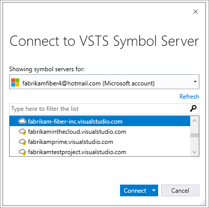

# Debug with symbols in Visual Studio

[!INCLUDE ]

Symbol servers enable debuggers to automatically retrieve the correct symbol files without knowing product names, build numbers or package names. To learn more about symbols, read the [concept page](../concepts/symbols.md); to publish symbols, see [this page](/vsts/build-release/symbols/index?toc=/vsts/package/toc.json). To use symbols in WinDbg, see [this page](debug-with-symbols-windbg.md).

## Add the symbol server to Visual Studio

To debug with symbols, select and add the VSTS symbol server to your Visual Studio environment using the Tools->Options->Debugger->Symbols page.

In the **Connect to VSTS Symbol Server** dialog, select the VSTS account to which the symbols have been published and the corresponding user identity that has access to this VSTS account. 

Click **Connect** in the above dialog. The VSTS Symbol Server is now remembered by Visual Studio. When a debugging session begins, Visual Studio will be able to get symbols from VSTS.

## Debugging optimized modules

If you're debugging an optimized module (e.g. something that was built with the `Release` configuration) and you haven't changed the default "Enable Just My Code" setting in Options, Visual Studio will not automatically fetch symbols for the optimized module. If this is the case, the Modules window will have a warning message.

To debug the module, you can either:
- Open the Modules window, right-click the module, and choose “Load Symbols” (recommended)
- In Options > Debugging > General, uncheck "Enable Just My Code"

## Source Link support

We recommend checking "Enable Source Link support" in Options > Debugging > General (it's checked by default).

If you choose to enable source server support, please consider the [security implications](https://docs.microsoft.com/en-us/visualstudio/debugger/source-server-security-alert) before doing so.

## Portable PDB differences

If you're using [Portable PDBs](https://github.com/dotnet/core/blob/master/Documentation/diagnostics/portable_pdb.md), there are a few impacts to VSTS workflows.

First, the VSTS **Index Sources and Publish Symbols** build task doesn't add source indexes to Portable PDBs because indexing is now done by the build. This is a design feature of Portable PDBs and .NET.

Second, [Visual Studio Source Link](https://github.com/dotnet/core/blob/master/Documentation/diagnostics/source_link.md) cannot currently authenticate to private source repositories (like VSTS), which means that Source Link does not work if your Portable PDB contains links to VSTS repositories.