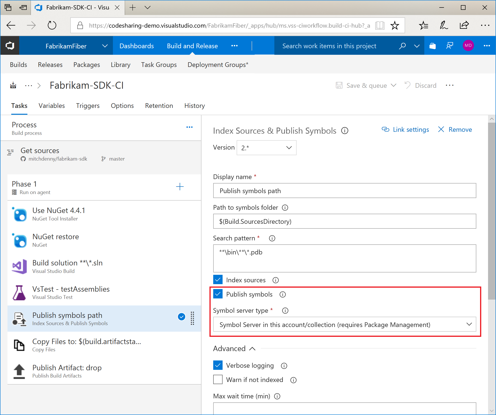
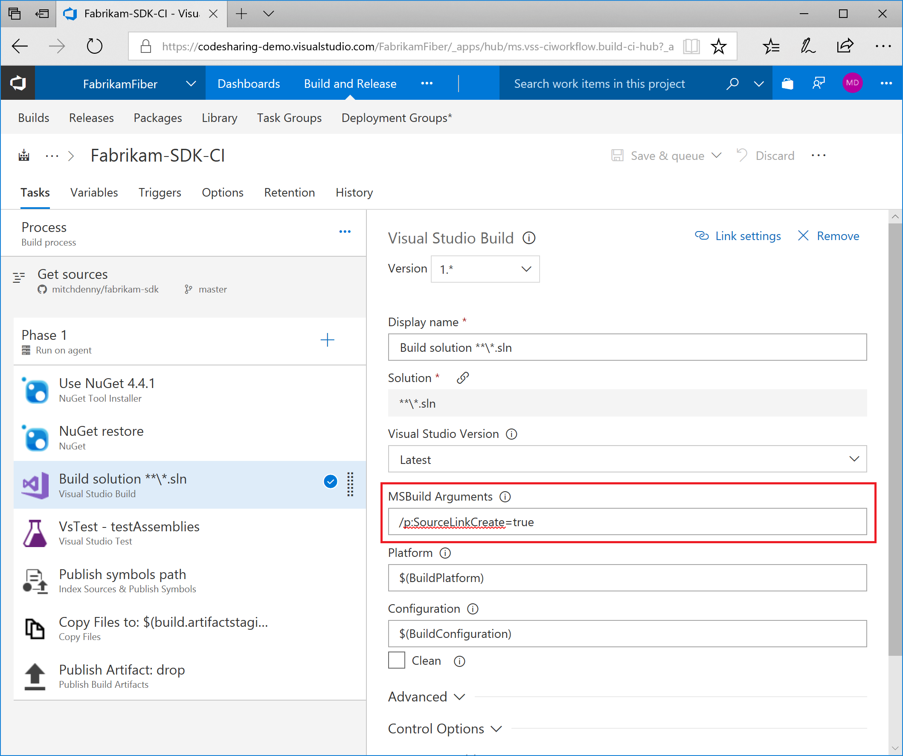
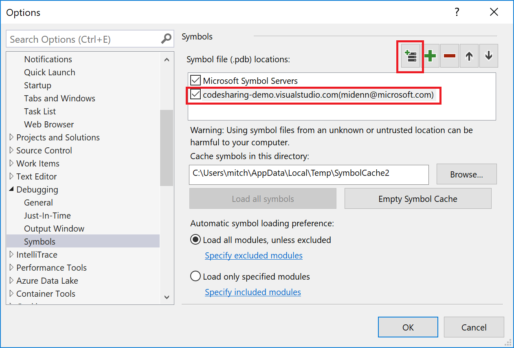
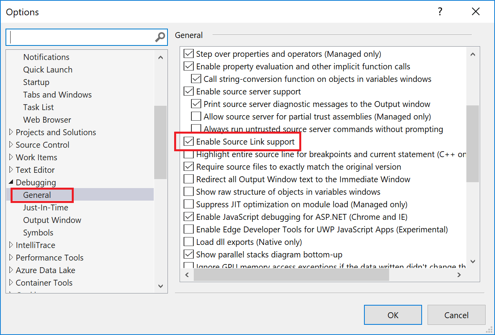

# Setting up GitHub Source Linking with VSTS Build & VSTS Symbol Server

Visual Studio Team Services now includes an integrated symbol server. When you run a build, PDB files are produced which you can upload to the symbol server. These symbols can then be later downloaded to debug production issues, or by other developers in your organization that might be reusing the code that you have published into a package. By default VSTS makes it very easy to index and publish symbols for source code that is hosted and built within VSTS, but did you know that you can also publish symbols for source code that is hosted on GitHub?

When building .NET code in VSTS the _Index and Publish Symbols_ build task is responsible finding PDB files and inserting source file location information into them so that when they are later downloaded the debugger knows where to locate source files. The symbols task is included by default in build pipeline templates. All you need to do is check the **Publish Symbols** parameter to get started.



For source code that is hosted in VSTS, that is all you need to do. However, for source code that is hosted on GitHub and being built in VSTS you need to do a few extra steps.

> [!NOTE]
> In order to publish symbols to and download symbols from the VSTS Symbol Server you must have the [Package Management](https://marketplace.visualstudio.com/items?itemName=ms.feed)  extension installed.

## Installing the Source Link Package
VSTS doesn't natively know how to map source code that originated from a GitHub repository so we need to give it a bit of a hand. To do that you need to install the ```SourceLink.Create.CommandLine``` package into your solution. This injects the logic necessary to map source code hosted in GitHub to symbols stored in PDB files so that the Visual Studio debugger can seamlessly download source files as another developer steps through your code.

## Modifying the Build Pipeline
The next step is to modify the build pipeline to invoke Source Link. This is done by adding a ```/p:SourceLinkCreate=true``` parameter to the _MSBuild_ task.



Once this is done you can save and queue the build pipeline and the GitHub source linking information will be embedded into the PDBs prior to be publishing to the symbol server in VSTS.

> [!NOTE]
> You may notice that during the build process a warning is still produced by the _Index and Publish Symbols_ task that it cannot index the source code because it is not hosted in VSTS. You can ignore this warning because the source location information was embedded earlier in the build process via the Source Link tooling.

## Verifying the Setup
Once the build has been completed and the symbols have been published it is time to make sure that everything is working as expected. Before attaching the debugger to your target process you should ensure that you have configured Visual Studio to download symbols from VSTS and use the Source Link information embedded in those symbols to download source from GitHub.

To point Visual Studio to VSTS for downloading symbols click on _Tools_, then _Options_ and then scroll down to the _Debugging_ group of items and select _Symbols_ item. Use the **New VSTS Symbol Server location** icon to select your VSTS server and add it to the list of symbols locations.



Next select the _General_ item under the _Debugging_ group and scroll down and check the **Enable Source Link support**.



Now that Visual Studio is setup it is time to attach the debugger to the process that is running the code that you want to download symbols for. Once the debugger is attached Visual Studio will attempt to locate symbols for each binary by probing VSTS, if the symbols are found then it will download the PDB files.

In order to trigger the download of source code you need to break into the running process. The first time Visual Studio attempts to download the source code it will prompt for consent.


Once consent is granted Visual Studio will download the source files directly from GitHub and display then in the editor with the break point highlighted.


> [!NOTE]
> When attaching to a process, you may need to uncheck the **Enable Just My Code** option under the _Debugging | General_ options.

## Conclusion
In this article we've shown you how to get up and running using the symbol server integrated with VSTS even when your source code is coming from GitHub.

## Q&A

### Does this work with private GitHub repositories?

No, currently the Source Link implementation in Visual Studio is not designed to work with authenticated GitHub repositories. This functionality is being added in will be available in the future release of Visual Studio 2017.

## Reference Information

- [VSTS is now a Symbol Server](https://blogs.msdn.microsoft.com/devops/2017/11/15/vsts-is-now-a-symbol-server/)
- [Publish Symbols for Debugging](https://docs.microsoft.com/en-us/vsts/pipelines/symbols/)
- [Build: Index & Publish Symbols](https://docs.microsoft.com/en-us/vsts/pipelines/tasks/build/index-sources-publish-symbols)
