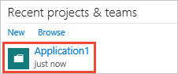
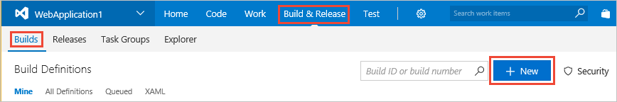

<li><p><a data-toggle="collapse" href="#expando-begin-create-build-definition-open-team-project">Open your project in your web browser &#x25BC;</a></p>
<div class="collapse" id="expando-begin-create-build-definition-open-team-project">


<p>(If you don't see your project listed on the home page, select **Browse**.)</p>
<ul>
<li>On-premises TFS: ```http://{your_server}:8080/tfs/DefaultCollection/{your_project}``` </li>
<li>Azure Pipelines: ```https://dev.azure.com/{your_organization}/{your_project}```</li>
</ul>
<p>[The TFS URL doesn't work for me. How can I get the correct URL?](/azure/devops/server/admin/websitesettings)</p>
</div>
</li>

<li><p><a data-toggle="collapse" href="#expando-begin-create-build-definition-create">Create a build pipeline (Pipelines tab > Builds) &#x25BC;</a></p>
<div class="collapse" id="expando-begin-create-build-definition-create">

<p></p>
</div>
</li>
