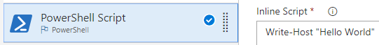

## Config-as-code or visual designer

Do you want to configure your build pipeline as code in YAML, or by using the visual designer in your web browser?

# [YAML](#tab/yaml)

::: moniker range="azdevops"

Choose this option if you want the advantages of configuration as code. This means your pipeline is versioned with your code and follows the same branching structure as your code.

```YAML
steps:
- script: echo hello world 
```

[Get started with YAML builds](../get-started-yaml.md).

Follow all the instructions in [Create your first pipeline](../get-started-yaml.md) to create a build pipeline for the sample app.

::: moniker-end

::: moniker range="< azdevops"
YAML builds are not yet available on TFS.
::: moniker-end

# [Designer](#tab/designer)

Choose this option if you prefer a graphical interface in your web browser.



---