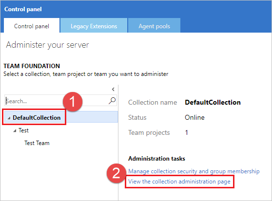
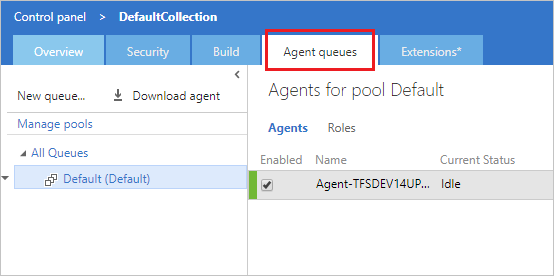

1. Navigate to your project and choose **Manage project** (gear icon). 

   

1. Choose **Control panel**.

   

1. Select the desired project collection, and choose **View the collection administration page**.

      

   1. Select **Agent Queues** (For TFS 2015, Select **Build** and then **Queues**).

      

