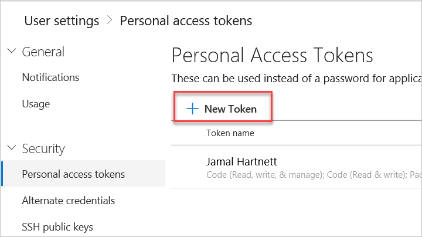

### Decide which user you'll use

As a one-time step, you must register the agent. Someone with permission to
[administer the agent queue](../../../../organizations/security/about-security-roles.md?view=azure-devops#agent-queue-security-roles)
must complete these steps. The agent will not use this person's
credentials in everyday operation, but they're required to complete registration.
Learn more about [how agents communicate](../../agents.md#communication).

::: moniker range=">= tfs-2017"

#### Authenticate with a personal access token (PAT)

1. Sign in with the user account you plan to use in either your Azure DevOps organization (```https://dev.azure.com/{your_organization}```)
or your Team Foundation Server web portal (```https://{your-server}:8080/tfs/```).

1.  From your home page, open your profile. Go to your security details.

 

1. Create a personal access token.

 

1. For the scope select **Agent Pools (read, manage)** and make sure all the other boxes are cleared.
   If it's a [deployment group](../../../release/deployment-groups/index.md) agent, for the scope select **Deployment group (read, manage)** and make sure all the other boxes are cleared.

1. Copy the token. You'll use this token when you configure the agent.

::: moniker-end

::: moniker range="<= tfs-2017"

#### Authenticate as a Windows user (TFS 2015 and TFS 2017)

As an alternative, on TFS 2017, you can use either a domain user or a
local Windows user on each of your TFS application tiers.

On TFS 2015, for macOS and Linux only, 
we recommend that you create a local Windows user on each of your TFS application tiers and dedicate that user for the purpose of deploying build agents.

::: moniker-end

### Confirm the user has permission

Make sure the user account that you're going to use has permission to register the agent.

Is the user an Azure DevOps organization owner or TFS server administrator? **Stop here**, you have permission.

Otherwise:

<ol>
<li>Open a browser and navigate to the **Agent pools** tab for your Azure Pipelines organization or TFS server:

[!INCLUDE [include](../../_shared/agent-pools-tab.md)]</li>

<li>Click the pool on the left side of the page and then click **Roles**.</li>

<li>If the user account you're going to use is not shown, then get an administrator to add it. The administrator can be an agent pool administrator, an [Azure DevOps organization owner](../../../../organizations/accounts/faq-add-delete-users.md#find-owner), or a [TFS server administrator](/azure/devops/server/admin/add-administrator-tfs).
If it's a [deployment group](../../../release/deployment-groups/index.md) agent, the administrator can be an deployment group administrator, an [Azure DevOps organization owner](../../../../organizations/accounts/faq-add-delete-users.md#find-owner), or a [TFS server administrator](/azure/devops/server/admin/add-administrator-tfs).
You can add a user to the deployment group administrator role in the **Security** tab on the **Deployment Groups** page in **Azure Pipelines**.</li>
</ol>

> If you see a message like this: _Sorry, we couldn't add the identity. Please try a different identity._, you probably followed the above steps for an organization owner or TFS server administrator. You don't need to do anything; you already have permission to administer the agent queue.
