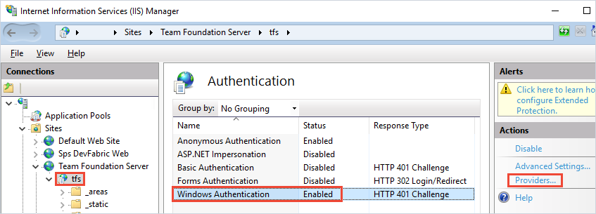

# Self-hosted agent authentication options

Azure Pipelines provides a choice of several authentication options you can use when you are registering an agent. These methods of authentication are used only during agent registration. See [Agents communication](./agents.md#communication) for details of how agents communicate after registration.

| Agent registration method | Azure DevOps Services | Azure DevOps Server & TFS |
|--------------------------|-----------------------|---------------------------|
| [Personal access token (PAT)](#personal-access-token-pat) | Supported | Supported when server is configured with HTTPS |
| [Service Principal](#service-principal)      | Supported | Currently not supported |
| [Device code flow](#device-code-flow)     | Supported | Currently not supported |
| [Integrated](#integrated) | Not supported | Windows agents only |
| [Negotiate](#negotiate) | Not supported | Windows agents only |
| [Alternate (ALT)](#alternate-alt) | Not supported | Supported when server is configured with HTTPS |

## Personal access token (PAT)

Specify **PAT** for authentication type during agent configuration to use a personal access token to authenticate during agent registration, then specify a personal access token (PAT) with **Agent Pools (read, manage)** scope (or **Deployment group (read, manage)** scope for a [deployment group](../release/deployment-groups/index.md) agent) can be used for agent registration.

For more information, see [Register an agent using a personal access token (PAT)](./personal-access-token-agent-registration.md)

## Service Principal

Specify **SP** for authentication type during agent configuration to use a service principal to authenticate during agent registration.

For more information, see [Register an agent using a Service Principal](./service-principal-agent-registration.md).

## Device code flow 

Specify `AAD` for authentication type during agent configuration to use device code flow to authenticate during agent registration.

For more information, see [Register an agent using device code flow](./device-code-flow-agent-registration.md).

## Integrated

:::moniker range="azure-devops"

Integrated windows authentication for agent registration is only available for Windows agent registration on Azure DevOps Server and TFS.

:::moniker-end

:::moniker range="< azure-devops"

Specify **Integrated** for authentication type during agent configuration to use integrated Windows authentication to authenticate during agent registration.

Connect a Windows agent to TFS using the credentials of the signed-in user through a Windows authentication scheme such as NTLM or Kerberos.

To use this method of authentication, you must first configure your TFS server.

1. Sign into the machine where you are running TFS.

1. Start Internet Information Services (IIS) Manager. Select your TFS site and make sure Windows Authentication is enabled with a valid provider such as NTLM or Kerberos.

:::moniker-end

## Negotiate

:::moniker range="azure-devops"

The negotiate authentication method for agent registration is only available for Windows agent registration on Azure DevOps Server and TFS.

:::moniker-end

:::moniker range="< azure-devops"

Connect to TFS as a user other than the signed-in user through a Windows authentication scheme such as NTLM or Kerberos.

To use this method of authentication, you must first configure your TFS server.

1. Log on to the machine where you are running TFS.

1. Start Internet Information Services (IIS) Manager. Select your TFS site and make sure Windows Authentication is enabled with the Negotiate provider and with another method such as NTLM or Kerberos.

:::moniker-end

## Alternate (ALT)

:::moniker range="azure-devops"

The alternate (basic) authentication method for agent registration is only available on Azure DevOps Server and TFS.

:::moniker-end

:::moniker range="< azure-devops"

Connect to TFS using Basic authentication. To use this method, you must first [configure HTTPS on TFS](/azure/devops/server/admin/websitesettings).

To use this method of authentication, you must configure your TFS server as follows:

1. Sign in to the machine where you are running TFS.

1. Configure basic authentication. See [Using `tfx` against Team Foundation Server 2015 using Basic Authentication](https://github.com/Microsoft/tfs-cli/blob/master/docs/configureBasicAuth.md).

:::moniker-end

