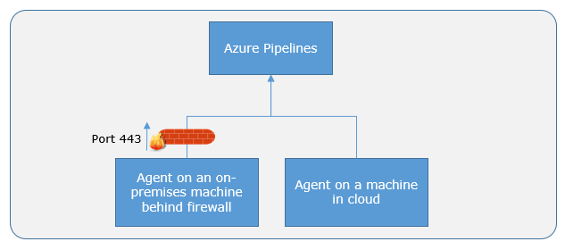
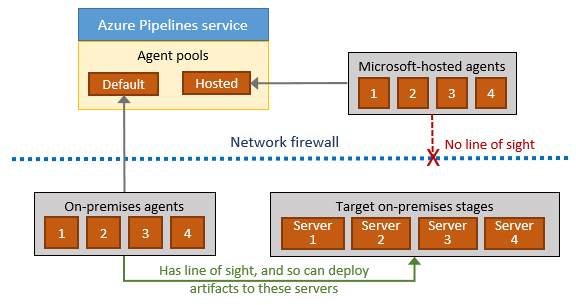
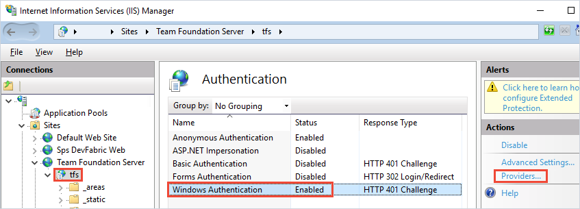
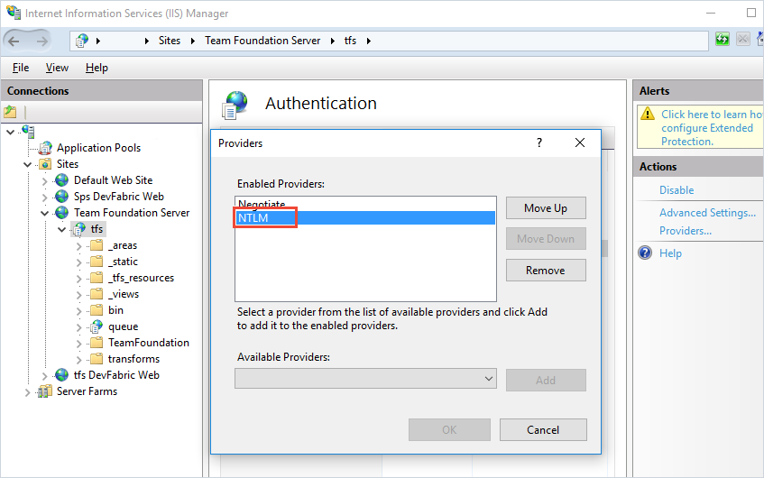
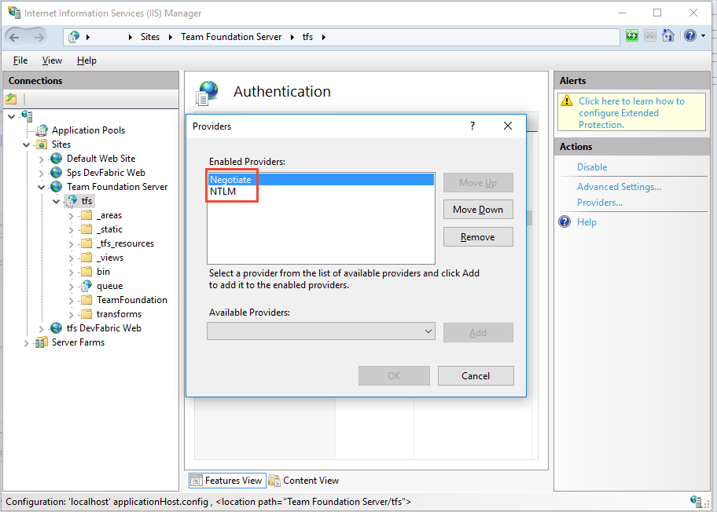

# Azure Pipelines agents

[!INCLUDE [version-tfs-2015-rtm](../_shared/version-tfs-2015-rtm.md)]

::: moniker range="<= tfs-2018"

[!INCLUDE [temp](../_shared/concept-rename-note.md)]

::: moniker-end

To build your code or deploy your software using Azure Pipelines, you need at least one agent. As you add more code and people, you'll eventually need more.

When your pipeline runs, the system begins one or more jobs.
An agent is installable software that runs one job at a time.

::: moniker range=">= azure-devops-2019"
Jobs can be run [directly on the host machine of the agent](../process/phases.md) or [in a container](../process/container-phases.md).
::: moniker-end

::: moniker range="azure-devops"

## Microsoft-hosted agents

[!INCLUDE [include](_shared/hosted-agent-intro.md)]

[Learn more about Microsoft-hosted agents](hosted.md).

::: moniker-end

<h2 id="install">Self-hosted agents</h2>

An agent that you set up and manage on your own to run jobs is a **self-hosted agent**.
You can use self-hosted agents in Azure Pipelines or Team Foundation Server (TFS).
Self-hosted agents give you more control to install dependent software needed for your builds and deployments.
Also, machine-level caches and configuration persist from run to run, which can boost speed.

::: moniker range="azure-devops"

> [!TIP]
> Before you install a self-hosted agent you might want to see if a Microsoft-hosted agent pool will work for you. In many cases this is the simplest way to get going. [Give it a try](hosted.md).

:::moniker-end

::: moniker range=">= tfs-2017"

You can install the agent on Linux, macOS, or Windows machines. You can also install an agent on a Docker container. For more information about installing a self-hosted agent, see:

* [macOS agent](v2-osx.md)
* [Linux agent](v2-linux.md) (x64, ARM, RHEL6)
* [Windows agent](v2-windows.md) (x64, x86)
* [Docker agent](docker.md)

::: moniker-end

::: moniker range="tfs-2015"

You can install the agent on Linux, macOS, or Windows machines. For more information about installing a self-hosted agent, see:

* [macOS agent](v2-osx.md)
* [Red Hat agent](v2-linux.md)
* [Ubuntu 14.04 agent](v2-linux.md)
* [Ubuntu 16.04 agent](v2-linux.md)
* [Windows agent v1](v1-windows.md)

::: moniker-end

After you've installed the agent on a machine, you can install any other software on that machine as required by your jobs.

::: moniker range="azure-devops"

## Parallel jobs

You can use a parallel job in Azure Pipelines to run a single job at a time in your organization. In Azure Pipelines, you can run parallel jobs on Microsoft-hosted infrastructure or on your own (self-hosted) infrastructure. 

Microsoft provides a free tier of service by default in every organization that includes at least one parallel job. Depending on the number of concurrent pipelines you need to run, you might need more parallel jobs to use multiple Microsoft-hosted or self-hosted agents at the same time. For more information on parallel jobs and different free tiers of service, see [Parallel jobs in Azure Pipelines](../licensing/concurrent-jobs.md).

::: moniker-end

::: moniker range=">= tfs-2015 < azure-devops"

## Parallel jobs

You might need more parallel jobs to use multiple agents at the same time:

* [Parallel jobs in TFS](../licensing/concurrent-pipelines-tfs.md)

::: moniker-end

::: moniker range=">= azure-devops-2019 < azure-devops"

> [!IMPORTANT]
> Starting with Azure DevOps Server 2019, you do not have to pay for self-hosted concurrent jobs in releases. You are only limited by the number of agents that you have.

::: moniker-end

<h2 id="capabilities">Capabilities</h2>

Every self-hosted agent has a set of capabilities that indicate what it can do. Capabilities are name-value pairs that are either automatically discovered by the agent software, in which case they are called **system capabilities**, or those that you define, in which case they are called **user capabilities**.

The agent software automatically determines various system capabilities such as the name of the machine, type of operating system, and versions of certain software installed on the machine. Also, environment variables defined in the machine automatically appear in the list of system capabilities.

When you author a pipeline you specify certain **demands** of the agent. The system sends the job only to agents that have capabilities matching the demands [specified in the pipeline](../build/options.md). As a result, agent capabilities allow you to direct jobs to specific agents.

> [!NOTE]
>
> Demands and capabilities apply only to self-hosted agents. When using Microsoft-hosted agents, you select an image for the hosted agent. 
> You cannot use capabilities with hosted agents.

You can view the system capabilities of an agent and manage its user capabilities by navigating to **Agent pools** and selecting the **Capabilities** tab for the desired agent.

1. In your web browser, navigate to Agent pools:

   [!INCLUDE [agent-pools-tab](_shared/agent-pools-tab.md)]

1. Navigate to the capabilities tab:
 
   [!INCLUDE [agent-capabilities](_shared/agent-capabilities-tab.md)]

> [!TIP]
>
> After you install new software on a self-hosted agent, you must restart the agent for the new capability to show up.

<h2 id="communication">Communication</h2>

::: moniker range="azure-devops"

### Communication with Azure Pipelines

::: moniker-end

::: moniker range=">= tfs-2015 < azure-devops"

### Communication with TFS

::: moniker-end

::: moniker range=">= tfs-2017"

The agent communicates with Azure Pipelines or TFS to determine which job it needs to run, and to report the logs and job status. This communication is always initiated by the agent. All the messages from the agent to Azure Pipelines or TFS happen over HTTP or HTTPS, depending on how you configure the agent. This pull model allows the agent to be configured in different topologies as shown below.

::: moniker-end

::: moniker range=">= tfs-2017 < azure-devops"

::: moniker-end

::: moniker range="azure-devops"

::: moniker-end

::: moniker range=">= tfs-2017"

Here is a common communication pattern between the agent and Azure Pipelines or TFS.

1. The user registers an agent with Azure Pipelines or TFS by adding it to an [agent pool](pools-queues.md). You need to be an [agent pool administrator](pools-queues.md#security) to register an agent in that agent pool. The identity of agent pool administrator is needed only at the time of registration and is not persisted on the agent, nor is it used in any further communication between the agent and Azure Pipelines or TFS. Once the registration is complete, the agent downloads a _listener OAuth token_ and uses it to listen to the job queue.

2. Periodically, the agent checks to see if a new job request has been posted for it in the job queue in Azure Pipelines/TFS. When a job is available, the agent downloads the job as well as a _job-specific OAuth token_. This token is generated by Azure Pipelines/TFS for the scoped identity [specified in the pipeline](../build/options.md). That token is short lived and is used by the agent to access resources (for example, source code) or modify resources (for example, upload test results) on Azure Pipelines or TFS within that job.

3. After the job is completed, the agent discards the job-specific OAuth token and goes back to checking if there is a new job request using the listener OAuth token.

The payload of the messages exchanged between the agent and Azure Pipelines/TFS are secured using asymmetric encryption. Each agent has a public-private key pair, and the public key is exchanged with the server during registration. The server uses the public key to encrypt the payload of the job before sending it to the agent. The agent decrypts the job content using its private key. This is how secrets stored in pipelines or variable groups are secured as they are exchanged with the agent.

::: moniker-end

::: moniker range="tfs-2015"

Here is a common communication pattern between the agent and TFS.

* An agent pool administrator joins the agent to an agent pool, and the credentials of the service account (for Windows) or the saved user name and password (for Linux and macOS) are used to initiate communication with TFS. The agent uses these credentials to listen to the job queue.

* The agent does not use asymmetric key encryption while communicating with the server. However, you can [use HTTPS to secure the communication](/azure/devops/server/admin/websitesettings) between the agent and TFS.

::: moniker-end

::: moniker range="azure-devops"

### Communication to deploy to target servers

When you use the agent to deploy artifacts to a set of servers, it must have "line of sight"
connectivity to those servers. The Microsoft-hosted agent pools, by default, have
connectivity to Azure websites and servers running in Azure.

> [!NOTE]
> If your Azure resources are running in an Azure Virtual Network, you can get the 
> [Agent IP ranges](hosted.md#agent-ip-ranges) where Microsoft-hosted agents are deployed 
> so you can configure the firewall rules for your Azure VNet to allow access by the agent.

If your on-premises environments do not have connectivity to a Microsoft-hosted agent pool
(which is typically the case due to intermediate firewalls), you'll need to
manually configure a self-hosted agent on on-premises computer(s). The agents must have connectivity to the target
on-premises environments, and access to the Internet to connect to Azure Pipelines or Team Foundation Server,
as shown in the following schematic.

::: moniker-end

## Authentication

To register an agent, you need to be a member of the [administrator role](pools-queues.md#security) in the agent pool. The identity of agent pool administrator is needed only at the time of registration and is not persisted on the agent, and is not used in any subsequent communication between the agent and Azure Pipelines or TFS. In addition, you must be a local administrator on the server in order to configure the agent. 

::: moniker range="azure-devops"

Your agent can authenticate to Azure Pipelines using the following method:

::: moniker-end

::: moniker range=">= tfs-2015 < azure-devops"

Your agent can authenticate to Azure DevOps Server or TFS using one of the following methods:

::: moniker-end

::: moniker range=">= tfs-2017"

### Personal Access Token (PAT): 
[Generate](../../organizations/accounts/use-personal-access-tokens-to-authenticate.md) and use a PAT to connect an agent with Azure Pipelines or TFS 2017 and newer. PAT is the only scheme that works with Azure Pipelines. Also, as explained above, this PAT is used only at the time of registering the agent, and not for subsequent communication.

To use a PAT with TFS, your server must be configured with HTTPS. See [Web site settings and security](/azure/devops/server/admin/websitesettings).

::: moniker-end

::: moniker range=">= tfs-2015 < azure-devops"

### Integrated

Connect a Windows agent to TFS using the credentials of the signed-in user through a Windows authentication scheme such as NTLM or Kerberos.

To use this method of authentication, you must first configure your TFS server.

1. Sign into the machine where you are running TFS.

1. Start Internet Information Services (IIS) Manager. Select your TFS site and make sure Windows Authentication is enabled with a valid provider such as NTLM or Kerberos.

### Negotiate

Connect to TFS as a user other than the signed-in user through a Windows authentication scheme such as NTLM or Kerberos.

To use this method of authentication, you must first configure your TFS server.

1. Log on to the machine where you are running TFS.

1. Start Internet Information Services (IIS) Manager. Select your TFS site and make sure Windows Authentication is enabled with the Negotiate provider and with another method such as NTLM or Kerberos.

### Alternate
Connect to TFS using Basic authentication. To use this method, you must first [configure HTTPS on TFS](/azure/devops/server/admin/websitesettings).

To use this method of authentication, you must configure your TFS server as follows:

1. Sign in to the machine where you are running TFS.

1. Configure basic authentication. See [Using tfx against Team Foundation Server 2015 using Basic Authentication](https://github.com/Microsoft/tfs-cli/blob/master/docs/configureBasicAuth.md).

::: moniker-end

<h2 id="interactive-or-service">Interactive vs. service</h2>

You can run your self-hosted agent as either a service or an interactive process.
After you've configured the agent, we recommend you first try it
in interactive mode to make sure it works. Then, for production use,
we recommend you run the agent in one of the following modes so
that it reliably remains in a running state. These modes also
ensure that the agent starts automatically if the machine is restarted.

1. **As a service**. You can leverage the service manager of the
   operating system to manage the lifecycle of the agent. In addition, the
   experience for auto-upgrading the agent is better when it is run
   as a service.

1. **As an interactive process with auto-logon enabled**. In some cases,
   you might need to run the agent interactively for production use -
   such as to run UI tests. When the agent is configured to run in this
   mode, the screen saver is also disabled. Some domain policies may
   prevent you from enabling auto-logon or disabling the screen saver. In
   such cases, you may need to seek an exemption from the domain policy,
   or run the agent on a workgroup computer where the domain policies
   do not apply.

   > [!NOTE]
   > There are security risks when you enable automatic logon
   > or disable the screen saver because you enable other users to walk
   > up to the computer and use the account that automatically logs on. If you configure the agent to run
   > in this way, you must ensure the computer is physically protected;
   > for example, located in a secure facility. If you use
   > Remote Desktop to access the computer on which an agent is running
   > with auto-logon, simply closing the Remote Desktop causes the
   > computer to be locked and any UI tests that run on this agent may
   > fail. To avoid this, use the [tscon](/windows-server/administration/windows-commands/tscon)
   > command to disconnect from Remote Desktop. For example:
   >
   > `%windir%\System32\tscon.exe 1 /dest:console`

<h2 id="account">Agent account</h2>

Whether you run an agent as a service or interactively, you can choose
which computer account you use to run the agent. (Note that this is different
from the credentials that you use when you register the agent with
Azure Pipelines or TFS.) The choice of agent account depends solely on the needs
of the tasks running in your build and deployment jobs.

For example, to run tasks that use Windows authentication to access an external
service, you must run the agent using an account that has access
to that service. However, if you are running UI tests such as Selenium or Coded UI tests that
require a browser, the browser is launched in the context of the agent account.

On Windows, you should consider using a service account such as Network Service or Local Service.
These accounts have restricted permissions and their passwords don't expire, meaning
the agent requires less management over time.

## Agent version and upgrades

::: moniker range="azure-devops"

We update the agent software every few weeks in Azure Pipelines.
We indicate the agent version in the format `{major}.{minor}`.
For instance, if the agent version is `2.1`, then the major version is 2 and the minor version is 1.

Microsoft-hosted agents are always kept up-to-date.
If the newer version of the agent is only different in _minor_ version, self-hosted agents can usually be updated automatically by Azure Pipelines.
An upgrade is requested when a platform feature or one of the tasks used in the pipeline requires a newer version of the agent.

If you run a self-hosted agent interactively, or if there is a newer _major_ version of the agent available, then you may have to manually upgrade the agents.
You can do this easily from the **Agent pools** tab under your organization.
Your pipelines won't run until they can target a compatible agent.

::: moniker-end

::: moniker range="< azure-devops"

We update the agent software with every update in Azure DevOps Server and TFS.
We indicate the agent version in the format `{major}.{minor}`.
For instance, if the agent version is `2.1`, then the major version is 2 and the minor version is 1.

When your Azure DevOps Server or TFS server has a newer version of the agent, and that newer agent is only different in _minor_ version, it can usually be automatically upgraded.
An upgrade is requested when a platform feature or one of the tasks used in the pipeline requires a newer version of the agent.
Starting with Azure DevOps Server 2019, you don't have to wait for a new server release.
You can [upload a new version of the agent to your application tier](#can-i-update-my-v2-agents-that-are-part-of-an-azure-devops-server-pool), and that version will be offered as an upgrade.

If you run the agent interactively, or if there is a newer _major_ version of the agent available, then you may have to manually upgrade the agents.
You can do this easily from the **Agent pools** tab under your project collection.
Your pipelines won't run until they can target a compatible agent.

::: moniker-end

You can view the version of an agent by navigating to **Agent pools** and selecting the **Capabilities** tab for the desired agent.

1. In your web browser, navigate to Agent pools:

   [!INCLUDE [agent-pools-tab](_shared/agent-pools-tab.md)]

1. Navigate to the capabilities tab:
 
   [!INCLUDE [agent-capabilities](_shared/agent-capabilities-tab.md)]

## Q & A

[!INCLUDE [include](_shared/v2/qa-agent-version.md)]

<h3 id="private-agent-performance-advantages">Do self-hosted agents have any performance advantages over Microsoft-hosted agents?</h3>

In many cases, yes. Specifically:

* If you use a self-hosted agent, you can run incremental builds. For example, if you define a pipeline that does not clean the repo and does not perform a clean build, your builds will typically run faster. When you use a Microsoft-hosted agent, you don't get these benefits because the agent is destroyed after the build or release pipeline is completed.

* A Microsoft-hosted agent can take longer to start your build. While it often takes just a few seconds for your job to be assigned to a Microsoft-hosted agent, it can sometimes take several minutes for an agent to be allocated depending on the load on our system.

### Can I install multiple self-hosted agents on the same machine?

Yes. This approach can work well for agents that run jobs that don't consume many shared resources. For example, you could try it for agents that run releases that mostly orchestrate deployments and don't do much work on the agent itself.

You might find that in other cases you don't gain much efficiency by running multiple agents on the same machine. For example, it might not be worthwhile for agents that run builds that consume much disk and I/O resources.

You might also run into problems if parallel build jobs are using the same singleton tool deployment, such as npm packages. For example, one build might update a dependency while another build is in the middle of using it, which could cause unreliable results and errors.

::: moniker range=">= azure-devops-2019"

## Learn more

For more information about agents, see the following modules from the [Build applications with Azure DevOps](/learn/paths/build-applications-with-azure-devops/) learning path.
* [Choose a Microsoft-hosted or self-hosted build agent](/learn/modules/host-build-agent/2-choose-a-build-agent)
* [Host your own build agent in Azure Pipelines](/learn/modules/host-build-agent/)

::: moniker-end
