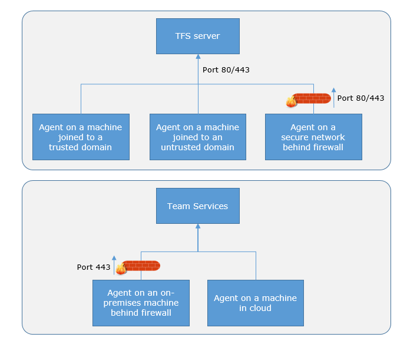
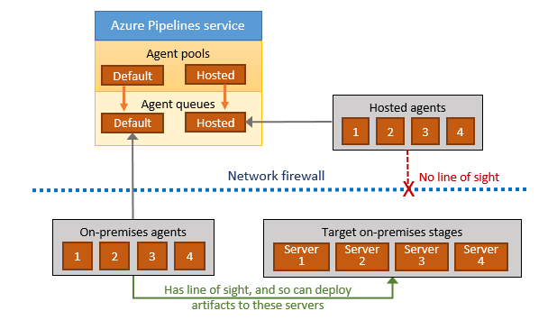

# Build and Release Agents

**VSTS | TFS 2018 | TFS 2017 | TFS 2015 | [Previous versions (XAML builds)](https://msdn.microsoft.com/library/bb399135%28v=vs.120%29.aspx)**

To build your code or deploy your software you need at least one agent. As you add more code and people, you'll eventually need more.

When your build or deployment runs, the system begins one or more jobs. An agent is installable software that runs one build or deployment job at a time.

::: moniker range="vsts"

## Microsoft-hosted agents

[!INCLUDE [include](_shared/hosted-agent-intro.md)]

[Learn more about Microsoft-hosted agents](hosted.md).

::: moniker-end

<h2 id="install">Self-hosted agents</h2>

An agent that you set up and manage on your own to run build and deployment jobs is a **self-hosted agent**. You can use self-hosted agents in VSTS or Team Foundation Server (TFS). Self-hosted agents give you more control to install dependent software needed for your builds and deployments.

You can install the agent on Linux, macOS, or Windows machines. You can also install an agent on a Linux Docker container.

After you've installed the agent on a machine, you can install any other software on that machine as required by your build or deployment jobs.

::: moniker range=">= tfs-2017"

### Install and connect to VSTS and TFS 2017 and newer

> [!TIP]
> Is your code in VSTS? If so, before you install an agent you might want to see if a Microsoft-hosted agent pool will work for you. In many cases this is the simplest way to get going. [Give it a try](hosted.md).

* [macOS agent](v2-osx.md)
* [Red Hat agent](v2-linux.md)
* [Ubuntu 14.04 agent](v2-linux.md)
* [Ubuntu 16.04 agent](v2-linux.md)
* [Windows agent v2](v2-windows.md)

::: moniker-end

::: moniker range="tfs-2015"

### Install and connect to TFS 2015

* [macOS agent](v2-osx.md)
* [Red Hat agent](v2-linux.md)
* [Ubuntu 14.04 agent](v2-linux.md)
* [Ubuntu 16.04 agent](v2-linux.md)
* [Windows agent v1](v1-windows.md)

::: moniker-end

::: moniker range="vsts"

### Concurrent jobs for self-hosted agents

You might need more concurrent jobs to use multiple agents at the same time:

* [Concurrent jobs in VSTS](../licensing/concurrent-jobs-vsts.md)

::: moniker-end

::: moniker range=">= tfs-2015 < vsts"

### Concurrent pipelines for self-hosted agents

You might need more concurrent pipelines to use multiple agents at the same time:

* [Concurrent pipelines in TFS](../licensing/concurrent-pipelines-tfs.md)

::: moniker-end

<h2 id="capabilities">Capabilities</h2>

Every agent has a set of capabilities that indicate what it can do. Capabilities are name-value pairs that are either automatically discovered by the agent software, in which case they are called **system capabilities**, or those that you define, in which case they are called **user capabilities**.

The agent software automatically determines various system capabilities such as the name of the machine, type of operating system, and versions of certain software installed on the machine. Also, environment variables defined in the machine automatically appear in the list of system capabilities.

When you author a build or release definition, or when you queue a build or deployment, you specify certain **demands** of the agent. The system sends the job only to agents that have capabilities matching the demands [specified in the definition](../build/options.md). As a result, agent capabilities allow you to direct builds and deployments to specific agents.

You can view the system capabilities of an agent, and manage its user capabilities by navigating to the **Agent pools** hub and selecting the **Capabilities** tab for the desired agent.

[!INCLUDE [agent-pools-tab](_shared/agent-pools-tab.md)]

> [!TIP]
>
> After you install new software on a agent, you must restart the agent for the new capability to show up.

<h2 id="communication">Communication</h2>

::: moniker range="vsts"

### Communication with VSTS

::: moniker-end

::: moniker range=">= tfs-2015 < vsts"

### Communication with TFS

::: moniker-end

::: moniker range=">= tfs-2017"

#### VSTS or TFS 2017 and newer

The agent communicates with VSTS or TFS to determine which job it needs to run, and to report the logs and job status. This communication is always initiated by the agent. All the messages from the agent to VSTS or TFS happen over HTTP or HTTPS, depending on how you configure the agent. This pull model allows the agent to be configured in different topologies as shown below.

Here is a common communication pattern between the agent and VSTS or TFS.

1. The user registers an agent with VSTS or TFS by adding it to an [agent pool](pools-queues.md). You need to be an [agent pool administrator](pools-queues.md#security) to register an agent in that agent pool. The identity of agent pool administrator is needed only at the time of registration and is not persisted on the agent, nor is used in any further communication between the agent and VSTS or TFS. Once the registration is complete, the agent downloads a _listener OAuth token_ and uses it to listen to the job queue.

2. Periodically, the agent checks to see if a new job request has been posted for it in the job queue in TFS/VSTS. When a job is available, agent downloads the job as well as a _job-specific OAuth token_. This token is generated by TFS/VSTS for the scoped identity [specified in the definition](../build/options.md). That token is short lived and is used by agent to access (e.g., source code) or modify resources (e.g., upload test results) on VSTS or TFS within that job.

3. Once the job is completed, agent discards the job-specific OAuth token and goes back to checking if there is a new job request using the listener OAuth token.

The payload of the messages exchanged between the agent and TFS/VSTS are secured using asymmetric encryption. Each agent has a public-private key pair, and the public key is exchanged with the server during registration. Server uses the public key to encrypt the payload of the job before sending it to the agent. The agent decrypts the job content using its private key. This is how secrets stored in build definitions, release definitions, or variable groups are secured as they are exchanged with the agent.

::: moniker-end

::: moniker range="tfs-2015"

#### TFS 2015

In TFS 2015:

* An agent pool administrator joins the agent to an agent pool, and the credentials of the service account (for Windows) or the saved user name and password (for Linux and macOS) are used to initiate communication with TFS. The agent uses these credentials to listening to the job queue.

* The agent does not use asymmetric key encryption while communicating with the server. However, you can [use HTTPS to secure the communication](../../security/websitesettings.md) between the agent and TFS.

::: moniker-end

### Communication to deploy to target servers

When you use the agent to deploy artifacts to a set of servers, it must have "line of sight"
connectivity to those servers. The Microsoft-hosted agent pools, by default, have
connectivity to Azure websites and servers running in Azure.

If your on-premises environments do not have connectivity to a Microsoft-hosted agent pool
(which is typically the case due to intermediate firewalls), you'll need to
manually configure a self-hosted agent on on-premises computer(s). The agents must have connectivity to the target
on-premises environments, and access to the Internet to connect to VSTS or Team Foundation Server,
as shown in the following schematic.

## Authentication

To register an agent, you need to be a member of the [administrator role](pools-queues.md#security) in the agent pool. The identity of agent pool administrator is needed only at the time of registration and is not persisted on the agent, nor is used in any further communication between the agent and VSTS or TFS. Also, one needs to be a local administrator on the server in order to configure the agent. Your agent can authenticate to VSTS or TFS using one of the following methods:

::: moniker range=">= tfs-2017"

**Personal Access Token (PAT):** [Generate](../../accounts/use-personal-access-tokens-to-authenticate.md) and use a PAT to connect an agent with VSTS or TFS 2017 and newer. PAT is the only scheme that works with VSTS.

::: moniker-end

::: moniker range=">= tfs-2015 < vsts"

**Integrated:** Connect a Windows agent to TFS using the credentials of the signed-in user via a Windows authentication scheme such as NTLM or Kerberos.

**Negotiate:** Connect to TFS as a user other than the signed-in user via a Windows authentication scheme such as NTLM or Kerberos.

**Alternate:** Connect to TFS using Basic authentication. To use this method you'll first need to [configure HTTPS on TFS](../../security/websitesettings.md).

::: moniker-end

<h2 id="account">Interactive vs. service</h2>

You can run your agent as either a service or an interactive process.
Whether you run an agent as a service or interactively, you can choose
which account you use to run the agent. Note that this is different
from the credentials that you use when you register the agent with
VSTS or TFS. The choice of agent account depends solely on the needs
of the tasks running in your build and deployment jobs.

For example, to run tasks that use Windows authentication to access an external
service, you must run the agent using an account that has access
to that service. However, if you are running UI tests such as Selenium or Coded UI tests that
require a browser, the browser is launched in the context of the agent account.

After you've configured the agent, we recommend you first try it
in interactive mode to make sure it works. Then, for production use,
we recommend you run the agent in one of the following modes so
that it reliably remains in a running state. These modes also
ensure that the agent starts automatically if the machine is restarted.

1. **As a service**. You can leverage the service manager of the
   operating system to manage the lifecycle of the agent. In addition, the
   experience for auto-upgrading the agent is better when it is run
   as a service.

1. **As an interactive process with auto-logon enabled**. In some cases,
   you might need to run the agent interactively for production use -
   such as to run UI tests. When the agent is configured to run in this
   mode, the screen saver is also disabled. Some domain policies may
   prevent you from enabling auto-logon or disabling the screen saver. In
   such cases, you may need to seek an exemption from the domain policy,
   or run the agent on a workgroup computer where the domain policies
   do not apply.

   **Note:** There are security risks when you enable automatic logon
   or disable the screen saver because you enable other users to walk
   up to the computer and use the account that automatically logs on. If you configure the agent to run
   in this way, you must ensure the computer is physically protected;
   for example, located in a secure facility. If you use
   Remote Desktop to access the computer on which an agent is running
   with auto-logon, simply closing the Remote Desktop causes the
   computer to be locked and any UI tests that run on this agent may
   fail. To avoid this, use the [tscon](https://docs.microsoft.com/en-us/windows-server/administration/windows-commands/tscon)
   command to disconnect from Remote Desktop. For example:

   `%windir%\System32\tscon.exe 1 /dest:console`

## Agent version and upgrades

We update the agent software every few weeks in VSTS, and with every update in TFS. We indicate the agent version in the format `{major}.{minor}`. For instance, if the agent version is `2.1`, then the major version is 2 and the minor version is 1. When a newer version of the agent is only different in minor version, it is automatically upgraded by VSTS or TFS. This upgrade happens when one of the tasks requires a newer version of the agent.

If you run the agent interactively, or if there is a newer major version of the agent available, then you have to manually upgrade the agents. You can do this easily from the agent pools tab under your team project collection or account.

You can view the version of an agent by navigating to the **Agent pools** hub and selecting the **Capabilities** tab for the desired agent.

[!INCLUDE [agent-pools-tab](_shared/agent-pools-tab.md)]

## Q&A

<h3 id="private-agent-performance-advantages">Do self-hosted agents have any performance advantages over Microsoft-hosted agents?</h3>

In many cases, yes. Specifically:

* If you use a self-hosted agent you can run incremental builds. For example, you define a CI build process that does not clean the repo and does not perform a clean build, your builds will typically run faster. When you use a Microsoft-hosted agent, you don't get these benefits because the agent is destroyed after the build or release process is completed.

* A Microsoft-hosted agent can take longer to start your build. While it often takes just a few seconds for your job to be assigned to a Microsoft-hosted agent, it can sometimes take several minutes for an agent to be allocated depending on the load on our system.

### Can I install multiple self-hosted agents on the same machine?

Yes. This approach can work well for agents that run jobs that don't consume a lot of shared resources. For example, you could try it for agents that run releases that mostly orchestrate deployments and don't do a lot of work on the agent itself.

You might find that in other cases you don't gain much efficiency by running multiple agents on the same machine. For example, it might not be worthwhile for agents that run builds that consume a lot of disk and I/O resources.

You might also run into problems if concurrent build processes are using the same singleton tool deployment, such as NPM packages. For example, one build might update a dependency while another build is in the middle of using it, which could cause unreliable results and errors.

[!INCLUDE [agent-latest-version](_shared/v2/qa-agent-version.md)]
